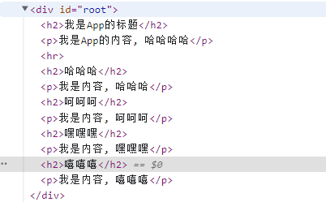

> + 标有 * 开头的，为 源码解读

## 一、jsx 与 react 基础

### 1、JSX存在意义与解析过程

+ `jsx`是为了方便写代码，`babel`会将`jsx`转换成为 `React.createElement()` 函数。
+ React.createElement 语法
  + React.createElement(component,props, ...children)

```js
React.createElement("div",null,React.createElement("div",{className: "Content"},'')
```


**react jsx语法并且使用babel解析编译**

```react

  <script type="text/babel">
    // 1.定义App根组件
    class App extends React.Component {
      constructor() {
        super();
        this.state = {
          message: "Hello World"
        };
      }

      render() {
        const { message } = this.state;

        return (
          <div>
            <div className="header">Header</div>
            <div className="Content">
              <div>{message}</div>
              <ul>
                <li>列表数据1</li>
                <li>列表数据2</li>
                <li>列表数据3</li>
                <li>列表数据4</li>
                <li>列表数据5</li>
              </ul>
            </div>
            <div className="footer">Footer</div>
          </div>
        );
      }
    }

    // 2.创建root并且渲染App组件
    const root = ReactDOM.createRoot(document.querySelector("#root"));
    root.render(<App />)
  </script>
```

**没有使用 jsx 与 babel 编译**

+ 直接使用 react原生语法 `React.createElement()` 创建

```js
  <script>
    // 1.定义App根组件
    class App extends React.Component {
      constructor() {
        super()
        this.state = {
          message: "Hello World"
        }
      }

      render() {
        const { message } = this.state

        const element = React.createElement(
          "div",
          null,
  /*#__PURE__*/ React.createElement(
            "div",
            {
              className: "header"
            },
            "Header"
          ),
  /*#__PURE__*/ React.createElement(
            "div",
            {
              className: "Content"
            },
    /*#__PURE__*/ React.createElement("div", null, "Banner"),
    /*#__PURE__*/ React.createElement(
              "ul",
              null,
      /*#__PURE__*/ React.createElement(
                "li",
                null,
                "\u5217\u8868\u6570\u636E1"
              ),
      /*#__PURE__*/ React.createElement(
                "li",
                null,
                "\u5217\u8868\u6570\u636E2"
              ),
      /*#__PURE__*/ React.createElement(
                "li",
                null,
                "\u5217\u8868\u6570\u636E3"
              ),
      /*#__PURE__*/ React.createElement(
                "li",
                null,
                "\u5217\u8868\u6570\u636E4"
              ),
      /*#__PURE__*/ React.createElement("li", null, "\u5217\u8868\u6570\u636E5")
            )
          ),
  /*#__PURE__*/ React.createElement(
            "div",
            {
              className: "footer"
            },
            "Footer"
          )
        );
        
        console.log(element)

        return element
      }
    }

    // 2.创建root并且渲染App组件
    const root = ReactDOM.createRoot(document.querySelector("#root"))
    root.render(React.createElement(App, null))
  </script>
```

### 2、react 渲染过程

**jsx > ReactElement > 真实DOM** 

#### 2.1 jsx

+ `jsx` 创建出来一个 `React.createElement()` 
+ `React.createElement()` 返回来一个 `虚拟DOM树(Virtual DOM Tree)`  而这个DOM树 就是 `ReactElement` JavaScript 对象

#### 2.2 ReactElement JavaScript 对象

+ 使用 root.render (ReactElement) 就可以将 虚拟dom和真实dom同步起来渲染出来一个 真实DOM

**React 官方对 Virtual 的 解释**


#### 2.3 真实DOM

+ 多平台控件 DOM元素
  + div
  + UIView


### 3、虚拟Dom的作用

#### 3.1 diff算法

+ 在 `虚拟dom` 创建之后会渲染成 `真实dom` 但是这个时候有依赖数据更改，那么创建的 `new虚拟dom` 会与 `old虚拟dom` 作比较，只去`更改有变化的数据或者节点`

#### 3.2 跨平台开发

+ 在`react-native` 中，`虚拟dom`渲染到`真实dom`中间有一步叫做`桥接`
  + 这个桥接做的事情就是把虚拟dom中的节点 view button 等元素`渲染成对应系统的控件`，
  + 例如 ios 中的 UIView UIButton

#### 3.3 声明式编程的模式

+ 声明式编程 - 虚拟DOM帮助我们从命令式编程转到了声明式编程的模式

* 你只需要告诉React希望让UI是什么状态
* React来确保DOM和这些状态是匹配的
* 不需要直接进行DOM操作，就可以从手动更改DOM、属性操作、事件处理中解放出来


### 4、this 指向问题

> 行内绑定函数本质如下：
>
> + 下方绑定函数最后会编译成
>   + fn= this.btnClick
>   + 调用时候：fn()
>     + 所以this会丢失
>
> ```jsx
> onClick={this.btnClick}
> ```
>
> 

* this绑定规则

  * 普通绑定 - `onClick={this.btnClick}` - 在内部是独立函数调用,所以this为undefined
  * this绑定方式一: bind绑定 - `onClick={this.btnClick.bind(this)}`
  * this绑定方式二: ES6 class fields - `onClick={this.btnClick}` - `btnClick = () => {}`
  * this绑定方式三: 直接传入一个箭头函数 - `onClick={() => this.btnClick()}`

* 给函数传递参

  * event参数的传递 - `onClick={(event) => this.btn1Click(event)}`
  * 额外参数的传递 - `onClick={(event) => this.btn2Click(event, "http", 18)}`

## 二、react 脚手架

### 1、基本使用

+ 脚手架名称
  + create-react-app 
+ 安装
  + create-react-app 项目名称
+ 注意事项
  + 项目名称不能包含`大写字母`

### 2、目录结构


**PWA** 

**整个目录结构都非常好理解，只是有一个PWA相关的概念：**

+ PWA全称Progressive Web App，即渐进式WEB应用；
+  一个 PWA 应用首先是一个网页, 可以通过 Web 技术编写出一个网页应用； 
+  随后添加上 App Manifest 和 Service Worker 来实现 PWA 的安装和离线等功能；
+ 这种Web存在的形式，我们也称之为是 Web App；  

**PWA解决了哪些问题呢？**

+ 可以添加至主屏幕，点击主屏幕图标可以实现启动动画以及隐藏地址栏；
+  实现离线缓存功能，即使用户手机没有网络，依然可以使用一些离线功能；
+  实现了消息推送； 
+  等等一系列类似于Native App相关的功能；

**更多PWA相关的知识，可以自行去学习更多；**

 https://developer.mozilla.org/zh-CN/docs/Web/Progressive_web_apps


### 3、查看脚手架webpack配置

+ 脚手架的package.json 中的脚本

```shell
#此操作不可逆
npm run eject

"eject": "react-scripts eject"
```


## 三、react 的组件化

### 1、组件分类

+ 根据组件的定义方式，可以分为：**函数组件(Functional Component )**和**类组件(Class Component)**；
+ 根据组件内部是否有状态需要维护，可以分成：**无状态组件(Stateless Component )**和**有状态组件(Stateful Component)**；
+ 根据组件的不同职责，可以分成：**展示型组件(Presentational Component)**和**容器型组件(Container Component)**；
+ 函数组件、无状态组件、展示型组件主要关注UI的展示
+ 类组件、有状态组件、容器型组件主要关注数据逻辑；


### 2、类组件

#### 2.1 类组件的定义要求

+ 组件的名称是**大写字符开头**（无论类组件还是函数组件）
+ 类组件需要继承自 **React.Component**
+ 类组件必须实现**render**函数，是 class 组件中唯一必须实现的方法；
+ **constructor**是可选的，我们通常在**constructor**中初始化一些数据；
+ this.state中维护的就是我们组件内部的数据；

#### 2.2 render 函数的返回值

+ 当 render 被调用时，它会检查 this.props 和 this.state 的变化并返回以下类型之一

+ React 元素

  + 通过**jsx**创建
  + `div` 和 `自定义组件` 都被称之为 `React元素` 因为jsx中所有元素最后babel会将其转换为 `React.createElement() `，并转为 平台需要的元素节点

+ 数组或 fragments：使得 render 方法可以返回多个元素。

  + ```jsx
       // 2.组件或者fragments
        return ["abc", "cba", "nba"]
        return [
          <h1>h1元素</h1>,
          <h2>h2元素</h2>,
          <div>哈哈哈</div>
        ]
          
        // 3.字符串/数字类型
        return "Hello World"
    ```

+ Portals

  + 可以渲染子节点到不同的 DOM 子树中

+ 字符串或数值类型

  + 它们在 DOM 中会被渲染为文本节点

+ 布尔类型或 null

  + 什么都不渲染。


### 3、函数组件

+ 函数组件是使用function来进行定义的函数，只是这个函数会返回和类组件中render函数返回一样的内容。
+ 函数组件有自己的特点。(有了hook之后截然不同，如果没有hooks 函数组件就是一个展示性组件)
  + 没有生命周期，也会被更新并挂载，但是没有生命周期函数
  + this关键字不能指向组件实例（因为没有组件实例）；
  + 没有内部状态（state）；


### 4、生命周期

[生命周期官方图表](https://projects.wojtekmaj.pl/react-lifecycle-methods-diagram/)

[官方文档生命周期](https://react.docschina.org/docs/react-component.html#reference)

#### 4.1 生命周期有哪些

+ constructor
  + 组件实例创建时
+ render
  + 数据渲染时，每次数据更改都会触发
+ componentDidMount
  + 组件已经挂载到DOM上时回调
  + 依赖于`DOM的操作`可以在这里进行
  + 在此处`发送网络请求`就最好的地方；（官方建议）
  + 如果需要`添加订阅`可以在这里（并且在componentWillUnmount取消订阅）
+ componentDidUpdate
  + 组件已经发生了更新时回调，首次渲染不会执行此方法
  + 如果 `props` 发生了变化需要重新请求数据，这里也可以请求
  + 并且该回调函数有三个参数
    + 第一个参数：上次更新的 props
    + 第二个参数：上次更新的 state
    + 第三个参数：上次更新的 snapshot

```jsx
 componentDidUpdate(prevProps, prevState, snapshot) {
    console.log("HelloWorld componentDidUpdate:", prevProps, prevState, snapshot);
  }
```

+ componentWillUnmount

  + 组件即将被移除时回调
  + 这里可以`取消订阅`与一些`必要的清理操作`

+ shouldComponentUpdate

  + 该函数会在数据更新时候触发（`发生在render与componentDidUpdate之前`）
  + 该函数返回一个布尔值，如果返回 false 那么视图不会更新（可以做性能优化）

+ getSnapshotBeforeUpdate

  + 在React更新DOM之前回调的一个函数，可以获取DOM更新前的一些信息

  + 可在该处返回一个返回值，保存一些下次更新需要的值

    + 并且可以在 `componentDidUpdate` 生命周期函数的第三个参数获取
    + 类似下方代码记录 滚动距离

  + ```jsx
    return {
          scrollPosition: 1000,
        };
    ```

#### 4.2 创建时

+ constructor
+ render
+ componentDidMount

#### 4.3 数据更新时

+ render
+ componentDidUpdate

#### 4.4 数据卸载时

+ componentWillUnmount


### 5、父子通信

#### 5.1 父传子 

> 绑定属性值，子组件中直接获取 `this.props`
>
> 默认值使用 `PropTypes`

+ 父组件 Main

```jsx
import React, { Component } from "react";
import MainBanner from "./MainBanner";
import MainProductList from "./MainProductList";
import axios from "axios";

export class Main extends Component {
  constructor() {
    super();
    this.state = {
      banners: [],
      productList: [],
    };
  }
  componentDidMount() {
    axios.get("http://123.207.32.32:8000/home/multidata").then((res) => {
      const banners = res.data.data.banner.list;
      const recommend = res.data.data.recommend.list;

      this.setState({
        banners,
        productList: recommend,
      });
    });
  }
  render() {
    const { banners, productList } = this.state;
    return (
      <div className="main">
        <div>Main</div>2
        <MainBanner banners={banners} title={"轮播图"} />
        <MainBanner />
        <MainProductList productList={productList} />
      </div>
    );
  }
}

export default Main;

```

+ 子组件 MainBanner 

```jsx
import React, { Component } from "react";
import PropTypes from "prop-types";
import "./style.css";

export class MainBanner extends Component {
  // es2022可以这里设置props默认值，当然不支持babel也会帮忙转化
  static defaultProps = {
    banners: [
      {
        title: "默认列表1",
      },
      {
        title: "默认列表2",
      },
    ],
    title: "默认轮播图标题",
  };
  constructor(props) {
    super(props);
    this.state = {};
  }
  render() {
    const { banners, title } = this.props;
    return (
      <>
        <h2 className="banner-title">{title}</h2>
        <ul>
          {banners.map((item, index) => (
            <li key={index}>{item.title}</li>
          ))}
        </ul>
      </>
    );
  }
}
MainBanner.propTypes = {
  banners: PropTypes.array.isRequired,
  title: PropTypes.string.isRequired,
};
// 可以这样设置props 默认值
// MainBanner.defaultProps = {
//   banners: [
//     {
//       title: "默认列表1",
//     },
//     {
//       title: "默认列表2",
//     },
//   ],
//   title: "默认轮播图标题",
// };

export default MainBanner;

```

+ 子组件 MainProductList

```jsx
import React, { Component } from "react";

export class MainProductList extends Component {
  // constructor(props) {
  //   super(props);
  //   this.state = {};
  // }
  render() {
    const { productList } = this.props;
    return (
      <div>
        <h2>商品列表</h2>
        <ul>
          {productList.map((item, index) => (
            <li key={index}>{item.title}</li>
          ))}
        </ul>
      </div>
    );
  }
}

export default MainProductList;

```


#### 5.2 子传父

> 子传父同样使用属性 绑定事件

+ 父组件 App

```jsx
import React, { Component } from "react";
import AddCounter from "./AddCounter";
import SubCounter from "./SubCounter";

export class App extends Component {
  constructor() {
    super();

    this.state = {
      counter: 100,
    };
  }

  changeCounter(count) {
    this.setState({ counter: this.state.counter + count });
  }

  render() {
    const { counter } = this.state;

    return (
      <div>
        <h2>当前计数: {counter}</h2>
        <AddCounter addClick={(count) => this.changeCounter(count)} />
      </div>
    );
  }
}

export default App;

```

+ 子组件 AddCounter

```jsx
import React, { Component } from 'react'
// import PropTypes from "prop-types"

export class AddCounter extends Component {
  addCount(count) {
    this.props.addClick(count)
  }

  render() {

    return (
      <div>
        <button onClick={e => this.addCount(1)}>+1</button>
        <button onClick={e => this.addCount(5)}>+5</button>
        <button onClick={e => this.addCount(10)}>+10</button>
      </div>
    )
  }
}

// AddCounter.propTypes = {
//   addClick: PropTypes.func
// }

export default AddCounter
```


### 6、context 非父子通信 数据共享

**类似与vue的 provide 与 inject**


#### 6.1 创建上下文 context

```jsx
import React from 'react'

// 1.创建一个Context
//默认值
const ThemeContext = React.createContext({ color: 'blue', size: 10 })

export default ThemeContext

```

#### 6.2 提供注入 Provider

+ 可以多层嵌套，嵌套多个`context`
  + 数据在value中

```jsx
import ThemeContext from './context/theme-context'
 
{/* 第二步操作: 通过ThemeContext中Provider中value属性为后代提供数据 */}
<ThemeContext.Provider value={{ color: 'red', size: '30' }}>
  <Home {...info} />
</ThemeContext.Provider>

```

#### 6.3 使用 

##### 6.3.1 类组件使用 context

```jsx
import ThemeContext from './context/theme-context'
export class HomeInfo extends Component {
  render() {
    // 4.第四步操作: 获取数据, 并且使用数据
    console.log(this.context)

    return (
      <div>
        <h2>HomeInfo: {this.context.color}</h2>
      </div>
    )
  }
}
// 3.第三步操作: 设置组件的contextType为某一个Context
HomeInfo.contextType = ThemeContext
```

##### 6.3.2 函数组件使用 Consumer

```jsx
import ThemeContext from './context/theme-context'

function HomeBanner() {
  return (
    <div>
      {/* 函数式组件中使用Context共享的数据 */}
      <ThemeContext.Consumer>
        {(value) => {
          return <h2> Banner theme:{value.color}</h2>
        }}
      </ThemeContext.Consumer>
    </div>
  )
}

export default HomeBanner

```

## 四、 setSate 详细使用

### 1、三种用法

#### 1.1 基本使用

```jsx
    // 1.基本使用
    this.setState({
      message: '你好啊, React',
    })
```

#### 1.2 函数返回

**这种方式的好处**

+ 可以在回调函数中编写新的state的逻辑
+ 当前的回调函数会将之前的state和props传递进来

```jsx
    this.setState((state, props) => {
      console.log(state, props)
      // 1.编写一些对新的state处理逻辑
      // 2.可以获取之前的state和props值
      console.log(this.state.message, this.props)
      return {
        message: '你好啊, React',
      }
    })
```


#### 1.3 callback 解决异步问题

+ 这种方式可以在回调函数种解决异步问题，在回调函数中操作


```jsx
console.log(this.state.message, '---') //Hello World
	this.setState(
     {
       message: '你好啊, React',
     },
     () => {
       console.log(this.state.message) //你好啊, React
     }
    )
console.log(this.state.message, '---') //Hello World
```


### 2、setState 为什么是异步的？

[React核心成员（Redux的作者）Dan Abramov的回复](https://github.com/facebook/react/issues/11527#issuecomment-360199710)


#### 2.1 提升性能

+ 批量处理数据，多次异步`setState` 调用了一次render函数

> 如果是 `setSate` 同步的,那么每次调用都会触发 `render` 函数，每次`render`函数中都要做`diff算法`，`回流`，`重组`等操作，这样会消耗不必要的性能。

> 而做成异步这样，就会等待多个 `setState` 改变的数据，一起调用一次`render`函数


#### 2.2 避免 state和props 不同步

+ 如果同步更新了`state`，这个时候可能还没有执行render函数，那么就可能造成`state`和`props`不能保持同步
+ 因为`render`函数可能不是那么及时，
+ 异步就会一起执行`render`函数所以可以保证`state`和`props`的数据一致


### 3、setState一定是异步吗？


[官方说明](https://react.docschina.org/blog/2022/03/29/react-v18.html#whats-new-in-react-18)


> 在`react18` 之前`setTimeout` 加入`宏任务`之后是可以`同步`的
>
> 但是在`react18`开始就没有了

```jsx
    setTimeout(() => {
      // 在react18之前, setTimeout中setState操作, 是同步操作
      // 在react18之后, setTimeout中setState异步操作(批处理)
      this.setState({ message: '你好啊, 李银河' })
      console.log(this.state.message)
    }, 0)
```


+ 在react 18 之后都是`异步批处理`，除非使用以下方式可以`实现同步单处理`
  + `flushSync` 函数中也可以`写多个setState` 因为这个函数内部所有会进行一次批处理

```jsx
import { flushSync } from 'react-dom'
flushSync(() => {
   this.setState({ message: '你好啊, react' })
   //this.setState({ message: '你好啊, react' })
})
console.log(this.state.message)//你好啊, react
```


## 五、react 性能优化


### 1、diff 算法做的优化

+ `react` 在做 `diff` 算法时候 只会在同一层去遍历查看是否相同
+ 如果是内容变化那么就变化内容，如果位置变化就会之后的重新渲染
  + 例如：新dom a、b、c、d、e 旧dom a、b、d、e
  + 从第二个开始后边的都会重新渲染
  + 这个问题可以使用key来解决
+ 如果给当前列表绑定了唯一的key，那么就会`插入`而不是全部渲染
  +  直接在 b d 中间插入 c 后边的向后排
+ 如果是节点`div` 变成了 `p` 那么就会这个节点下的树结构重新渲染(根节点也不例外)

### 2、SCU （PureComponent与memo做的优化）

> 是为了优化，父组件 `state 变化` 子组件`没有被影响`到就`不要去重新渲染`

> + shouldComponentUpdate 简称wei **SCU**
>
> `PureComponent` 底层做的就是`shouldComponentUpdate`中的新旧对比.来决定是否渲染 `render` 函数
>
> `memo`底层也是做对比是否相同来决定是否调用函数

**场景：一个父组件包裹两个子组件（一个类组件一个函数组件）**

+ App 父组件

+ Home 类组件接收父组件 `message`
+ Person 函数组件接收父组件 `counter`

> 此时如果App中的message或者counter`不管哪一个修改`，两个`子组件`都会`重新执行`render函数 这样会造成不少的性能消耗

#### 2.1 手动SCU优化

+ 在 `shouldComponentUpdate` 函数中又两个参数
  + 一个是 `下一个state` 一个是`下一个props`

```jsx
  shouldComponentUpdate(newProps, nextState) {
    // 自己对比state是否发生改变: this.state和nextState
    if (this.props.message !== newProps.message) {
      return true
    }
    return false
  }
```

+ 但是手动方式 函数组件是不可以的
  + 并且如果类组件多个`state`变化 手动来实现是不明智的
  + 所以类组件可以继承`PureComponent`
  + 函数组件可以使用`memo` 函数

#### 2.2 自动SCU优化

+ 类组件 继承 `PureComponent` 类
  + 让 PureComponent 帮忙自动优化

```jsx
import React, { PureComponent } from 'react'

export class Home extends PureComponent {
  constructor(props) {
    super(props)

    this.state = {
      friends: [],
    }
  }
  // shouldComponentUpdate(newProps, nextState) {
  //   // 自己对比state是否发生改变: this.state和nextState
  //   if (this.props.message !== newProps.message) {
  //     return true
  //   }
  //   return false
  // }
  render() {
    console.log('Home render')
    return (
      <div>
        <h2>Home Page: {this.props.message}</h2>
      </div>
    )
  }
}

export default Home

```

+ 函数组件 使用 `memo` 函数
  + 让 memo 对比是否有改变来决定使用调用 组件函数

```jsx
import { memo } from "react"

const Person  = memo(function(props) {
  console.log("profile render")
  return <h2>Profile: {props.counter}</h2>
})

export default Person 

```


### 3、* react中的数据不可变


#### 3.1 不可以直接修改state中的数据

+ PureComponent

> + 如果在赋值时候直接修改**state**中的值是不生效的
> + 原因是在**react** 中 会去判断两个值是否相同做浅层比较，而修改**state本身内存**中的地址是**同一个地址**，所以判断出来**结果是相同的**

**源码中的主要两步（react 18.2.0）**

1. 判断是否 `pureComponent`
   + packages\react\src\ReactBaseClasses.js（144行）
   + 
2. 浅层比较 
   + packages\react-reconciler\src\ReactFiberClassComponent.new.js（355行）
   + 
   + packages\shared\shallowEqual.js（18行）
   + 


## 六、react 使用

### 1、获取原生DOM ref

**获取元素有三种方式**

+ `第二种方法是官方推荐使用的`

1. 在react元素上绑定一个ref字符串（已抛弃）

```jsx
 console.log(this.refs.test)
<h2 ref="test">Hello World</h2>
```

2. 提前创建好 使用react提供的createRef方法(建议)
   + 并且该方法与 state 是完全无关的

```jsx
import React, { PureComponent, createRef } from 'react'  
constructor() {
    super()
    this.state = {}
    this.titleRef = createRef()
}
console.log(this.titleRef.current)
```

3. 通过回调函数赋值

```jsx
 constructor() {
    super()
    this.state = {}
    this.titleEl = null
}

console.log(this.titleEl)

<h2 ref={(el) => { this.titleEl = el }} >
	Hello javaScript
</h2>
```

### 2、获取组件实例 

> 获取组件实例同样可以使用 **createRef** 并且可以调用实例的方法

```jsx
import React, { PureComponent, createRef } from 'react'
//子组件
class HelloWorld extends PureComponent {
  test() {
    console.log('HelloWorld中test方法')
  }
  render() {
    return <h1>HelloWorld</h1>
  }
}
//父组件
constructor() {
   super()
   this.state = {}
   this.CompoentInstance = createRef()
}
getComponent() {
   this.CompoentInstance.current.test()//HelloWorld中test方法
}
<HelloWorld ref={this.CompoentInstance} />
```

### 3、函数组件的实例

> 函数组件是没有实例的，也就是说不能使用直接绑定ref 获取内部元素与方法，但是可以**直接给组件中的 某个dom绑定**

+ 需要使用 **forwardRef** 来实现

```jsx
import React, { PureComponent, createRef, forwardRef } from 'react'
//使用 forwardRef 第二个参数就是传入的ref
const HelloWorld = forwardRef(function (props, ref) {
  return (
    <div>
      <h1>HelloWorld</h1>
        <!-- 使用传入ref绑定元素 -->
      <div ref={ref}>哈哈哈</div>
    </div>
  )
})

//父组件
constructor() {
   super()
   this.state = {}
   this.CompoentInstance = createRef()
}
getComponent() {
   console.log(this.CompoentInstance.current)//h1 dom
}
<HelloWorld ref={this.CompoentInstance} />
```

### 4、受控组件与非受控组件

#### 4.1 定义

+ 组件自己维护 `state` 那么就是 `非受控组件`。

```jsx
{/* 非受控组件 */}
<input type="text" />

{/* 使用  defaultValue 绑定默认值 */}
{/* ref 获取实例 拿到value */}
<input type="text" defaultValue={intro} ref={this.introRef} />
```

+ 由 `react state` 控制则为受控组件。 

```jsx
//value 由react state 管理
{/* 受控组件 */}
  <input
    type="checkbox"
    value={username}
    onChange={(e) => this.inputChange(e)}
/>
```


### 5、高阶组件

+  高阶组件并不是React API的一部分，它是基于React的组合特性而形成的设计模式；


#### 定义

> 高阶组件的英文是 **Higher-Order Components**，简称为 HOC；
>
> + 官方定义
>   + **高阶组件是参数为组件，返回值为新组件的函数**
> + 理解定义
>   + 一个函数`接收一个组件参数`并`返回一个新的组件`


#### 意义

> 渲染组件时做一个`拦截`，在拦截中做一些操作，并`优雅的处理代码`
>
> **以下几个小例子**
>
> + 渲染鉴权判断
> + 生命周期劫持 查看渲染时长


#### 缺点

> + HOC需要在原组件上进行包裹或者嵌套，如果大量使用HOC，将会产生非常多的嵌套，这让调试变得非常困难
> + HOC可以劫持props，在不遵守约定的情况下也可能造成冲突；


#### 使用示例

##### 1、登录鉴权高阶组件

+ App.jsx

```jsx
import React, { PureComponent } from 'react'
import Cart from './pages/Cart'

export class App extends PureComponent {
  constructor() {
    super()
    this.state = {}
  }
  loginClick() {
    console.log(this)
    localStorage.setItem('token', 'lpz')
    this.forceUpdate()
  }
  render() {
    return (
      <div>
        <button onClick={(e) => this.loginClick()}>登录</button>
        <Cart />
      </div>
    )
  }
}

export default App

```

+ cart.jsx

```jsx
import React, { PureComponent } from 'react'
import loginAuth from '../hoc/login_auth'

export class Cart extends PureComponent {
  render() {
    return <h2>Cart Page</h2>
  }
}

export default loginAuth(Cart)

```

+ login_auth.js

```js
function loginAuth(OriginComponent) {
  return (props) => {
    const token = localStorage.getItem('token')
    console.log(token)
    if (token) {
      return <OriginComponent {...props} />
    } else {
      return <h2>请先登录，获取token</h2>
    }
  }
}
export default loginAuth

```

##### 2、props PureComponent

+ App.jsx

```jsx
import React, { PureComponent } from 'react'
import enhancedUserInfo from './hoc/enhanced_props'
import About from './pages/About'

const Home = enhancedUserInfo(function (props) {
  return (
    <h1>
      Home: {props.name}-{props.level}-{props.banners}
    </h1>
  )
})

const Profile = enhancedUserInfo(function (props) {
  return (
    <h1>
      Profile: {props.name}-{props.level}
    </h1>
  )
})

const HelloFriend = enhancedUserInfo(function (props) {
  return (
    <h1>
      HelloFriend: {props.name}-{props.level}
    </h1>
  )
})

export class App extends PureComponent {
  render() {
    return (
      <div>
        <Home banners={['轮播1', '轮播2']} />
        <Profile />
        <HelloFriend />

        <About />
      </div>
    )
  }
}

export default App

```

+ enhanced_props.js

```js
import React, { PureComponent } from 'react'
export default function enhancedUserInfo(OriginComponent) {
  class enhanced_props extends PureComponent {
    constructor(props) {
      super(props)
      this.state = {
        userInfo: {
          name: 'lpz',
          level: 99,
        },
      }
    }
    render() {
      return <OriginComponent {...this.props} {...this.state.userInfo} />
    }
  }
  return enhanced_props
}

```


##### 3、context 共享

+ App.jsx

```jsx
import React, { PureComponent } from 'react'
import ThemeContext from './context/theme_context'
import Product from './pages/Product'

export class App extends PureComponent {
  render() {
    return (
      <div>
        <ThemeContext.Provider value={{ color: 'red', age: 22 }}>
          <Product />
        </ThemeContext.Provider>
      </div>
    )
  }
}

export default App

```

+ Product.jsx

```jsx
import React, { PureComponent } from 'react'
import withTheme from '../hoc/with_theme'

export class Product extends PureComponent {
  render() {
    const { color, age } = this.props
    return (
      <div>
        <h2>
          Product: {color}-{age}
        </h2>
      </div>
    )
  }
}

export default withTheme(Product)

```

+ with_theme.js

```js
import React, { PureComponent } from 'react'
import ThemeContext from '../context/theme_context'

function withTheme(OriginComponment) {
  return (props) => {
    return (
      <ThemeContext.Consumer>
        {(value) => {
          return <OriginComponment {...value} {...props} />
        }}
      </ThemeContext.Consumer>
    )
  }
}

export default withTheme

```


### 6、Portals

> Portals 与 vue 的 Teleport 相同，将一个组件内部的一部分模板“传送”到该组件的 DOM 结构外层的位置去。

#### 6.1 结合高阶组件使用

+ index.html

```html
  <div id="root"></div>
  <div id="lpz"></div>
  <div id="modal"></div>
```

+ Modal 组件

```jsx
import React, { PureComponent } from 'react'
import { createPortal } from "react-dom"

export class Modal extends PureComponent {
  render() {
    return createPortal(this.props.children, document.querySelector("#modal"))
  }
}

export default Modal
```

+ App 组件

```jsx
import React, { PureComponent } from 'react'
import { createPortal } from "react-dom"
import Modal from './Modal'

export class App extends PureComponent {
  render() {
    return (
      <div className='app'>
        <h1>App H1</h1>
        {
          createPortal(<h2>App H2</h2>, document.querySelector("#lpz"))
        }

        {/* 2.Modal组件 */}
        <Modal>
          <h2>我是标题</h2>
          <p>我是内容, 哈哈哈</p>
        </Modal>
      </div>
    )
  }
}

export default App
```

### 7、Fragment 代码块标签

#### 定义

> 不允许多个根时，可以占位使用




+ 可以简写（但是在有 `key` 的情况下不可以）

```jsx
// 无 key
<>
  <h2>我是App的标题</h2>
  <p>我是App的内容, 哈哈哈哈</p>
</>    

// 有 key
{sections.map((item) => {
  return (
    <Fragment key={item.title}>
       <h2>{item.title}</h2>
       <p>{item.content}</p>
     </Fragment>
   )
})}
```

### 8、 严格模式 **StrictMode**

+ 可以检测出一些废弃语法与代码错误

```jsx
// 导入
import React, { PureComponent, StrictMode } from 'react';
import Home from './pages/Home';

export class App extends PureComponent {
  render() {
    return (
      <div>
         <!-- 使用 -->
        <StrictMode>
          <Home />
        </StrictMode>
      </div>
    );
  }
}

export default App;

```


### 9、过渡动画 **react-transition-group**

#### 官方地址

[react-transition-group](http://reactcommunity.org/react-transition-group/)


**react-transition-group主要包含四个组件：**

+ Transition
  + 该组件是一个和平台无关的组件（不一定要结合CSS）；
  + 在前端开发中，我们一般是结合CSS来完成样式，所以比较常用的是CSSTransition； 

+ CSSTransition
  + 在前端开发中，通常使用CSSTransition来完成过渡动画效果

+ SwitchTransition
  + 两个组件显示和隐藏切换时，使用该组件

+ TransitionGroup
  + 将多个动画组件包裹在其中，一般用于列表中元素的动画；


#### 9.1 CSSTransition

##### 9.1.1 属性

+ **in 判断进入退出状态** 
  + 布尔值

+ **classNames 动画class的名称**
  + 决定了在编写css时，对应的class名称：比如card-enter、card-enter-active、card-enter-done；
+ **timeout**
  + 过渡动画的时间 (类名移除时间)
+ **unmountOnExit**（必须，不然不会卸载组件）
  + 退出后卸载组件

##### 9.1.2 状态

+ 三个状态 **appear、enter、exit；**
  + 开始状态
    + -appear、-enter、exit
  + enter 执行动画
    + -appear-active、-enter-active、-exit-active
  + exit 执行结束
    + -appear-done、-enter-done、-exit-done


##### 9.1.3 示例

+ App.jsx

```jsx
import React, { PureComponent } from 'react';
import { createRef } from 'react';
import { CSSTransition } from 'react-transition-group';
import './style.css';

export class App extends PureComponent {
  constructor() {
    super();
    this.state = {
      isShow: true,
    };
    this.hRef = createRef();
  }
  render() {
    const { isShow } = this.state;
    return (
      <div>
        <button onClick={(e) => this.setState({ isShow: !isShow })}>
          切换显示
        </button>
        {/* {isShow && <h2>哈哈哈</h2>} */}
        {/* 这里指定nodeRef可以解决在严格模式下组件需要使用 findDOMNode 方法(findDOMNode已弃用)找节点的警告 */}
        {/* unmountOnExit 必须写 当为exit的时候卸载掉包裹内的组件 */}
        <CSSTransition
          nodeRef={this.hRef}
          in={isShow}
          classNames="lpz"
          timeout={1000}
          unmountOnExit={true}
          appear
          onEnter={(e) => console.log('开始进入动画')}
          onEntering={(e) => console.log('执行进入动画')}
          onEntered={(e) => console.log('进入完成动画')}
          onExit={(e) => console.log('开始离开动画')}
          onExiting={(e) => console.log('执行离开动画')}
          onExited={(e) => console.log('离开完成动画')}
        >
          <h2 ref={this.hRef}>哈哈哈</h2>
        </CSSTransition>
      </div>
    );
  }
}

export default App;

```

+ style.css

```css
/* .lpz-appear {
  transform: translateX(-150px);
}
.lpz-appear-active {
  transform: translateX(0);
  transition: transform 1s ease;
} */
/* 进入动画 */
.lpz-enter,
.lpz-appear {
  opacity: 0;
}

.lpz-enter-active,
.lpz-appear-active {
  opacity: 1;
  transition: opacity 1s ease;
}

/* 离开动画 */
.lpz-exit {
  opacity: 1;
  transition: opacity 1s;
}
.lpz-exit-active {
  opacity: 0;
  transition: opacity 1s;
}

```


#### 9.2 SwitchTransition

##### 9.2.1 属性

+ **mode** 切换模式
  + in-out：表示新组件先进入，旧组件再移除；
  + out-in：表示旧组件先移除，新组件再进入；
+ 需要包裹 `CSSTransition 组件`


##### 9.2.2 示例

+ App.jsx

```jsx
import React, { PureComponent } from 'react';
import { CSSTransition, SwitchTransition } from 'react-transition-group';
import './style.css';

export class App extends PureComponent {
  constructor() {
    super();
    this.state = {
      isLogin: false,
    };
  }
  render() {
    const { isLogin } = this.state;
    return (
      <div>
        {/* type 模式 out-in in-out */}
        <SwitchTransition type="out-in">
          {/* key 唯一 */}
          <CSSTransition
            key={isLogin ? 'go-out' : 'go-in'}
            classNames="login"
            timeout={1000}
          >
            <button onClick={(e) => this.setState({ isLogin: !isLogin })}>
              {isLogin ? '退出' : '登录'}
            </button>
          </CSSTransition>
        </SwitchTransition>
      </div>
    );
  }
}

export default App;

```

+ style.css

```css
.login-enter {
  transform: translateX(100px);
  opacity: 0;
}
.login-enter-active {
  transform: translateX(0);
  opacity: 1;
  transition: all 1s ease;
}

.login-exit {
  transform: translateX(0);
  opacity: 1;
}
.login-exit-active {
  transform: translateX(-100px);
  opacity: 0;
  transition: all 1s ease;
}

```


#### 9.3 TransitionGroup

##### 9.3.1 属性

+ component
  + 使用什么标签包裹 (默认div)
+ 需要包裹 `CSSTransition 组件`

##### 9.3.2 示例

+ App.jsx

```jsx
import React, { PureComponent } from 'react';
import { TransitionGroup, CSSTransition } from 'react-transition-group';
import './style.css';

export class App extends PureComponent {
  constructor() {
    super();

    this.state = {
      books: [
        { id: 111, name: '你不知道JS', price: 99 },
        { id: 222, name: 'JS高级程序设计', price: 88 },
        { id: 333, name: 'Vuejs高级设计', price: 77 },
      ],
    };
  }

  addNewBook() {
    const books = [...this.state.books];
    books.push({
      id: new Date().getTime(),
      name: 'React高级程序设计',
      price: 99,
    });
    this.setState({ books });
  }

  removeBook(index) {
    const books = [...this.state.books];
    books.splice(index, 1);
    this.setState({ books });
  }

  render() {
    const { books } = this.state;

    return (
      <div>
        <h2>书籍列表:</h2>
        {/* component 设置使用什么包裹 默认div */}
        <TransitionGroup component="ul">
          {books.map((item, index) => {
            return (
              <CSSTransition key={item.id} classNames="book" timeout={5000}>
                <li>
                  <span>
                    {item.name}-{item.price}
                  </span>
                  <button onClick={(e) => this.removeBook(index)}>删除</button>
                </li>
              </CSSTransition>
            );
          })}
        </TransitionGroup>
        <button onClick={(e) => this.addNewBook()}>添加新书籍</button>
      </div>
    );
  }
}

export default App;

```

+ style.css

```css
.book-enter {
  transform: translateX(150px);
  opacity: 0;
}

.book-enter-active {
  transform: translateX(0);
  opacity: 1;
  transition: all 1s ease;
}

.book-exit {
  transform: translateX(0);
  opacity: 1;
}

.book-exit-active {
  transform: translateX(150px);
  opacity: 0;
  transition: all 1s ease;
}

```


### 10、react 中的 css

#### 10.1 内联样式


##### 示例

```jsx
<h2 style={{ color: 'red', fontSize: `${titleSize}px` }}>我是标题</h2>
```

##### 优点

+ 内联样式, 样式之间不会有冲突
+ 可以动态获取当前state中的状态

##### 缺点

+ 写法上都需要使用驼峰标识
+ 样式没提示
+ 大量行内代码，特别乱
+ 伪类等代码无法编写


#### 10.2 普通的css

##### 示例

+ App.css

```css
.title {
  font-size: 32px;
  color: green;
}

.content {
  font-size: 22px;
  color: orange;
}

```

+ App.jsx

```jsx
import "./App.css"

<h2 className='title'>我是标题</h2>
<p className='content'>我是内容, 哈哈哈哈</p>
```

##### 优点

+ 编写方便
+ 可以动态切换 `类名`

##### 缺点

+ `全局css` 容易覆盖其他组件的样式


#### 10.3 css modules

##### 示例

> 需要将 css 文件改为 `.module.css/.module.less/.module.scss` 后缀

+ app.jsx

```jsx
import appStyle from "./App.module.css"

<h2 className={appStyle.title}>我是标题</h2>
<p className={appStyle.content}>我是内容, 哈哈哈哈</p>
```

+ app.module.css

```css
.title {
  font-size: 32px;
  color: green;
}

.content {
  font-size: 22px;
  color: orange;
}
```

##### 优点

+ 解决模块化，避免全局样式影响

##### 缺点

+ 类名不可以使用`链接符` `lpz-title`
+ 需要当作模块导入进来


#### 10.4 使用 less

+ `create-react-app`  简称 `craco`

> + [ant Design](https://ant.design/docs/react/use-with-create-react-app-cn) 就是使用的 less 编写的css
>
> + 需要安装插件与 loder 并且配置
>   + @craco/craco
>     + 可能版本对不上，直接去github上看(@craco/craco@alpha)
>   + craco-less
>     + 可能版本对不上，直接去github上看(craco-less@alpha)
> + 需要将 `package.json`的启动项改一下
>
> ```json
> - "start": "react-scripts start",
> - "build": "react-scripts build",
> - "test": "react-scripts test",
> 
> + "start": "craco start",
> + "build": "craco build",
> + "test": "craco test",
> ```


##### 示例

+ craco.config.js

```js
const CracoLessPlugin = require('craco-less');

module.exports = {
  plugins: [
    {
      plugin: CracoLessPlugin,
      options: {
        lessLoaderOptions: {
          lessOptions: {
            // 注入一些变量
            modifyVars: { '@primary-color': '#1DA57A' },
            javascriptEnabled: true,
          },
        },
      },
    },
  ],
};

```

+ App.jsx

```jsx
import "./App.less"

<h2 className='title'>我是标题</h2>
<p className='content'>我是内容, 哈哈哈</p>
```

+ App.less

```less
@primaryColor: red;

.section {
  border: 1px solid @primaryColor;

  .title {
    font-size: 30px;
    color: @primaryColor;
  }

  .content {
    font-size: 20px;
    color: @primaryColor;
  }
}

```

##### 优点


##### 缺点

+ 各种变量太多
+ 动态切换 state 中的值 不好切换


#### 10.5 css in js (推荐)

##### **styled-components**

> + 实现了 **all in js**
> + 需要使用插件 
>   + styled-components
>   + 本身会变成一个`样式组件` 
> + vscode 代码提示插件
>   + vscode-styled-components


##### 10.5.1 使用示例

###### props 默认attrs 变量

+ App.jsx

```jsx
import React, { PureComponent } from 'react';
import { AppWrapper, SectionWrapper } from './style';

export class App extends PureComponent {
  constructor() {
    super();
    this.state = {
      size: 30,
      color: 'red',
    };
  }
  changeColor() {
    this.setState({
      color: 'yellow',
    });
  }
  render() {
    const { size, color } = this.state;
    return (
      <AppWrapper>
        {/* 因为本身就是一个组件所以可以接收props  */}
        <SectionWrapper size={size} color={color}>
          <h2 className="title">我是标题</h2>
          <p className="content">我是内容, 哈哈哈</p>

          <button onClick={(e) => this.changeColor()}>更改color颜色</button>
        </SectionWrapper>
        <div className="footer">
          <p>免责声明</p>
          <p>版权声明</p>
        </div>
      </AppWrapper>
    );
  }
}

export default App;

```


+ style.js

```js
import styled from 'styled-components';
import { primaryColor, largeSize } from './style/variables';

//  styled 提示插件(vscode)
//  vscode-styled-components

// 1.基本使用
// 这里的styled.div 会渲染出来一个div
export const AppWrapper = styled.div`
  padding: 10px;
  border: 1px solid red;

  .footer {
    border: 2px solid orange;
  }
`;

// 2. 子元素单独抽取到 "样式组件"
// 3. 因为本身就是一个组件所以可以接收props
// 4. 使用attrs 设置 属性 默认值
// 5. 单独文件引入样式 (也可以使用函数)
export const SectionWrapper = styled.div.attrs((props) => ({
  sColor: props.color || 'blue',
}))`
  .title {
    font-size: ${(props) => props.size}px;
    color: ${(props) => props.sColor};
    &:hover {
      background: purple;
    }
  }
  .content {
    font-size: ${largeSize}px;
    color: ${primaryColor};
  }
  button {
    margin: 10px 0;
  }
`;

```

+ variables.js（变量文件）

```js
export const primaryColor = "#ff8822"
export const secondColor = "#ff7788"

export const smallSize = "12px"
export const middleSize = "14px"
export const largeSize = "18px"

```


##### 10.5.2 ThemeProvider 使用


+ jsx

```jsx
import { ThemeProvider } from 'styled-components';
import Home from './home';

{/* ThemeProvider  */}
 <ThemeProvider
     theme={{
      themeColor: 'purple',
      }}
   >
   	<Home />
</ThemeProvider>
```

+ style.js

```js
import styled from 'styled-components';

export const HomeWrapper = styled.div`
  padding: 10px;
  border: 1px solid #000;
  .testProvider {
    /* 在props.theme 获取ThemeProvider的值 */
    color: ${(props) => props.theme.themeColor};
  }
`;

```

##### 10.5.3 继承

+ jsx

```jsx
import { ButtonWrapper } from './style';   

<ButtonWrapper>继承</ButtonWrapper>
```

+ style.js

```js
const Button = styled.button`
  border: 1px solid red;
  border-radius: 5px;
`;

export const ButtonWrapper = styled(Button)`
  background-color: #0f0;
  color: #fff;
`;
```

##### 优点

+ 可以解决模块化
+ 可以使用 state
+ 灵活性高

##### 缺点

+ 我说没有就是没有


### 11、React 动态 class

> + classnames 插件

+ App.jsx

```jsx
import classNames from 'classnames';

 {/* 普通使用 */}
<h2 className={`aaa ${isbbb ? 'bbb' : ''} ${isccc ? 'ccc' : ''}`}>哈哈哈</h2>
<h2 className={classname}>呵呵呵</h2> 

{/* classNames使用 */}
{/* 对象 */}
<h2 className={classNames('aaa', { bbb: isbbb, ccc: isccc })}>嘿嘿嘿</h2>
{/* 数组 */}
<h2 className={classNames(['aaa', { bbb: isbbb, ccc: isccc }])}>嘻嘻嘻</h2>
```


