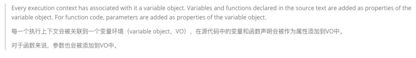
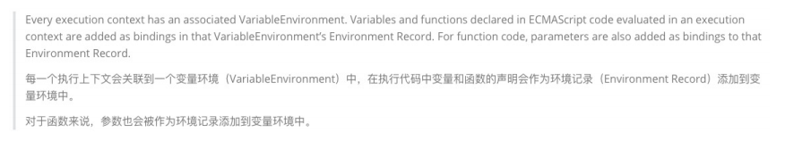
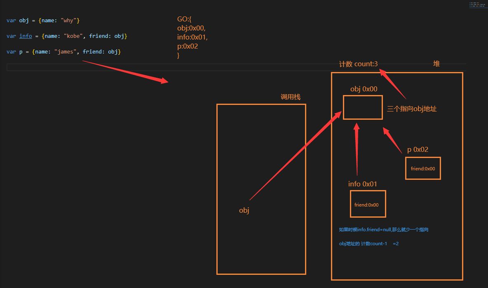
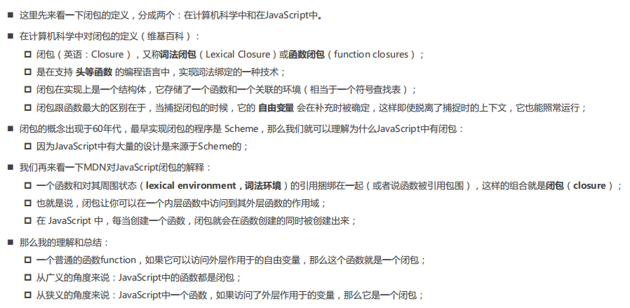
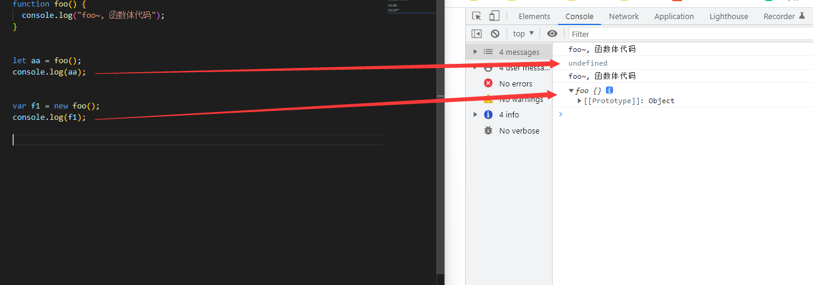
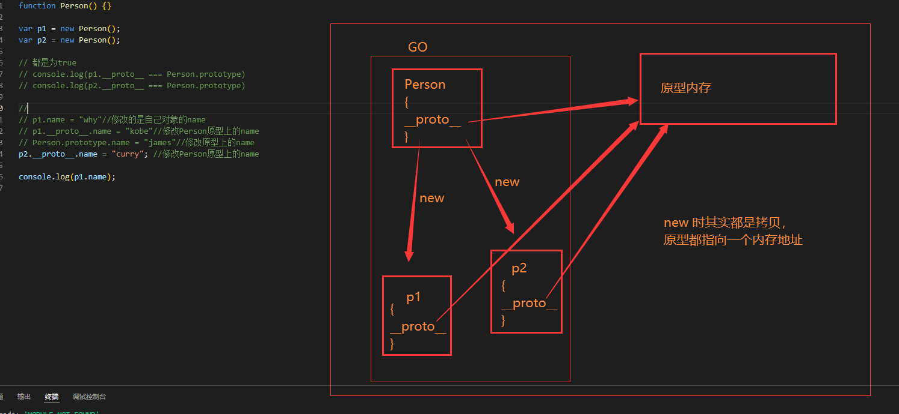
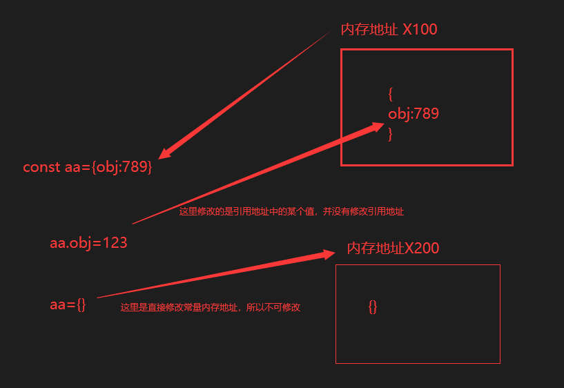
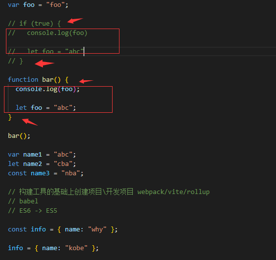

# JavaScript进阶

## 阅读源码的问题

+ 一定不要浮躁
+ 看到后面忘记前面的东西
  + Bookmarks的打标签的工具：ctrl + alt + k 
+ 读完一个函数还是不知道它要干嘛
  + 提高 js 功底
+ debugger


## 一、js执行过程与堆栈


## 二、环境变量与记录(ECMA版本规范)

+ 现在大部分还是再说早期ECMA的版本规范




+ 在最新的ECMA的版本规范中，对于一些词汇进行了修改：



> 整体来说VO对象(variable Object),也就是每次入栈创建的vo对象改了称呼为 "变量环境"


## 三、认识内存管理


**解释说明**：

不管什么样的编程语言，在**代码的执行过程中都是需要给它分配内存**的，不同的是**某些编程语言**需要我们**自己手动**

**的管理内存**，**某些编程语言**会可以**自动帮助我们管理内存**： 

+ 不管以什么样的方式来管理内存，**内存的管理都会有如下的生命周期**：
  + 第一步：分配申请你需要的内存（申请）；
  + 第二步：使用分配的内存（存放一些东西，比如对象等）；
  + 第三步：不需要使用时，对其进行释放；
+ **不同的编程语言对于第一步和第三步会有不同的实现：**
  + 手动管理内存：比如C、C++，包括早期的OC，都是需要手动来管理内存的申请和释放的（malloc和free函数）；
  + 自动管理内存：比如Java、JavaScript、Python、Swift、Dart等，它们有自动帮助我们管理内存；
  + 我们可以知道JavaScript通常情况下是不需要手动来管理的。


### 1、垃圾回收机制 GC (Garbage Collection)

#### 	1.1 引用计数算法

+ 在浏览器内存中的 **变量/函数** 会在自己的 **堆内存地址上** 身上做上标记点，也就是有几个指向他，直到没有指向他的，过段时间浏览器就会删除这块内存




+ 但是引用计数有 一个严重的弊端 **循环引用**，下图这样两个变量互相指定就不会被销毁


#### 	1.2 标记清除算法

+ 这个算法是设置一个根对象（root object），垃圾回收器会定期从这个根开始，找所有从根开始有引用到的对象，对于哪些没有引用到的对象，就认为是不可用的对象；

+ **JS引擎比较广泛的采用的就是标记清除算法**


## 四、函数

### 1、闭包

#### 	1.1 闭包的定义




**个人理解对闭包的定义：**

> 就是一个函数可以访问到外部的函数就称之为 **闭包**。

**闭包与普通函数的区别：**

> 当捕捉闭包的时候，它的 **自由变量** 会在捕捉时被确定，这样即使脱离了捕捉时的上下文，它也能照常运行；


### 2、 闭包的内存泄露

#### 	2.1 闭包内存泄漏的定义

> 指向闭包函数指向变量的堆内存地址所以内存越来越大


### 3、this绑定

#### 	3.1 默认绑定

+ 独立函数调用即为默认绑定

```js
// 默认绑定: 独立函数调用
// 1.案例一:
 function foo() {
   console.log(this); // window
 }

 foo();

// 2.案例二:
function foo1() {
  console.log(this); // window
}

function foo2() {
  console.log(this); // window
  foo1();
}

function foo3() {
  console.log(this); // window
  foo2();
}

foo3();

//3.案例三:
var obj = {
  name: "why",
  foo: function () {
    console.log(this);
  },
};

var bar = obj.foo;
bar(); // window
```

#### 	3.2 隐性绑定

+  object.fn() 这样fn会被隐形绑定this 为 object

```js
// 隐式绑定: object.fn()
// object对象会被js引擎绑定到fn函数的中this里面

// 1.案例一:
var obj = {
  name: "why",
  foo: foo
}

obj.foo() // obj对象

// 2.案例二:
var obj = {
  name: "why",
  eating: function() {
    console.log(this.name + "在吃东西")
  },
  running: function() {
    console.log(obj.name + "在跑步")
  }
}

obj.eating()//why
obj.running()//why

var fn = obj.eating
fn()//独立调用 window


// 3.案例三:
var obj1 = {
  name: "obj1",
  foo: function() {
    console.log(this)
  }
}

var obj2 = {
  name: "obj2",
  bar: obj1.foo
}

obj2.bar()//obj2
```

#### 	3.3 显性绑定

###### 		3.3.1 apply && call

+ 使用

```js
function foo() {
  console.log("函数被调用了", this)
}

//1.foo直接调用和call/apply调用的不同在于this绑定的不同
//foo直接调用指向的是全局对象(window)
foo()

var obj = {
  name: "obj"
}

//call/apply是可以指定this的绑定对象
foo.call(obj)//obj
foo.apply(obj) //obj
foo.apply("aaaa")//aaaa
```

+ 区别

```js
// 2.call和apply有什么区别?
function sum(num1, num2, num3) {
  console.log(num1 + num2 + num3, this)
}

sum.call("call", 20, 30, 40)
sum.apply("apply", [20, 30, 40])//将后边的数组展开放在形参中

// 3.call和apply在执行函数时,是可以明确的绑定this, 这个绑定规则称之为显示绑定
```

###### 		3.3.2 bind

+ 先接收为函数，后使用bind 绑定

```js
function foo() {
  console.log(this)
}

var newFoo = foo.bind("aaa")//aaa
```

###### 		3.3.3 new 绑定

```js
// 我们通过一个new关键字调用一个函数时(构造器), 这个时候this是在调用这个构造器时创建出来的对象
// this = 创建出来的对象
// 这个绑定过程就是new 绑定

function Person(name, age) {
  this.name = name;
  this.age = age;
}

var p1 = new Person("why", 18);
console.log(p1.name, p1.age);//why 18
console.log(p1);//Person {name: 'why', age: 18}

var p2 = new Person("kobe", 30);
console.log(p2.name, p2.age);//kobe 30
```

#### 	3.4 this绑定规则优先级

> new绑定 > 显示绑定(apply/call/bind) > 隐式绑定(obj.foo()) > 默认绑定(独立函数调用)

### 4、call，apply，bind函数实现

#### 4.1 call 函数实现

```js
//call 函数js实现(听说源代码中是C++写的这个方法)
// 前言：
// call函数有多个参数，第一个参数为this，其他参数为自定义需要使用的参数
// call(this,10,20,30)
//let result = call(this,10,20,30)

function foo() {
  console.log("foo函数被执行", this);
}

function sum(num1, num2) {
  console.log("sum函数被执行", this, num1, num2);
  return num1 + num2;
}

// 系统的函数的call方法
// foo.call();
// var result = sum.call({}, 20, 30);

//需要给所有的Function的原型 加上需要添加的属性/方法
// arg:arguments
// ...args 表示传入的剩余参数
Function.prototype.pzcall = function (thisArg, ...args) {
  //1.获取需要执行的代码
  //因为call函数是foo.pzcall()这样使用,索引pzcall会有一个隐形绑定this，指向的就是foo函数
  let fn = this;

  //2.将thisArg转为对象类型
  //将thisArg重新赋值，处理边界行为(没传就使用window)
  thisArg = thisArg !== undefined && thisArg !== null ? Object(thisArg) : window;

  //3.调用需要执行的代码
  // 在传入的this中赋值一个需要执行的函数并返回出去
  thisArg.fn = fn;
  let result = thisArg.fn(...args); //执行代码并接收返回值
  delete thisArg.fn;

  //4.将处理后的函数返回值
  return result;
};

foo.pzcall(undefined);
var result = sum.pzcall("abc", 20, 30);
console.log("pzcall的调用:", result);

```

#### 4.2 apply 函数实现

```js
//apply 函数js实现(听说源代码中是C++写的这个方法)
// 前言：
// apply有两个参数，第一个为this，第二个为数组，数组中可以放置多个参数
//foo.apply(this, [1]);
//let result =  foo.apply(this, [1,2]);

function sum(num1, num2) {
  console.log("sum被调用", this, num1, num2);
  return num1 + num2;
}

function foo(num) {
  console.log(this, num);
  return num;
}

function bar() {
  console.log("bar函数被执行", this);
}

// 系统调用
// foo.apply("foo", [1]);
// var result = sum.apply("sum", [10, 20]);
// console.log(result);

// var result = foo.apply("foo", [1]);
// console.log(result);

Function.prototype.pzapply = function (thisArg, argArray) {
  //1.获取需要执行的代码
  let fn = this;

  //2.将thisArg转为对象类型
  //将thisArg重新赋值，处理边界行为(没传就使用window)
  thisArg = thisArg !== undefined && thisArg !== null ? Object(thisArg) : window;

  //3.调用需要执行的代码
  // 在传入的this中赋值一个需要执行的函数并返回出去
  thisArg.fn = fn;
  let result;
  argArray = argArray || [];
  result = thisArg.fn(...argArray); //结构数组调用
  delete thisArg.fn;

  //4.将处理后的函数返回值
  return result;
};

// 自己实现的调用
// foo.pzapply("foo", [1]);

var result = sum.apply("sum", [10, 20]);
console.log(result);

// var result = foo.apply("foo", [1]);
// console.log(result);

```

#### 4.2 bind函数实现

```js
//bind 函数js实现(听说源代码中是C++写的这个方法)
// 前言：
// bind有多个参数，第一个为this，其他参数为自定义需要使用的参数
// bar = foo.bind("abc",10,20);
// result = bar(30,40)

function foo() {
  console.log("foo被执行", this);
  return 20;
}

function sum(num1, num2, num3, num4) {
  console.log(num1, num2, num3, num4);
  return "我是返回的";
}

// 系统的bind使用
// var bar = foo.bind("abc");
// bar();

// var newSum = sum.bind("aaa", 10, 20, 30, 40)
// newSum()

// var newSum = sum.bind("aaa")
// newSum(10, 20, 30, 40)

var newSum = sum.bind("aaa", 10);
newSum(20, 30, 40); //10 20 30 40

//需要给所有的Function的原型 加上需要添加的属性/方法
// arg:arguments
// ...argArray 为赋值函数的参数
Function.prototype.pzbind = function (thisArg, ...argArray) {
  // 1.获取到真实需要调用的函数
  let fn = this;

  //2.将thisArg转为对象类型
  //将thisArg重新赋值，处理边界行为(没传就使用window)
  thisArg = thisArg !== undefined && thisArg !== null ? Object(thisArg) : window;
  // ...args 为使用函数的参数
  function proxyFn(...args) {
    // 3.将函数放到thisArg中进行调用
    thisArg.fn = fn;
    // 特殊: 对两个传入的参数进行合并
    var finalArgs = [...argArray, ...args];
    var result = thisArg.fn(...finalArgs);
    delete thisArg.fn;

    // 4.返回结果
    return result;
  }

  return proxyFn;
};

// 使用自己定义的bind

let sum1 = sum.pzbind("789", 10, 20);
let result = sum1(30, 40); //10 20 30 40
console.log(result); //123

```

### 5、认识arguments

#### 5.1 arguments定义

+ **arguments** 是一个 对应于 **传递给函数的参数** 的 **类数组(array-like)对象**。
+ array-like意味着它不是一个数组类型，而是一个对象类型：
  + 但是它却拥有数组的一些特性，比如说length，比如可以通过index索引来访问；
  + 但是它却没有数组的一些方法，比如forEach、map等；

#### 5.2 arguments基本使用

```js
function foo(num1, num2, num3) {
  // 类数组对象中(长的像是一个数组, 本质上是一个对象): arguments
  console.log(arguments);

  // 常见的对arguments的操作是三个
  // 1.获取参数的长度
  console.log(arguments.length);

  // 2.根据索引值获取某一个参
  console.log(arguments[2]);
  console.log(arguments[3]);
  console.log(arguments[4]);

  // 3.callee获取当前arguments所在的函数
  console.log(arguments.callee);
  // arguments.callee()//如果这样调用本身函数那么就会形成无线递归调用，会把浏览器累的骂娘的
}

foo(10, 20, 30, 40, 50);

```

#### 5.3 arguments转成Array

```js
function foo(num1, num2) {
  // 1.自己遍历
  // var newArr = []
  // for (var i = 0; i < arguments.length; i++) {
  //   newArr.push(arguments[i] * 10)
  // }
  // console.log(newArr)

  // 2.arguments转成array类型
  // 2.1.自己遍历arguments中所有的元素

  // 2.2.Array.prototype.slice将arguments转成array
   //利用数组的slice(数组截取)将 arguments 转成数组
  var newArr2 = Array.prototype.slice.call(arguments)
  console.log(newArr2)

  var newArr3 = [].slice.call(arguments)
  console.log(newArr3)

  // 2.3.ES6的语法
  var newArr4 = Array.from(arguments)
  console.log(newArr4)
  var newArr5 = [...arguments]
  console.log(newArr5)
}

foo(10, 20, 30, 40, 50)

// 额外补充的知识点: Array中的slice实现
// Array.prototype.hyslice = function(start, end) {
//   var arr = this
//   start = start || 0
//   end = end || arr.length
//   var newArray = []
//   for (var i = start; i < end; i++) {
//     newArray.push(arr[i])
//   }
//   return newArray
// }

// var newArray = Array.prototype.hyslice.call(["aaaa", "bbb", "cccc"], 1, 3)
// console.log(newArray)

// var names = ["aaa", "bbb", "ccc", "ddd"]
// names.slice(1, 3)


```

#### 5.4 箭头函数中没有arguments

+ 在箭头函数中并没有 **arguments** 
  + 如果在箭头函数中使用 **arguments** 那么箭头函数就会去上层作用域中寻找
+ 箭头函数使用

```js
var foo = () => {
  console.log(arguments) #arguments is not defined
}
foo()
```

+ 箭头函数去上级作用域查找

```js
function foo() {
  var bar = () => {
    console.log(arguments) //arguments [123,callee]
  }
  return bar
}

var fn = foo(123)
fn()
```

### 6、纯函数

#### 6.1 纯函数的定义

+ 确定的输入，一定会产生确定的输出
+ 函数在执行过程中，不能产生副作用；

```js
// 1.相同的输入一定产生相同的输出
// 2.在执行的过程中不会产生任何的副作用
function foo(num1, num2) {
  return num1 * 2 + num2 * num2
}
```


#### 6.2 副作用的定义

+ 副作用指的是调用一个函数，而这个函数把外部的变量修改了，这就称之为 **函数的副作用** 

```js
// 这个bar不是一个纯函数, 因为它修改了外界的变量
var name = "abc" 
function bar() {
  console.log("bar其他的代码执行")
  name = "cba"
}

bar()
// 这里边的baz也不是一个纯函数, 因为传入的值被修改了
function baz(info) {
  info.age = 100
}

var obj = {name: "why", age: 18}
baz(obj)
console.log(obj)
```


### 7、javaScript 柯里化

#### 7.1 柯里化的定义

+ 只传递给函数一部分参数来调用它，让它返回一个函数去处理剩余的参数； 
+ 这个过程就称之为柯里化；

```js
//这个函数的过程就称之为柯里化
function sum1(x) {
  return function(y) {
    return function(z) {
      return x + y + z
    }
  }
}

var result1 = sum1(10)(20)(30)
console.log(result1)


// 简化柯里化的代码
var sum2 = x => y => z => {
  return x + y + z
}

console.log(sum2(10)(20)(30))
```


### 8、组合函数

#### 8.1 组合函数的定义

+ 将两个函数或多个组合起来使用就叫组合函数

```js
function double(num) {
  return num * 2;
}

function square(num) {
  return num ** 2;
}

var count = 10;
var result = square(double(count));
console.log(result);

// 实现最简单的组合函数
function composeFn(m, n) {
  return function (count) {
    return n(m(count));
  };
}

var newFn = composeFn(double, square);
console.log(newFn(10));
```


+ 复杂通用函数

```js
function hyCompose(...fns) {
  var length = fns.length//拿到函数的参数长度
  for (var i = 0; i < length; i++) {
    if (typeof fns[i] !== 'function') {//如果某一个不为函数抛错
      throw new TypeError("Expected arguments are functions")
    }
  }

  function compose(...args) {
    var index = 0
    var result = length ? fns[index].apply(this, args): args
    while(++index < length) {
      result = fns[index].call(this, result)
    }
    return result
  }
  return compose
}

function double(m) {
  return m * 2
}

function square(n) {
  return n ** 2
}

var newFn = hyCompose(double, square)
console.log(newFn(10))

```


## 五、Js面向对象

### 1、对象的认识

#### 	1.1 对象的基本使用


**创建对象的方式**

+ 通过 new Object() 创建

```js
var obj = new Object();
obj.name = "why";
obj.age = 18;
obj.height = 1.88;
obj.running = function () {
  console.log(this.name + "在跑步~");
};
```

+ 通过字面量的方式去创建

```js
var info = {
  name: "kobe",
  age: 40,
  height: 1.98,
  eating: function () {
    console.log(this.name + "在吃东西~");
  },
};
```


#### 	1.2 描述符


**相关API**

+  [defineProperty](https://developer.mozilla.org/zh-CN/docs/Web/JavaScript/Reference/Global_Objects/Object/defineProperty) 单一属性描述符
+ [defineProperties](https://developer.mozilla.org/zh-CN/docs/Web/JavaScript/Reference/Global_Objects/Object/defineProperties)  多个属性描述符
+ [getOwnPropertyDescriptor](https://developer.mozilla.org/zh-CN/docs/Web/JavaScript/Reference/Global_Objects/Object/getOwnPropertyDescriptor) 获取某一个特性属性的属性描述符
+ [getOwnPropertyDescriptors](https://developer.mozilla.org/zh-CN/docs/Web/JavaScript/Reference/Global_Objects/Object/getOwnPropertyDescriptors) 获取对象的所有属性描述符


##### 			1.2.1 数据属性描述符

```js
// name和age虽然没有使用属性描述符来定义, 但是它们也是具备对应的特性的
// value: 赋值的value
// configurable: true
// enumerable: true
// writable: true
var obj = {
  name: "why",
  age: 18,
};

// 数据属性描述符
// 用了属性描述符, 那么会有默认的特性
Object.defineProperty(obj, "address", {
  // 很多配置
  // value: "北京市", // 默认值undefined
  // 该特殊不可删除/也不可以重新定义属性描述符
  // configurable: false, // 默认值false
  // // 该特殊是配置对应的属性(address)是否是可以枚举
  // enumerable: true, // 默认值false
  // // 该特性是属性是否是可以赋值(写入值)
  // writable: false // 默认值false
});

// 测试configurable的作用
// delete obj.name
// console.log(obj.name)
// delete obj.address
// console.log(obj.address)

// Object.defineProperty(obj, "address", {
//   value: "广州市",
//   configurable: true
// })

// 测试enumerable的作用
console.log(obj);
for (var key in obj) {
  console.log(key);
}
console.log(Object.keys(obj));

// 测试Writable的作用
// obj.address = "上海市"
// console.log(obj.address)

```


##### 			1.2.2 存取属性描述符

```js
var obj = {
  name: "why",
  age: 18,
  _address: "北京市", //作为一个 '伪装' 值
};

// 存取属性描述符
// 1.隐藏某一个私有属性被希望直接被外界使用和赋值
// 2.如果我们希望截获某一个属性它访问和设置值的过程时, 也会使用存储属性描述符
Object.defineProperty(obj, "address", {
  enumerable: true,
  configurable: true,
  get: function () {
    foo();
    return this._address;
  },
  set: function (value) {
    bar();
    this._address = value;
  },
});

console.log(obj.address);//北京市

obj.address = "上海市";
console.log(obj.address);//上海市

function foo() {
  console.log("获取了一次address的值");
}

function bar() {
  console.log("设置了addres的值");
}

```

##### 1.2.3 定义多个属性描述符

```js
var obj = {
  // 私有属性(js里面是没有严格意义的私有属性)
  _age: 18,
  _eating: function () {},
  set age(value) {
    this._age = value;
  },
  get age() {
    return this._age;
  },
};

// defineProperties 可给对象定义多个属性描述符
Object.defineProperties(obj, {
  name: {
    // 该特殊不可删除/也不可以重新定义属性描述符
    configurable: true,
    // 是否可以枚举
    enumerable: true,
    //是否是可以赋值(写入值)
    writable: true,
    value: "why",
  },
  age: {
    configurable: true,
    enumerable: true,
    get: function () {
      return this._age;
    },
    set: function (value) {
      this._age = value;
    },
  },
});

obj.age = 19;
console.log(obj.age);

console.log(obj);

```

##### 1.2.4 获取属性描述符

```js
var obj = {
  // 私有属性(js里面是没有严格意义的私有属性)
  _age: 18,
  _eating: function() {}
}

Object.defineProperties(obj, {
  name: {
    configurable: true,
    enumerable: true,
    writable: true,
    value: "why"
  },
  age: {
    configurable: true,
    enumerable: true,
    get: function() {
      return this._age
    },
    set: function(value) {
      this._age = value
    }
  }
})

// 获取某一个特性属性的属性描述符
console.log(Object.getOwnPropertyDescriptor(obj, "name"))
console.log(Object.getOwnPropertyDescriptor(obj, "age"))

// 获取对象的所有属性描述符
console.log(Object.getOwnPropertyDescriptors(obj))


```


### 2、对象的一些操作

**不常用**

```js
var obj = {
  name: 'why',
  age: 18
}

// 1.禁止对象继续添加新的属性
Object.preventExtensions(obj)
// 2.禁止对象配置/删除里面的属性
Object.seal(obj)

delete obj.name
console.log(obj.name)//依然存在

// 3.让属性不可以修改(writable: false)
Object.freeze(obj)

obj.name = "kobe"
console.log(obj.name)//依然还是why
```


### 3、构造函数

#### 3.1.1 认识构造函数

+ 定义：

> 通过new关键字去调用一个函数, 那么这个函数就是一个构造函数了


+ 普通调用函数与new一个函数有什么区别呢？

> 通过new出来的函数可以接收到函数体




#### 3.1.2 new关键字的执行

+ 如果一个函数被使用new操作符调用了，那么它会依次执行如下操作：
  + 在内存中创建一个新的对象（空对象）；
  + 这个对象内部的[[prototype]]属性会被赋值为该构造函数的prototype属性；
  + 构造函数内部的this，会指向创建出来的新对象；
  +  执行函数的内部代码（函数体代码）；
  +  如果构造函数没有返回非空对象，则返回创建出来的新对象；


#### 3.1.3 构造函数的使用


##### 3.1.3.1 创建对象的方案

```js
// 规范: 构造函数的首字母一般是大写
function Person(name, age, height, address) {
  this.name = name
  this.age = age
  this.height = height
  this.address = address

  this.eating = function() {
    console.log(this.name + "在吃东西~")
  }

  this.running = function() {
    console.log(this.name + "在跑步")
  }
}


var p1 = new Person("张三", 18, 1.88, "广州市")
var p2 = new Person("李四", 20, 1.98, "北京市")

console.log(p1)
console.log(p2)
p1.eating()
p2.eating()
```

##### 3.1.3.2 构造函数的缺点

+ 在构造函数中每次new一个函数，都会将函数中的函数重新创建一遍，**如果数量过大就会有一些被占用，而这些空间被占用是没必要的**

```js
function foo() {
  function bar() {}//这里会被重新创建所以两个new函数不相等
  return bar;
}

var fn1 = foo();
var fn2 = foo();

console.log(fn1 === fn2);//false

```


### 4、对象的原型

#### 4.1 隐式原型


##### 4.1.1 基础知识

> 我们每个对象中都有一个 [[prototype]], 这个属性可以称之为对象的原型(隐式原型)

+ 如何去查看一个对象的 **prototype** 


**第一种方法 ** 

> 早期在浏览器中提供了一个方法叫做 **__ proto __**  (既然是浏览器提供，那么就一定会有兼容问题)

```js
var obj = { name: "why" }; // [[prototype]]
var info = {}; // [[prototype]]

// __proto__
 console.log(obj.__proto__) // {}
 console.log(info.__proto__) // {}
```

**第二种方法**  

> es5 之后提供了 API **getPrototypeOf** 来获取一个对象的原型

```js
 console.log(Object.getPrototypeOf(obj))
```

+ 原型的作用

```js
// 当我们从一个对象中获取某一个属性时, 它会触发 [[get]] 操作
// 1. 在当前对象中去查找对应的属性, 如果找到就直接使用
// 2. 如果没有找到, 那么会沿着它的原型去查找 [[prototype]]
// obj.age = 18
obj.__proto__.age = 18;

console.log(obj.age);//18
```


#### 4.2 显式原型

+ 箭头函数没有显式原型

> 函数也是一个对象
>
> 函数作为对象来说, 它也是有[[prototype]] 隐式原型
>
> 但是因为它是一个函数, 所以它还会多出来一个显示原型属性: prototype

```js
function foo() {}

console.log(foo.prototype);

var f1 = new foo();
var f2 = new foo();

console.log(f1.__proto__ === foo.prototype);//true
console.log(f2.__proto__ === foo.prototype);//true

```


##### 4.2.1 构造函数原型在内存中的样子




上图代码

```js
function Person() {}

var p1 = new Person();
var p2 = new Person();

// 都是为true
// console.log(p1.__proto__ === Person.prototype)
// console.log(p2.__proto__ === Person.prototype)

//
// p1.name = "why"//修改的是自己对象的name
// p1.__proto__.name = "kobe"//修改Person原型上的name
// Person.prototype.name = "james"//修改原型上的name
p2.__proto__.name = "curry"; //修改Person原型上的name

console.log(p1.name); //curry

```


##### 4.2.2 函数原型上的属性


```js
function foo() {}

// 1.constructor属性
// foo.prototype这个对象中有一个constructor属性
// console.log(foo.prototype)
// console.log(Object.getOwnPropertyDescriptors(foo.prototype))

//使用属性描述符
// Object.defineProperty(foo.prototype, "constructor", {
//   enumerable: true,
//   configurable: true,
//   writable: true,
//   value: "哈哈哈哈"
// })

// console.log(foo.prototype)

// prototype.constructor = 构造函数本身
// console.log(foo.prototype.constructor) // [Function: foo]
// console.log(foo.prototype.constructor.name)

// console.log(foo.prototype.constructor.prototype.constructor.prototype.constructor)

// 2.我们也可以添加自己的属性
// foo.prototype.name = "why"
// foo.prototype.age = 18
// foo.prototype.height = 18
// foo.prototype.eating = function() {

// }

var f1 = new foo();
console.log(f1.name, f1.age);

// 3.直接修改整个prototype对象
foo.prototype = {
  //但是自己修改的prototype中没有constructor
  // constructor: foo,
  name: "why",
  age: 18,
  height: 1.88,
};

var f1 = new foo();

console.log(f1.name, f1.age, f1.height);

// 真实开发中我们可以通过Object.defineProperty方式添加constructor
Object.defineProperty(foo.prototype, "constructor", {
  enumerable: false,
  configurable: true,
  writable: true,
  value: foo,
});

```

+ 原型和构造函数 创建对象

```js
function Person(name, age, height, address) {
  this.name = name
  this.age = age
  this.height = height
  this.address = address
}

Person.prototype.eating = function() {
  console.log(this.name + "在吃东西~")//这里的this指向的隐形绑定
}

Person.prototype.running = function() {
  console.log(this.name + "在跑步~")//这里的this指向的隐形绑定
}

var p1 = new Person("why", 18, 1.88, "北京市")
var p2 = new Person("kobe", 20, 1.98, "洛杉矶市")

p1.eating()
p2.eating()


```


#### 4.3  JavaScript 原型链


### 5、面向对象

#### 5.1.1 面向对象的三大特性

##### 封装、继承、多态


##### 5.1.1.1 封装

> 我们前面将属性和方法封装到一个类中，可以称之为封装的过程


##### 5.1.1.2 继承

> 继承是面向对象中非常重要的，不仅仅可以减少重复代码的数量，也是多态前提（纯面向对象中）


##### 5.1.1.3 多态

>当对不同的数据类型执行同一个操作时, 如果表现出来的行为(形态)不一样, 那么就是多态的体现

+ 多态的前提是继承


### 5.2 类 class


#### 5.2.1 构造方法

+ 构造函数做的事情

>1.在内存中创建一个对象 moni = {}
>2.将类的原型prototype赋值给创建出来的对象 moni.__proto__ = Person.prototype
>3.将对象赋值给函数的this: new绑定 this = moni
>4.执行函数体中的代码
>5.自动返回创建出来的对象

```js
// 类的声明
class Person {
  // 类的构造方法
  // 注意: 一个类只能有一个构造函数
  // 1.在内存中创建一个对象 moni = {}
  // 2.将类的原型prototype赋值给创建出来的对象 moni.__proto__ = Person.prototype
  // 3.将对象赋值给函数的this: new绑定 this = moni
  // 4.执行函数体中的代码
  // 5.自动返回创建出来的对象
  constructor(name, age) {
    this.name = name
    this.age = age
  }
}


var p1 = new Person("why", 18)
var p2 = new Person("kobe", 30)
console.log(p1, p2)


```

#### 5.2.2 类方法定义


```js
var names = ["abc", "cba", "nba"]

class Person {
  constructor(name, age) {
    this.name = name
    this.age = age
    this._address = "广州市"
  }

  // 普通的实例方法
  // 创建出来的对象进行访问
  // var p = new Person()
  // p.eating()
  eating() {
    console.log(this.name + " eating~")
  }

  running() {
    console.log(this.name + " running~")
  }

  // 类的访问器方法
  get address() {
    console.log("拦截访问操作")
    return this._address
  }

  set address(newAddress) {
    console.log("拦截设置操作")
    this._address = newAddress
  }

  // 类的静态方法(类方法)
  // Person.createPerson()
  static randomPerson() {
    var nameIndex = Math.floor(Math.random() * names.length)
    var name = names[nameIndex]
    var age = Math.floor(Math.random() * 100)
    return new Person(name, age)
  }
}

var p = new Person("why", 18)
p.eating()
p.running()

console.log(p.address)
p.address = "北京市"
console.log(p.address)

// console.log(Object.getOwnPropertyDescriptors(Person.prototype))

for (var i = 0; i < 50; i++) {
  console.log(Person.randomPerson())
}

```

#### 5.2.3 类的继承 extends


```js
class Person {
  constructor(name, age) {
    this.name = name
    this.age = age
  }

  running() {
    console.log(this.name + " running~")
  }

  eating() {
    console.log(this.name + " eating~")
  }

  personMethod() {
    console.log("处理逻辑1")
    console.log("处理逻辑2")
    console.log("处理逻辑3")
  }

  static staticMethod() {
    console.log("PersonStaticMethod")
  }
}

// Student称之为子类(派生类)
class Student extends Person {
  // JS引擎在解析子类的时候就有要求, 如果我们有实现继承
  // 那么子类的构造方法中, 在使用this之前
  constructor(name, age, sno) {
    super(name, age)
    this.sno = sno
  }

  studying() {
    console.log(this.name + " studying~")
  }

  // 类对父类的方法的重写
  running() {
    console.log("student " + this.name + " running")
  }

  // 重写personMethod方法
  personMethod() {
    // 复用父类中的处理逻辑
    super.personMethod()

    console.log("处理逻辑4")
    console.log("处理逻辑5")
    console.log("处理逻辑6")
  }

  // 重写静态方法
  static staticMethod() {
    super.staticMethod()
    console.log("StudentStaticMethod")
  }
}

var stu = new Student("why", 18, 111)
console.log(stu)

// console.log(Object.getOwnPropertyDescriptors(stu.__proto__))
// console.log(Object.getOwnPropertyDescriptors(stu.__proto__.__proto__))

stu.eating()
stu.running()

stu.personMethod()

Student.staticMethod()

console.log(Object.getOwnPropertyDescriptors(Person))


```


## 六、Es6-12


### 6.1 Es6 (ES2015)


#### 6.1.1 语法糖与增强缩写


##### 6.1.1.1 es6字面量增强写法

```js
var name = "why";
var age = 18;

var obj = {
  // 1.property shorthand(属性的简写)
  name,//name:name 语法糖
  age,

  // 2.method shorthand(方法的简写)
  foo: function () {
    console.log(this);//obj
  },
  bar() {//function语法糖
    console.log(this);//obj
  },
  baz: () => {
    console.log(this);//window   node中为{}
  },

  // 3.computed property name(计算属性名)
  [name + 123]: "hehehehe",
};

obj.baz();
obj.bar();
obj.foo();

// obj[name + 123] = "hahaha"
console.log(obj);
console.log(obj["why123"]);//hehehehe

```


#### 6.1.2 解构


##### 6.1.2.1 数组的解构

```js
var names = ["abc", "cba", "nba"];
// 转换成es5的做法
// var item1 = names[0]
// var item2 = names[1]
// var item3 = names[2]

// 对数组的解构: []
var [item1, item2, item3] = names;
console.log(item1, item2, item3);

// 解构后面的元素
var [, , itemz] = names;
console.log(itemz); //'nba'

// 解构出一个元素,后面的元素放到一个新数组中
var [itemx, ...newNames] = names;
console.log(itemx, newNames); //abc ['cba','nba]

// 解构的默认值
var [itema, itemb, itemc, itemd = "789"] = names;
console.log(itemd); //789

```

##### 6.1.2.2 对象的解构

```js
var obj = {
  name: "why",
  age: 18,
  height: 1.88,
};

// 对象的解构: {}
// 根据键来找到指定值
var { name, age, height } = obj;
console.log(name, age, height); //'why',18,1.88

var { age } = obj;
console.log(age); //18

//将键解构出来重新命名
var { name: newName } = obj;
console.log(newName); //why

var { address: newAddress = "广州市" } = obj;
console.log(newAddress); //广州市

function foo(info) {
  console.log(info.name, info.age);
}

foo(obj);

function bar({ name, age }) {
  console.log(name, age); //'why',18
}

bar(obj);

```

#### 6.1.3 常用语法

##### 6.1.3.1 || 与 ?? 区别

> 双竖杠||，只要前面的值转为布尔值为false时，就取后面，否则取前面，如undefined、null、false、空字符串和数值0

> 双问号则为：前面的值为null、undefined，则取后面的值，否则都取前面的值

+ 双问号??更加适合在不知道变量是否定义时，或者是否赋值时的场景来使用。


##### 6.1.3.2 标签模板字符串

```js
// 第一个参数依然是模块字符串中整个字符串, 只是被切成多块,放到了一个数组中
// 第二个参数是模块字符串中, 第一个 ${}
function foo(m, n, x) {
  console.log(m, n, x, "---------");
}

// foo("Hello", "World")

// 另外调用函数的方式: 标签模块字符串
// foo``

// foo`Hello World`//[ 'Hello', 'Wo' ] 
const name = "why";
const age = 18;
// ['Hello', 'Wo', 'rld']
foo`Hello${name}Wo${age}rld`; //[ 'Hello', 'Wo', 'rld' ] why 18 ---------

```

##### 6.1.3.3 函数中的默认参数

**注意：**

+ 如果有默认值，应该放在最后
+ 在有默认值的函数中，重第一个默认值开始，以后的函数 **length** 就不算了

```js
// ES5以及之前给参数默认值
/**
 * 缺点:
 *  1.写起来很麻烦, 并且代码的阅读性是比较差
 *  2.这种写法是有bug
 */
// function foo(m, n) {
//   m = m || "aaa"
//   n = n || "bbb"

//   console.log(m, n)
// }

// 1.ES6可以给函数参数提供默认值
function foo(m = "aaa", n = "bbb") {
  console.log(m, n);
}

// foo()
foo(0, ""); //0 ''

// 2.对象参数和默认值以及解构
function printInfo({ name, age } = { name: "why", age: 18 }) {
  console.log(name, age);
}

printInfo({ name: "kobe", age: 40 }); //kobe 40

// 另外一种写法
function printInfo1({ name = "why", age = 18 } = {}) {
  console.log(name, age);
}

printInfo1(); //why 18

// 3.有默认值的形参最好放到最后
function bar(x, y, z = 30) {
  console.log(x, y, z);
}

// bar(10, 20)
bar(undefined, 10, 20);

// 4.有默认值的函数的length属性
function baz(x, y, z, m, n = 30) {
  console.log(x, y, z, m, n);
}

console.log(baz.length);

```

##### 6.1.3.4 函数中的剩余参数

**剩余参数和arguments有什么区别呢？**

+ 剩余参数只包含那些没有对应形参的实参，而 arguments 对象包含了传给函数的所有实参（所有的参数都会放在这里）

+ arguments对象不是一个真正的数组，而 **rest(剩余)** 参数是一个真正的数组，可以进行数组的所有操作

+ arguments是早期的ECMAScript中为了方便去获取所有的参数提供的一个数据结构，而rest参数是ES6中提供 

  并且希望以此来替代arguments的

```js
// ...args不可以放在第一个
// function foo(...args, m, n) {
//   console.log(m, n)
//   console.log(args)

//   console.log(arguments)//这里包含所有参数
// }

// foo(20, 30, 40, 50, 60)

// rest paramaters必须放到最后
// Rest parameter must be last formal parameter(Rest参数必须是最后一个形参)//否则报错
function foo(m, n = m + 1) {
  console.log(m, n);
}

foo(10);

```

##### 6.1.3.5 展开运算符

**基本使用**

```js
const names = ["abc", "cba", "nba"];
const name = "why";
const info = { name: "why", age: 18 };

// 1.函数调用时
function foo(x, y, z) {
  console.log(x, y, z);
}

// foo.apply(null, names)
foo(...names); ///abc cba nba
foo(...name); //w h y

// 2.构造数组时
const newNames = [...names, ...name];
console.log(newNames); //[ 'abc', 'cba', 'nba', 'w', 'h', 'y' ]

// 3.构建对象字面量时ES2018(ES9)
const obj = { ...info, address: "广州市", ...names };

console.log(obj);
// {
//   '0': 'abc',
//   '1': 'cba',
//   '2': 'nba',
//   name: 'why',
//   age: 18,
//   address: '广州市'
// }

```

**展开运算符其实是一个浅拷贝**

+ 对象中的 friend 其实是使用的一个内存地址

```js
const info = {
  name: "why",
  friend: { name: "kobe" },
};

const obj = { ...info, name: "coderwhy" };
// console.log(obj)
obj.friend.name = "james";

console.log(info.friend.name); //james

```


##### 6.1.3.6 数值的显示

**数值过大可用 _ 链接（es12）**

```js
const num1 = 100 // 十进制

// b -> binary
const num2 = 0b100 // 二进制
// o -> octonary
const num3 = 0o100 // 八进制
// x -> hexadecimal
const num4 = 0x100 // 十六进制

console.log(num1, num2, num3, num4)

// 大的数值的连接符(ES2021 ES12)
const num = 10_000_000_000_000_000
console.log(num)//10000000000000000

```

##### 6.1.3.7 Symbol的基本使用方式


###### 6.1.3.7.1 Symbol 每次都会创建一个唯一的key

**可用来解决对象中重复的键**

```js
const s1 = Symbol();
const s2 = Symbol();

console.log(s1 === s2);//false
```

###### 6.1.3.7.2 Symbol值作为key，在定义对象字面量时使用

**description 可以拿到里边的值**

```js
// ES2019(ES10)中, Symbol还有一个描述(description)
const s3 = Symbol("aaa");
console.log(s3.description);//aaa

// 3.Symbol值作为key
// 3.1.在定义对象字面量时使用
const obj = {
  [s1]: "abc",
  [s2]: "cba",
};

// 3.2.新增属性
obj[s3] = "nba";
```

###### 6.1.3.7.3 获取对象中的 Symbol

**赋值给对象中获取使用，指定的Symbol的变量值获取 (obj[s1])**

```js
// 3.Symbol值作为key
// 3.1.在定义对象字面量时使用
const obj = {
  [s1]: "abc",
  [s2]: "cba",
};

// 3.2.新增属性
obj[s3] = "nba";

// 3.3.Object.defineProperty方式
const s4 = Symbol();
Object.defineProperty(obj, s4, {
  enumerable: true,
  configurable: true,
  writable: true,
  value: "mba",
});

console.log(obj[s1], obj[s2], obj[s3], obj[s4]);
// 注意: 不能通过.语法获取
// console.log(obj.s1)
```

###### 6.1.3.7.4 遍历对象中的Symbol Key

**遍历 Object 中 Symbol Key**

```js
// 4.使用Symbol作为key的属性名,在遍历/Object.keys等中是获取不到这些Symbol值
// 需要Object.getOwnPropertySymbols来获取所有Symbol的key
console.log(Object.keys(obj)); //[]
console.log(Object.getOwnPropertyNames(obj)); //[]
console.log(Object.getOwnPropertySymbols(obj)); //[]
const sKeys = Object.getOwnPropertySymbols(obj);
for (const sKey of sKeys) {
  console.log(obj[sKey]);
}
```

###### 6.1.3.7.5 Symbol 创建相同数据

**Symbol** 创建相同数据并获取

```js
// 5.Symbol.for(key)/Symbol.keyFor(symbol)
// 使用Symbol.for 可以创建一个相同的数据
// 使用Symbol.keyFor 可以获取Symbol.for创建的数据
const sa = Symbol.for("aaa");
const sb = Symbol.for("aaa");
console.log(sa === sb); //true

const key = Symbol.keyFor(sa);
console.log(key); //aaa
const sc = Symbol.for(key);
console.log(sa === sc); //true
```


#### 6.1.3.8 数据结构 

##### 6.1.3.8.1 set

**set的常用方法**

+ add(value)
  + 添加某个元素，返回Set对象本身
+ delete(value)
  + 从set中删除和这个值相等的元素，返回boolean类型
+ has(value)
  + 判断set中是否存在某个元素，返回boolean类型
+ clear()
  + 清空set中所有的元素，没有返回值
+ forEach(callback, [, thisArg])
  + 通过forEach遍历set

**另外Set是支持for of的遍历的。**


+ set 数据结构 不允许存在相同的值

```js
// 1.创建Set结构
const set = new Set();
set.add(10);
set.add(20);
set.add(40);
set.add(333);

set.add(10); //set中不可以重复 {10,20,40,333}

```

+ set 添加多个对象是可以重复的 
  + 因为对象引用不同的内存地址

```js
set.add({});
set.add({}); //加入对象可以，因为引用的内存地址不同

const obj = {};
set.add(obj);
set.add(obj);//报错，因为是同一个
```

+ set 可以对数据去重

```js
// 对数组去重(去除重复的元素)
const arr = [33, 10, 26, 30, 33, 26];
// const newArr = []
// for (const item of arr) {
//   if (newArr.indexOf(item) !== -1) {
//     newArr.push(item)
//   }
// }
const arrSet = new Set(arr);
console.log(arrSet); //Set(4) { 33, 10, 26, 30 }
const newArr = Array.from(arrSet); //【33, 10, 26, 30】
// const newArr = [...arrSet]【33, 10, 26, 30】
console.log(newArr);
```

+ set size属性查看多少数据

```js
console.log(arrSet.size); //4
```

+ set 的方法

```js
// 5.Set的方法
// add
arrSet.add(100); //添加方法
console.log(arrSet); //Set(5) { 33, 10, 26, 30, 100 }

// delete
arrSet.delete(33); //删除方法
console.log(arrSet); //Set(4) { 10, 26, 30, 100 }

// has 是否包含
console.log(arrSet.has(100));

// clear
// arrSet.clear() 清空
console.log(arrSet);

// 6.对Set进行遍历
arrSet.forEach((item) => {
  console.log(item);
});

// for (const item of arrSet) {
//   console.log(item);
// }

```


##### 6.1.3.8.2 weakSet 

**weakSet  和 set 区别** 

+ WeakSet中只能存放对象类型，不能存放基本数据类型

+ set建立强引用、weakSet为弱引用
  + WeakSet对元素的引用是弱引用，如果没有其他引用对某个对象进行引用，那么GC可以对该对象进行回收

**WeakSet常见的方法** 

+ add(value)
  + 添加某个元素，返回WeakSet对象本身
+ delete(value)
  + 从WeakSet中删除和这个值相等的元素，返回boolean类型；
+ has(value)
  + 判断WeakSet中是否存在某个元素，返回boolean类型


```js
const weakSet = new WeakSet()

// 1.区别一: 只能存放对象类型
// TypeError: Invalid value used in weak set
// weakSet.add(10)

// 强引用和弱引用的概念(看图)

// 2.区别二: 对对象是一个弱引用
let obj = { 
  name: "why"
}

// weakSet.add(obj)

const set = new Set()
// 建立的是强引用
set.add(obj)

// 建立的是弱引用
weakSet.add(obj)

// 3.WeakSet的应用场景
const personSet = new WeakSet()
class Person {
  constructor() {
    personSet.add(this)
  }

  running() {
    if (!personSet.has(this)) {
      throw new Error("不能通过非构造方法创建出来的对象调用running方法")
    }
    console.log("running~", this)
  }
}

let p = new Person()
p.running()
p = null

p.running.call({name: "why"})

```

**WeakSet的应用场景**

```js

const personSet = new WeakSet();
class Person {
  constructor() {
    personSet.add(this);
  }

  running() {
    if (!personSet.has(this)) {
      throw new Error("不能通过非构造方法创建出来的对象调用running方法");
    }
    console.log("running~", this);
  }
}

let p = new Person();
p.running();
// p.running.call({ aa: "789" }); //throw new Error
p = null;
p.running.call({ aa: "789" }); //p被清除

```


##### 6.1.3.8.3 强引用与弱引用的区别

**强引用**

```js
const set = new Set()
let obj = {//指向内存地址0x100
   name:'lpz'
}

{//内存地址0x100
   name:'lpz'
}

set.add(obj)//加入的对象指向指向内存地址0x100

obj = null//将obj置空，0x100只有set指向，而因为Set是强引用则0x100不会销毁

```

**弱引用**

```js
const weakSet = new WeakSet()
let obj = {//指向内存地址0x100
   name:'lpz'
}

{//内存地址0x100
   name:'lpz'
}

weakSet.add(obj)//加入的对象指向指向内存地址0x100

obj = null//将obj置空，0x100只有weakSet指向，而因为Set是弱引用则0x100直接回收机制直接销毁

```

##### 6.1.3.8.4 Map

+ 作用
  + 用于存储映射关系
  + 可以使用 **对象** 或者 **基本数据类型** 作为 **key** 
+ Map常见的方法
  + set(key, value)
    + 在Map中添加key、value，并且返回整个Map对象
  + get(key)
    + 根据key获取Map中的value
  + has(key)
    + 判断是否包括某一个key，返回Boolean类型
  + delete(key)
    + 根据key删除一个键值对，返回Boolean类型
  + clear()
    + 清空所有的元素
  + forEach(callback, [, thisArg])
    + 通过forEach遍历Map


```js
// 1.JavaScript中对象中是不能使用对象来作为key的
const obj1 = { name: "why" };
const obj2 = { name: "kobe" };

// const info = {
//   [obj1]: "aaa",
//   [obj2]: "bbb"
// }

// console.log(info)

// 2.Map就是允许我们对象类型来作为key的
// 构造方法的使用
const map = new Map();
map.set(obj1, "aaa");
map.set(obj2, "bbb");
map.set(1, "ccc");
console.log(map);

const map2 = new Map([
  //直接创建时候存储[[key,value]]
  [obj1, "aaa"],
  [obj2, "bbb"],
  [2, "ddd"],
]);
console.log(map2);

// 3.常见的属性和方法
console.log(map2.size); //获取长度

// set
map2.set("why", "eee");
console.log(map2);

// get(key)
console.log(map2.get("why")); //eee

// has(key)
console.log(map2.has("why")); //true

// delete(key)
map2.delete("why");
console.log(map2);

// clear
// map2.clear()
// console.log(map2)

// 4.遍历map
map2.forEach((item, key) => {
  console.log(item, key);
});

for (const item of map2) {
  console.log(item[0], item[1]);
}

for (const [key, value] of map2) {
  console.log(key, value);
}

```


##### 6.1.3.8.5 WeakMap

+ map 与 weakMap 区别
  + 引用区别
    + map 是 强引用
    + weakMap 是弱引用
  + 不能使用基本数据类型作为 key

+ WeakMap常见的方法有四个
  + set(key, value)
    + 在Map中添加key、value，并且返回整个Map对象
  + get(key)
    + 根据key获取Map中的value
  + has(key)
    + 判断是否包括某一个key，返回Boolean类型
  + delete(key)
    + 根据key删除一个键值对，返回Boolean类型
+ WeakMap也是不能遍历的


###### 6.1.3.8.5.1 WeakMap 应用场景(vue3响应式原理)

```js
// 应用场景(vue3响应式原理)
const obj1 = {
  name: "why",
  age: 18,
};

function obj1NameFn1() {
  console.log("obj1NameFn1被执行");
}

function obj1NameFn2() {
  console.log("obj1NameFn2被执行");
}

function obj1AgeFn1() {
  console.log("obj1AgeFn1");
}

function obj1AgeFn2() {
  console.log("obj1AgeFn2");
}

const obj2 = {
  name: "kobe",
  height: 1.88,
  address: "广州市",
};

function obj2NameFn1() {
  console.log("obj1NameFn1被执行");
}

function obj2NameFn2() {
  console.log("obj1NameFn2被执行");
}

// 1.创建WeakMap
const weakMap = new WeakMap();

// 2.收集依赖结构
// 2.1.对obj1收集的数据结构
const obj1Map = new Map();
obj1Map.set("name", [obj1NameFn1, obj1NameFn2]); //将函数作为value
obj1Map.set("age", [obj1AgeFn1, obj1AgeFn2]); //将函数作为value
weakMap.set(obj1, obj1Map); //将对象作为key map作为value

// 2.2.对obj2收集的数据结构
const obj2Map = new Map();
obj2Map.set("name", [obj2NameFn1, obj2NameFn2]); //将函数作为value
weakMap.set(obj2, obj2Map); //将对象作为key map作为value

// 3.如果obj1.name发生了改变
// Proxy/Object.defineProperty
obj1.name = "james"; //name变化
const targetMap = weakMap.get(obj1); //获取到weakMap中的key值obj1返回obj1Map map对象
const fns = targetMap.get("name"); //obj1Map map对象获取name返回两个函数
fns.forEach((item) => item()); //两个函数循环调用

```


### 6.2 var let const 

#### 6.2.1 let const 基本使用

+ 为什么 const 常量可以修改 里边的值，而本身不可修改

> const 为常量所以本身不可修改
>
> 但是如果使用了引用类型，那么可以修改里边的值
>
> **修改本身是修改常量的内存地址**
>
> **而修改其中的值是修改该内存地址的某个值**





```js
// var foo = "foo"
// let bar = "bar"

// const constant(常量/衡量)
// const name = "abc"
// name = "cba"

// 注意事项一: const本质上是传递的值不可以修改
// 但是如果传递的是一个引用类型(内存地址), 可以通过引用找到对应的对象, 去修改对象内部的属性, 这个是可以的
// const obj = {
//   foo: "foo"
// }

// // obj = {}
// obj.foo = "aaa"
// console.log(obj.foo)

// 注意事项二: 通过let/const定义的变量名是不可以重复定义
// var foo = "abc"
// var foo = "cba"

let foo = "abc";
// SyntaxError: Identifier 'foo' has already been declared
let foo = "cba";

console.log(foo);

```

#### 6.2.2 let 与 const 作用域提升

+ var 存在作用域提升，可以在定义前访问到，但是为 undefind

```js
// console.log(foo); //undefined
// var foo = "foo";

// Reference(引用)Error: Cannot access 'foo' before initialization(初始化)
// let/const他们是没有作用域提升
// foo被创建出来了, 但是不能被访问
// 作用域提升: 能提前被访问
console.log(foo);
let foo = "foo";

```


#### 6.2.3 块级作用域

##### 6.2.3.1 es6块级作用域

```js

// ES6的代码块级作用域
// 对let/const/function/class声明的类型是有效
{
  let foo = "why"
  function demo() {
    console.log("demo function")
  }
  class Person {}
}

// console.log(foo) // foo is not defined
// 不同的浏览器有不同实现的(大部分浏览器为了兼容以前的代码, 让function是没有块级作用域)
// demo()
var p = new Person() // Person is not defined

```

##### 6.2.3.2 if-switch-for 块级作用域

```js
{

}

// if语句的代码就是块级作用域
// if (true) {
//   var foo = "foo"
//   let bar = "bar"
// }

// console.log(foo)
// console.log(bar)

// switch语句的代码也是块级作用域
// var color = "red"

// switch (color) {
//   case "red":
//     var foo = "foo"
//     let bar = "bar"
// }

// console.log(foo)
// console.log(bar)

// for语句的代码也是块级作用域
// for (var i = 0; i < 10; i++) {
//   // console.log("Hello World" + i)
// }

// console.log(i)

for (let i = 0; i < 10; i++) {
}

console.log(i)

```

#### 6.2.4 let const 的暂时性死区

+ 在一个作用域中称之为暂时性死区，在这里是不可以提前访问变量
+ 以下标记出来的为暂时性死区




### 6.3 Es7 (ES2016)

#### 6.3.1 array-includes方法

+ indexOf 不可以判断NaN
+ includes 参数
  + 第一个：需要匹配的值
  + 第二个：从多少索引开始

```js
const names = ["abc", "cba", "nba", "mba", NaN];

if (names.indexOf("cba") !== -1) {
  console.log("包含abc元素");
}

// ES7 ES2016
// 第二个参数是从第几个索引开始判断
if (names.includes("cba", 2)) {
  console.log("包含abc元素");
}

// indexOf 判断不了NaN
if (names.indexOf(NaN) !== -1) {
  console.log("包含NaN");
}

if (names.includes(NaN)) {
  console.log("包含NaN");
}

```

6.3.2 指数的运算方法 (平方等)

+ **

```js
const result1 = Math.pow(3, 3);
// ES7: **
const result2 = 3 ** 3;
console.log(result1, result2); //27,27

```


### 6.4 Es8 

#### 6.4.1 Object.keys()

+ 获取对象中的所有的 **key**

```js
const obj = {
  name: "why",
  age: 18,
};

console.log(Object.keys(obj)); //[ 'name', 'age' ]
```


#### 6.4.2 Object.values()

+ 获取对象中的所有的 **value**

```js
const obj = {
  name: "why",
  age: 18,
};

console.log(Object.values(obj)); //[ 'why', 18 ]
// 用的非常少
console.log(Object.values(["abc", "cba", "nba"])); //[ 'abc', 'cba', 'nba' ]
console.log(Object.values("abc")); //[ 'a', 'b', 'c' ]
```

#### 6.4.3 Object entries

+ 通过Object.entries 可以获取到一个数组，数组中会存放可枚举属性的键值对数组

```js
const obj = {
  name: "why",
  age: 18,
};

console.log(Object.entries(obj)); //[ [ 'name', 'why' ], [ 'age', 18 ] ]
const objEntries = Object.entries(obj);
objEntries.forEach((item) => {
  console.log(item[0], item[1]); //name why age 18
});

console.log(Object.entries(["abc", "cba", "nba"])); //[ [ '0', 'abc' ], [ '1', 'cba' ], [ '2', 'nba' ] ]
console.log(Object.entries("abc")); //[ [ '0', 'a' ], [ '1', 'b' ], [ '2', 'c' ] ]

```


#### 6.4.4 String Padding

+ 某些字符串我们需要对其进行前后的填充，来实现某种格式化效果，ES8中增加了 padStart 和 padEnd 方法，分别是对字符串的首尾进行填充的。


```js
const message = "Hello World";

const newMessage = message.padStart(15, "*").padEnd(20, "-");
console.log(newMessage); //****Hello World-----

// 案例
const cardNumber = "321324234242342342341312";
const lastFourCard = cardNumber.slice(-4);
const finalCard = lastFourCard.padStart(cardNumber.length, "*");
console.log(finalCard); //********************1312

```


### 6.5 Es10

#### 6.5.1 flat 与 flatMap降维

> 降维就是将数组里边的数组消除

+ flat 降一级维
+ flatMap 降多级维

##### 6.5.1.1 flat 使用

```js
const nums = [
  10,
  20,
  [2, 9],
  [
    [30, 40],
    [10, 45],
  ],
  78,
  [55, 88],
];
const newNums = nums.flat();
console.log(newNums);
//[ 10, 20, 2, 9, [ 30, 40 ], [ 10, 45 ], 78, 55, 88 ]

const newNums2 = nums.flat(2);
console.log(newNums2);
//[10, 20, 2, 9, 30, 40, 10, 45, 78, 55, 88];
```

##### 6.5.1.2 flatMap 使用

```js
const nums2 = [10, 20, 30];
const newNums3 = nums2.flatMap((item) => {
  return item * 2;
});
const newNums4 = nums2.map((item) => {
  return item * 2;
});

console.log(newNums3);//[ 20, 40, 60 ]
console.log(newNums4);//[ 20, 40, 60 ]
```


##### 6.5.1.3 flatMap 应用场景


```js
const messages = ["Hello World", "hello lyh", "my name is coderwhy"];
const words = messages.flatMap((item) => {
  return item.split(" ");
});

console.log(words);
//["Hello", "World", "hello", "lyh", "my", "name", "is", "coderwhy"];
```


#### 6.5.2 fromEntries

```js
// const obj = {
//   name: "why",
//   age: 18,
//   height: 1.88
// }

// const entries = Object.entries(obj)
// console.log(entries)

// const newObj = {}
// for (const entry of entries) {
//   newObj[entry[0]] = entry[1]
// }

// 1.ES10中新增了Object.fromEntries方法
// const newObj = Object.fromEntries(entries)

// console.log(newObj)

// 2.Object.fromEntries的应用场景
const queryString = "name=why&age=18&height=1.88";
const queryParams = new URLSearchParams(queryString);
for (const param of queryParams) {
  console.log(param);
}

const paramObj = Object.fromEntries(queryParams);
console.log(paramObj);

```


#### 6.5.3 trimStart 与 trimEnd 去除首尾空格

```js
const message = "    Hello World    "

console.log(message.trim())//Hello World
console.log(message.trimStart())//Hello World*******
console.log(message.trimEnd())//******Hello World


```


### 6.6 ES11 

#### 6.6.1  OptionalChaining（可选链）

```js
const info = {
  name: "why",
  // friend: {
  //   girlFriend: {
  //     name: "hmm"
  //   }
  // }
}


// console.log(info.friend.girlFriend.name)
// if (info && info.friend && info.friend.girlFriend) {
//   console.log(info.friend.girlFriend.name)
// }

// ES11提供了可选链(Optional Chainling)
console.log(info.friend?.girlFriend?.name)

console.log('其他的代码逻辑')


```


#### 6.6.2 获取当前环境的全局对象

```js
// 获取某一个环境下的全局对象(Global Object)

// 在浏览器下
// console.log(window)
// console.log(this)

// 在node下
// console.log(global)

// ES11
console.log(globalThis)
```

### 6.7 ES12 （ES2021）


#### 6.7.1 finalRegistry类 (监听对象在内存中被销毁)

```js
// ES12: FinalizationRegistry类
const finalRegistry = new FinalizationRegistry((value) => {
  // value === 注册的名字
  console.log("注册在finalRegistry的对象, 某一个被销毁", value);
});

let obj = { name: "why" };
let info = { age: 18 };
// 注册的值  注册的名字
finalRegistry.register(obj, "obj");
finalRegistry.register(info, "value");

obj = null;
info = null;

```


#### 6.7.2 WeakRef （弱引用的使用）

```js
// ES12: WeakRef类
// WeakRef.prototype.deref: 
// > 如果原对象没有销毁, 那么可以获取到原对象
// > 如果原对象已经销毁, 那么获取到的是undefined
const finalRegistry = new FinalizationRegistry((value) => {
  console.log("注册在finalRegistry的对象, 某一个被销毁", value)
})

let obj = { name: "why" }
let info = new WeakRef(obj)

finalRegistry.register(obj, "obj")

obj = null

setTimeout(() => {
  console.log(info.deref()?.name)
  console.log(info.deref() && info.deref().name)
}, 10000)

```


#### 6.7.3 逻辑 与、或、空  赋值运算


##### 6.7.3.1 ||= 逻辑或赋值运算

```js
// 1.||= 逻辑或赋值运算
let message = "hello world";
message = message || "default value";
message ||= "default value"; //如果message有值message = message否则message = default value
console.log(message);
```

##### 6.7.3.2 &&= 逻辑与赋值运算

```js
// 2.&&= 逻辑与赋值运算
// &&
const obj = {
  name: "why",
  foo: function () {
    console.log("foo函数被调用");
  },
};

// obj.foo && obj.foo();//info.foo有值那么调用info.foo()

// &&=
let info = {
  name: "why",
};
info.name &&= 789; //info.name有值info.name=789
console.log(info);
// 1.判断info
// 2.有值的情况下, 取出info.name
// info = info && info.name
info &&= info.name
console.log(info)
```

##### 6.7.3.3 ??= 逻辑空赋值运算

```js
// 3.??= 逻辑空赋值运算
let message = 0;
message ??= "default value"; //message不等于undefind与null message=message否则message = default value
console.log(message);

```


### 6.8  Proxy-Reflect

#### 6.8.1 监听对象的操作

##### 6.8.1.1 Object.defineProperty 监听 

```js
const obj = {
  name: "why",
  age: 18
}

// Object.defineProperty(obj, "name", {
//   get: function() {
//     console.log("监听到obj对象的name属性被访问了")
//   },
//   set: function() {
//     console.log("监听到obj对象的name属性被设置值")
//   }
// })


Object.keys(obj).forEach(key => {
  let value = obj[key]

  Object.defineProperty(obj, key, {
    get: function() {
      console.log(`监听到obj对象的${key}属性被访问了`)
      return value
    },
    set: function(newValue) {
      console.log(`监听到obj对象的${key}属性被设置值`)
      value = newValue
    }
  })
})

obj.name = "kobe"
obj.age = 30

console.log(obj.name)
console.log(obj.age)

obj.height = 1.88

```


##### 6.8.1.2 Proxy 监听

###### Proxy 捕获器

**13个捕获器**


+ handler.getPrototypeOf()
  + 获取代理的 原型 **PrototypeOf**
+ handler.setPrototypeOf()
  + 设置代理的原型
+ handler.isExtensible()
+ handler.preventExtensions()
+ handler.getOwnPropertyDescriptor()
+ handler.defineProperty()
+ handler.ownKeys()
  + Object.getOwnPropertyNames 方法和Object.getOwnPropertySymbols 方法的捕捉器。
+ handler.has()
  + in 操作符的捕捉器
+ **handler.get()**
  + 属性读取操作的捕捉器。
+ **handler.set()**
  + 属性设置操作的捕捉器。
+ **handler.deleteProperty()**
  + delete 操作符的捕捉器
+ handler.apply()
  + 函数调用操作的捕捉器。
+ handler.construct()
  + new 操作符的捕捉器


###### 例子

```js
const obj = {
  name: "why",
  age: 18
}

const objProxy = new Proxy(obj, {
  // 获取值时的捕获器
  get: function(target, key) {
    console.log(`监听到对象的${key}属性被访问了`, target)
    return target[key]
  },

  // 设置值时的捕获器
  set: function(target, key, newValue) {
    console.log(`监听到对象的${key}属性被设置值`, target)
    target[key] = newValue
  }
})

console.log(objProxy.name)
console.log(objProxy.age)

objProxy.name = "kobe"
objProxy.age = 30

console.log(obj.name)
console.log(obj.age)

```

###### 6.8.1.2.1 Proxy的其他捕获器

###### 常用捕获

+ **get** 监听获取
+ **set** 监听修改
+ **has** 监听 in
+ **deleteProperty** 监听删除

```js
const obj = {
  name: "why", // 数据属性描述符
  age: 18
}

// 变成一个访问属性描述符
// Object.defineProperty(obj, "name", {

// })

const objProxy = new Proxy(obj, {
  // 获取值时的捕获器
  get: function(target, key) {
    console.log(`监听到对象的${key}属性被访问了`, target)
    return target[key]
  },

  // 设置值时的捕获器
  set: function(target, key, newValue) {
    console.log(`监听到对象的${key}属性被设置值`, target)
    target[key] = newValue
  },

  // 监听in的捕获器
  has: function(target, key) {
    console.log(`监听到对象的${key}属性in操作`, target)
    return key in target
  },

  // 监听delete的捕获器
  deleteProperty: function(target, key) {
    console.log(`监听到对象的${key}属性in操作`, target)
    delete target[key]
  }
})


// in操作符
// console.log("name" in objProxy)

// delete操作
delete objProxy.name

```


###### 6.8.1.2.1 Proxy 对函数对象的监听

```js
function foo() {

}

const fooProxy = new Proxy(foo, {
  apply: function(target, thisArg, argArray) {
    console.log("对foo函数进行了apply调用")
    return target.apply(thisArg, argArray)
  },
  construct: function(target, argArray, newTarget) {
    console.log("对foo函数进行了new调用")
    return new target(...argArray)
  }
})

fooProxy.apply({}, ["abc", "cba"])
new fooProxy("abc", "cba")

```


#### 6.8.2 Reflect 

+ Reflect也是ES6新增的一个API，它是**一个对象**，字面的意思是**反射**

##### 作用 

+ 它主要提供了很多操作JavaScript对象的方法，有点像Object中操作对象的方法
+ 比如Reflect.getPrototypeOf(target)类似于 Object.getPrototypeOf()；
+ 比如Reflect.defineProperty(target, propertyKey, attributes)类似于Object.defineProperty() 


 [Object和Reflect对象之间的API关系](https://developer.mozilla.org/zh-CN/docs/Web/JavaScript/Reference/Global_Objects/Reflect/Comparing_Reflect_and_Object_methods)


##### 6.8.2.1 Reflect 与 Proxy 搭配使用

+ **Reflect.set** 会返回一个 Boolean 值 来通知是否在设置成功

```js
const obj = {
  name: "why",
  age: 18
}

const objProxy = new Proxy(obj, {
  get: function(target, key, receiver) {
    console.log("get---------")
    return Reflect.get(target, key)
  },
  set: function(target, key, newValue, receiver) {
    console.log("set---------")
    target[key] = newValue

    const result = Reflect.set(target, key, newValue)
    if (result) {
    } else {
    }
  }
})

objProxy.name = "kobe"
console.log(objProxy.name)


```


##### 6.8.2.2 Reflect 中 第三个参数 receiver

+ receiver 是创建出来的代理对象
  + 用于被代理对象的 this 指向 代理对象

```js
const obj = {
  _name: "why",
  get name() {
    return this._name//如不传入第三个参数 receiver
  },
  set name(newValue) {
    this._name = newValue
  }
}

const objProxy = new Proxy(obj, {
  get: function(target, key, receiver) {
    // receiver是创建出来的代理对象
    console.log("get方法被访问--------", key, receiver)
    console.log(receiver === objProxy)//true
    return Reflect.get(target, key, receiver)
  },
  set: function(target, key, newValue, receiver) {
    console.log("set方法被访问--------", key)
    Reflect.set(target, key, newValue, receiver)
  }
})

// console.log(objProxy.name)
objProxy.name = "kobe"
console.log(obj);

```


##### 6.8.2.3  construct 更改类型

> construct (target，arrayLike，newTarget ) 

```js
function Student(name, age) {
  this.name = name
  this.age = age
}

function Teacher() {

}

// const stu = new Student("why", 18)
// console.log(stu)
// console.log(stu.__proto__ === Student.prototype)

// 执行Student函数中的内容, 但是创建出来对象是Teacher对象

const teacher = Reflect.construct(Student, ["why", 18], Teacher)
console.log(teacher)//Teacher { name: 'why', age: 18 }
console.log(teacher.__proto__ === Teacher.prototype)//true


```


## 七、响应式原理

### 7.1 什么是响应式

+ 在一些值变化时，一些函数或者语句做出来一些反应或响应，就叫做响应式

```js
// let m = 100

// // 一段代码
// console.log(m)
// console.log(m * 2)
// console.log(m ** 2)
// console.log("Hello World")

// m = 200// m变化上边代码重新执行这就叫做响应式

// 对象的响应式
const obj = {
  name: "why",
  age: 18
}

const newName = obj.name
console.log("你好啊, 李银河")
console.log("Hello World")
console.log(obj.name) // 100行
obj.name = "kobe"//obj中的name 变化上边代码重新执行这就叫做对象的响应式


```

### 7.2 响应式函数封装

#### 7.2.1 使用函数 1.0手动版本(只针对指定变量)

```js
/**
 * 响应式函数 针对某一个指定变量手动调用
 */


// 封装一个响应式的函数
let reactiveFns = []//装载需要响应式调用的函数
function watchFn(fn) {//创建响应式函数
  reactiveFns.push(fn)
}

// 对象的响应式
const obj = {
  name: "why",
  age: 18
}

watchFn(function() {//将需要响应式调用的函数传入
  const newName = obj.name
  console.log("你好啊, 李银河")
  console.log("Hello World")
  console.log(obj.name) // 100行
})

watchFn(function() {//将需要响应式调用的函数传入
  console.log(obj.name, "demo function -------")
})

function bar() {
  console.log("普通的其他函数")
  console.log("这个函数不需要有任何响应式")
}

obj.name = "kobe"//当obj.name变化时候 循环调用 需要响应式的函数
reactiveFns.forEach(fn => {
  fn()
})

```

#### 7.2.2 使用 类 函数 2.0手动版本(只针对指定变量)

```js
class Depend {
  constructor() {//每次new一个新的数据
    this.reactiveFns = []
  }

  addDepend(reactiveFn) {//将需要响应的函数传入
    this.reactiveFns.push(reactiveFn)
  }

  notify() {//调用需要响应的函数
    this.reactiveFns.forEach(fn => {
      fn()
    })
  }
}

// 封装一个响应式的函数
const depend = new Depend()
function watchFn(fn) {
  depend.addDepend(fn)
}

// 对象的响应式
const obj = {
  name: "why", // depend对象
  age: 18 // depend对象
}

watchFn(function() {
  const newName = obj.name
  console.log("你好啊, 李银河")
  console.log("Hello World")
  console.log(obj.name) // 100行
})

watchFn(function() {
  console.log(obj.name, "demo function -------")
})

obj.name = "kobe"
depend.notify()

```

#### 7.2.3 使用Proxy监听 3.0自动版本(只针对指定变量)

+ 响应式监听
  + **Vue2** 使用的是 **Object.defineProperty()**
  + **Vue3** 使用的是 **Proxy()**

```js
class Depend {
  constructor() {//每次new一个新的数据
    this.reactiveFns = []
  }

  addDepend(reactiveFn) {//将需要响应的函数传入
    this.reactiveFns.push(reactiveFn)
  }

  notify() {//调用需要响应的函数
    this.reactiveFns.forEach(fn => {
      fn()
    })
  }
}

// 封装一个响应式的函数
const depend = new Depend()
function watchFn(fn) {
  depend.addDepend(fn)
}

// 对象的响应式
const obj = {
  name: "why", // depend对象
  age: 18 // depend对象
}

// 监听对象的属性变量: Proxy(vue3)/Object.defineProperty(vue2)
const objProxy = new Proxy(obj, {
  get: function(target, key, receiver) {
    return Reflect.get(target, key, receiver)
  },
  set: function(target, key, newValue, receiver) {//监听值变化调用响应式方法
    Reflect.set(target, key, newValue, receiver)
    depend.notify()
  }
})

watchFn(function() {
  const newName = objProxy.name
  console.log("你好啊, 李银河")
  console.log("Hello World")
  console.log(objProxy.name) // 100行
})

watchFn(function() {
  console.log(objProxy.name, "demo function -------")
})

watchFn(function() {
  console.log(objProxy.age, "age 发生变化是需要执行的----1")
})

watchFn(function() {
  console.log(objProxy.age, "age 发生变化是需要执行的----2")
})

objProxy.name = "kobe"
objProxy.name = "james"
objProxy.name = "curry"

objProxy.age = 100

```


#### 7.2.4 使用map与weekMap 绑定指定对象的响应式函数 4.0版本

```js
class Depend {
  constructor() {
    this.reactiveFns = []
  }

  addDepend(reactiveFn) {
    this.reactiveFns.push(reactiveFn)
  }

  notify() {
    this.reactiveFns.forEach(fn => {
      fn()
    })
  }
}

// 封装一个响应式的函数
const depend = new Depend()
function watchFn(fn) {
  depend.addDepend(fn)
}

// 封装一个获取指定key的depend函数
const targetMap = new WeakMap()
function getDepend(target, key) {
  // 根据target对象获取map的过程
  let map = targetMap.get(target)
  if (!map) {//第一次没有target对应的值则创建一个
    map = new Map()
    targetMap.set(target, map)
  }

  // 根据key获取depend对象
  let depend = map.get(key)
  if (!depend) {//第一次map中没有key对应的值则创建一个
    depend = new Depend()
    map.set(key, depend)
  }
  return depend
}

// 对象的响应式
const obj = {
  name: "why", // depend对象
  age: 18 // depend对象
}

// 监听对象的属性变量: Proxy(vue3)/Object.defineProperty(vue2)
const objProxy = new Proxy(obj, {
  get: function(target, key, receiver) {
    return Reflect.get(target, key, receiver)
  },
  set: function(target, key, newValue, receiver) {
    Reflect.set(target, key, newValue, receiver)
    // depend.notify()
    const depend = getDepend(target, key)//获取到指定key的depend类
    depend.notify()
  }
})

watchFn(function() {
  const newName = objProxy.name
  console.log("你好啊, 李银河")
  console.log("Hello World")
  console.log(objProxy.name) // 100行
})

watchFn(function() {
  console.log(objProxy.name, "demo function -------")
})

watchFn(function() {
  console.log(objProxy.age, "age 发生变化是需要执行的----1")
})

watchFn(function() {
  console.log(objProxy.age, "age 发生变化是需要执行的----2")
})

objProxy.name = "kobe"
objProxy.name = "james"
objProxy.name = "curry"

objProxy.age = 100


const info = {
  name: "kobe",
  address: "广州市"
}

watchFn(function() {
  console.log(info.address, "监听address变化+++++++++1")
})

watchFn(function() {
  console.log(info.address, "监听address变化+++++++++2")
})

// obj对象
// name: depend
// age: depend
// const objMap = new Map()
// objMap.set("name", "nameDepend")
// objMap.set("age", "ageDepend")

// // info对象
// // address: depend
// // name: depend
// const infoMap = new Map()
// infoMap.set("address", "addressDepend")


// const targetMap = new WeakMap()
// targetMap.set(obj, objMap)
// targetMap.set(info, infoMap)

// // obj.name
// const depend = targetMap.get(obj).get("name")
// depend.notify()

```

#### 7.2.5 5.0版本响应式针对对象中的key绑定

```js
class Depend {
  constructor() {
    this.reactiveFns = [];
  }

  addDepend(reactiveFn) {
    this.reactiveFns.push(reactiveFn);
  }

  notify() {
    console.log(this.reactiveFns);
    this.reactiveFns.forEach((fn) => {
      fn();
    });
  }
}

// 封装一个响应式的函数
let activeReactiveFn = null;
function watchFn(fn) {
  activeReactiveFn = fn;
  fn();
  activeReactiveFn = null;
}

// 封装一个获取指定key的depend函数
const targetMap = new WeakMap();
function getDepend(target, key) {
  // 根据target对象获取map的过程
  let map = targetMap.get(target);
  if (!map) {
    //第一次没有target对应的值则创建一个
    map = new Map();
    targetMap.set(target, map);
  }

  // 根据key获取depend对象
  let depend = map.get(key);
  if (!depend) {
    //第一次map中没有key对应的值则创建一个
    depend = new Depend();
    map.set(key, depend);
  }
  return depend;
}

// 对象的响应式
const obj = {
  name: "why", // depend对象
  age: 18, // depend对象
};

// 监听对象的属性变量: Proxy(vue3)/Object.defineProperty(vue2)
const objProxy = new Proxy(obj, {
  get: function (target, key, receiver) {
    // 根据target.key获取对应的depend
    const depend = getDepend(target, key);
    // 给depend对象中添加响应函数
    depend.addDepend(activeReactiveFn); //第一次初始化会调用所有函数并且走这里

    return Reflect.get(target, key, receiver);
  },
  set: function (target, key, newValue, receiver) {
    Reflect.set(target, key, newValue, receiver);
    // depend.notify()
    const depend = getDepend(target, key); //获取到指定key的depend类
    depend.notify();
  },
});

watchFn(function () {
  console.log("-----第一个name函数开始------");
  console.log("你好啊, 李银河");
  console.log("Hello World");
  console.log(objProxy.name); // 100行
  console.log("-----第一个name函数结束------");
});

watchFn(function () {
  console.log(objProxy.name, "demo function -------");
});

watchFn(function () {
  console.log(objProxy.age, "age 发生变化是需要执行的----1");
});

watchFn(function () {
  console.log(objProxy.age, "age 发生变化是需要执行的----2");
});

watchFn(function () {
  console.log(objProxy.name, "新函数");
  console.log(objProxy.age, "新函数");
});

console.log("------------------------------改变obj的name值");

objProxy.name = "kobe";
// objProxy.name = "james"

// objProxy.age = 20
// objProxy.age = 30

```

#### 7.2.6 终版 6.0 版本对象的响应式操作 (reactive)

```js
// 保存当前需要收集的响应式函数
let activeReactiveFn = null;

/**
 * Depend优化:
 *  1> depend方法
 *  2> 使用Set来保存依赖函数, 而不是数组[]
 */

class Depend {
  constructor() {
    this.reactiveFns = new Set(); //避免重复
  }

  // addDepend(reactiveFn) {
  //   this.reactiveFns.add(reactiveFn)
  // }

  depend() {
    if (activeReactiveFn) {
      this.reactiveFns.add(activeReactiveFn);
    }
  }

  notify() {
    this.reactiveFns.forEach((fn) => {
      fn();
    });
  }
}

// 封装一个响应式的函数
function watchFn(fn) {
  activeReactiveFn = fn;
  fn();
  activeReactiveFn = null;
}

// 封装一个获取depend函数
const targetMap = new WeakMap();
function getDepend(target, key) {
  // 根据target对象获取map的过程
  let map = targetMap.get(target);
  if (!map) {
    map = new Map();
    targetMap.set(target, map);
  }

  // 根据key获取depend对象
  let depend = map.get(key);
  if (!depend) {
    depend = new Depend();
    map.set(key, depend);
  }
  return depend;
}

function reactive(obj) {
  return new Proxy(obj, {
    get: function (target, key, receiver) {
      // 根据target.key获取对应的depend
      const depend = getDepend(target, key);
      // 给depend对象中添加响应函数
      // depend.addDepend(activeReactiveFn)
      depend.depend();

      return Reflect.get(target, key, receiver);
    },
    set: function (target, key, newValue, receiver) {
      Reflect.set(target, key, newValue, receiver);
      // depend.notify()
      const depend = getDepend(target, key);
      depend.notify();
    },
  });
}

// 监听对象的属性变量: Proxy(vue3)/Object.defineProperty(vue2)
const objProxy = reactive({
  name: "why", // depend对象
  age: 18, // depend对象
});

const infoProxy = reactive({
  address: "广州市",
  height: 1.88,
});

watchFn(() => {
  console.log(infoProxy.address);
});

infoProxy.address = "北京市";

const foo = reactive({
  name: "foo",
});

watchFn(() => {
  console.log(foo.name);
});

foo.name = "bar";

```

#### 7.3 仿造Vue2响应式原理 （Object.defineProperty）


```js
// 保存当前需要收集的响应式函数
let activeReactiveFn = null

/**
 * Depend优化:
 *  1> depend方法
 *  2> 使用Set来保存依赖函数, 而不是数组[]
 */

class Depend {
  constructor() {
    this.reactiveFns = new Set()
  }

  // addDepend(reactiveFn) {
  //   this.reactiveFns.add(reactiveFn)
  // }

  depend() {
    if (activeReactiveFn) {
      this.reactiveFns.add(activeReactiveFn)
    }
  }

  notify() {
    this.reactiveFns.forEach(fn => {
      fn()
    })
  }
}

// 封装一个响应式的函数
function watchFn(fn) {
  activeReactiveFn = fn
  fn()
  activeReactiveFn = null
}

// 封装一个获取depend函数
const targetMap = new WeakMap()
function getDepend(target, key) {
  // 根据target对象获取map的过程
  let map = targetMap.get(target)
  if (!map) {
    map = new Map()
    targetMap.set(target, map)
  }

  // 根据key获取depend对象
  let depend = map.get(key)
  if (!depend) {
    depend = new Depend()
    map.set(key, depend)
  }
  return depend
}

function reactive(obj) {
  // {name: "why", age: 18}
  // ES6之前, 使用Object.defineProperty
  Object.keys(obj).forEach(key => {
    let value = obj[key]
    Object.defineProperty(obj, key, {
      get: function() {
        const depend = getDepend(obj, key)
        depend.depend()
        return value
      },
      set: function(newValue) {
        value = newValue
        const depend = getDepend(obj, key)
        depend.notify()
      }
    })
  })
  return obj
}

// 监听对象的属性变量: Proxy(vue3)/Object.defineProperty(vue2)
const objProxy = reactive({
  name: "why", // depend对象
  age: 18 // depend对象
})

const infoProxy = reactive({
  address: "广州市",
  height: 1.88
})

watchFn(() => {
  console.log(infoProxy.address)
})

infoProxy.address = "北京市"

const foo = reactive({
  name: "foo"
})

watchFn(() => {
  console.log(foo.name)
})

foo.name = "bar"
foo.name = "hhh"

```


## 八、Promise

### 8.1 promise 三个状态

+ 待定（pending）: 初始状态，既没有被兑现，也没有被拒绝
  + 当执行executor中的代码时，处于该状态
+ 已兑现（fulfilled）: 意味着操作成功完成；
  + 执行了resolve时，处于该状态
+ 已拒绝（rejected）: 意味着操作失败
  + 执行了reject时，处于该状态

>  Promise状态一旦确定下来, 那么就不能再进入其他状态


```js
// 注意: Promise状态一旦确定下来, 那么就是不可更改的(锁定)
new Promise((resolve, reject) => {
  // pending状态: 待定/悬而未决的
  console.log("--------")
  reject() // 处于rejected状态(已拒绝状态)
  resolve() // 处于fulfilled状态(已敲定/兑现状态)
  console.log("++++++++++++")
}).then(res => {
  console.log("res:", res)
}, err => {
  console.log("err:", err)
})

```

### 8.2 promise resolve的参数三种形式

+  普通的值或者对象  pending(等待) -> fulfilled(完成)
+ 传入一个promise
  + 如果传入一个promise 那么当前 promise 的状态将会移交给传入的 promise
+ 传入一个对象, 并且这个对象有实现then方法(并且这个对象是实现了thenable接口) 那么也会执行该then方法, 并且由该then方法决定后续状态

> "thenable"是定义`then`方法的对象或函数。

**1、传入promise**

```js
const newPromise = new Promise((resolve, reject) => {
  // resolve("aaaaaa")
  reject("err message")
})

new Promise((resolve, reject) => {
  // pending -> fulfilled
  resolve(newPromise)//将状态移交给传入的promise
}).then(res => {
  console.log("res:", res)
}, err => {
  console.log("err:", err)
})
```

**2、传入一个对象，并且这个对象有then方法**

```js
// 2.传入一个对象, 这个兑现有then方法
new Promise((resolve, reject) => {
  // pending -> fulfilled
  const obj = {
    then: function (resolve, reject) {
      // resolve("resolve message")
      reject("reject message");
    },
  };
  resolve(obj);
}).then(
  (res) => {
    console.log("res:", res);
  },
  (err) => {
    console.log("err:", err);//err: reject message
  }
);

```

### 8.3 Promise的对象方法与类方法


#### 8.3.1 对象方法与类方法的区别


类方法：

+ Promise.all()
+ Promise.race()
+ Promise.resolve()
+ Promise.reject()

对象方法:

+ Promise.prototype.then()
+ Promise.prototype.catch()

> 类方法是在Promise类上的静态方法
>
> 而对象方法是在Promise.prototype上定义的
>
> **Object.getOwnPropertyDescriptors(Promise.prototype)** 查看对象方法

```js
const promise = new Promise()
promise.then()//对象方法通过创建对象访问
Promise.all()//类方法直接通过类就可以访问
```

#### 8.3.2 .then 方法

##### thenable

+ `thenable` 是定义`then`方法的对象或函数。

> then 方法中有两个参数 第一个是resolve的返回值，一个是reject的返回值

```js
const promise = new Promise((resolve, reject) => {
  //resolve("hahaha")
   reject(666)
})
promise.then(res => {
  console.log("res1:", res)//hahaha
},err=>{
   console.log("err1:", err)//666
})

```


+ 同一个Promise可以被多次调用then方法
+  当我们的resolve方法被回调时, 所有的then方法传入的回调函数都会被调用

```js
const promise = new Promise((resolve, reject) => {
  resolve("hahaha")
})
promise.then(res => {
  console.log("res1:", res)//hahaha
})

promise.then(res => {
  console.log("res2:", res)//hahaha
})

promise.then(res => {
  console.log("res3:", res)//hahaha
})

```

+ then方法传入的 "回调函数" 可以有返回值
  + then方法本身也是有返回值的, 它的返回值是Promise

```js
const promise = new Promise((resolve, reject) => {
  resolve("hahaha")
})
promise
  .then((res) => {
    return "aaaaaa";
  })
  .then((res) => {
    console.log("res:", res); //aaaaaa
    return "bbbbbb";
  })
  .then((res) => {
    console.log("res:", res); //bbbbbb
  });
```

+ 返回一个 promise  
  + promise 的状态将会移交给的 promise

```js
promise
  .then((res) => {
    return new Promise((resolve, reject) => {
      setTimeout(() => {
        resolve(111111);
      }, 3000);
    });
  })
  .then((res) => {
    console.log("res:", res); ///111111
  });
```

+ 如果返回的是一个对象, 并且该对象实现了thenable
  + "thenable"是定义`then`方法的对象或函数。
+ promise函数返回时自己调用了一下 `then`函数

```js
promise
  .then((res) => {
    return {
      then: function (resolve, reject) {
        resolve(222222);
      },
    };
  })
  .then((res) => {
    console.log("res:", res); //222222
  });

```


#### 8.3.3 catch 方法

1. 当executor抛出异常时, 会调用错误(拒绝)捕获的回调函数的

```js
const promise = new Promise((resolve, reject) => {
   reject("rejected status")
  // throw new Error("rejected status")
});
//第一个参数为resolve返回值 第二个reject返回值 (也可以捕获异常thorw)
promise.then(undefined, err => {
  console.log("err:", err)//rejected status
})
```

2. 通过catch方法来传入错误(拒绝)捕获的回调函数

```js
const promise = new Promise((resolve, reject) => {
   resolve();
});
promise.catch((err) => {
  console.log("err:", err);
});
promise
  .then((res) => {
    return new Promise((resolve, reject) => {
      //在then中也可以报异常和调用reject
      reject("then rejected status");
    });
    // throw new Error("error message");
  })
  .catch((err) => {
    console.log("err:", err); //then rejected status
  });

```

3. 拒绝捕获的问题在`then` 中

```js
const promise = new Promise((resolve, reject) => {
  // resolve();
  reject("rejected status");
  // throw new Error("rejected status")
});

promise.then(
  (res) => {},
  (err) => {
    console.log("err:", err); //err: rejected status
  }
);
```

```js
const promise = new Promise((resolve, reject) => {
  reject("111111");
  // resolve()
});

promise
  .then((res) => {})
  .then((res) => {
    throw new Error("then error message");
  })
  .catch((err) => {
    console.log("err:", err); //111111因为之前有错误所以捕获到了，不然输出then error message
  });

promise.catch((err) => {});
```

4. catch方法的返回值与链式

```js
const promise = new Promise((resolve, reject) => {
  reject("111111");
});

promise
  .then((res) => {
    console.log("res:", res);
  })
  .catch((err) => {
    console.log("err:", err); //111111
    return "catch return value";
  })
  .then((res) => {
    console.log("res result:", res); //catch return value
  })
  .catch((err) => {
    console.log("err result:", err);
  });

```

#### 8.3.4 finally

+ 一定会执行，完成结束

```js
const promise = new Promise((resolve, reject) => {
  // resolve("resolve message")
  reject("reject message");
});

promise
  .then((res) => {
    console.log("res:", res); //undefined
  })
  .catch((err) => {
    console.log("err:", err); //reject message
  })
  .finally(() => {
    console.log("finally code execute");
  });

```

#### 8.3.5  Promise.resolve 返回值

```js
// 转成Promise对象
function foo() {
  const obj = { name: "why" };
  return new Promise((resolve) => {
    resolve(obj);
  });
}

foo().then((res) => {
  console.log("res:", res); // { name: "why" }
});

// 类方法Promise.resolve
// 1.普通的值
const promise = Promise.resolve({ name: "why" });
// 相当于
const promise2 = new Promise((resolve, reject) => {
  resolve({ name: "why" });
});

// 2.传入Promise
const promise = Promise.resolve(
  new Promise((resolve, reject) => {
    resolve("11111");
  })
);

promise.then((res) => {
  console.log("res:", res); //11111
});

// 3.传入thenable对象

```

#### 8.3.6  Promise.reject 

```js
// const promise = Promise.reject("rejected message")
// 相当于
// const promise2 = new Promsie((resolve, reject) => {
//   reject("rejected message")
// })

// 注意: 无论传入什么值都是一样的
const promise = Promise.reject(new Promise(() => {}));

promise
  .then((res) => {
    console.log("res:", res);
  })
  .catch((err) => {
    console.log("err:", err); // Promise { <pending> }
  });

```

#### 8.3.7  Promise.all

+ **all** 可以将多个**promise**放在一起等待返回
  + **all** 本身也是一个promise
+ all中的多个**promise**如果有一个能变成了**rejected**状态，那么 **all** 整个**promise** 也会进入 **rejected** 状态

```js
// 创建多个Promise
const p1 = new Promise((resolve, reject) => {
  setTimeout(() => {
    resolve(11111);
  }, 1000);
});

const p2 = new Promise((resolve, reject) => {
  setTimeout(() => {
    reject(22222);
  }, 2000);
});

const p3 = new Promise((resolve, reject) => {
  setTimeout(() => {
    resolve(33333);
  }, 3000);
});

// 需求: 所有的Promise都变成fulfilled时, 再拿到结果
// 意外: 在拿到所有结果之前, 有一个promise变成了rejected, 那么整个promise是rejected
Promise.all([p2, p1, p3, "aaaa"])
  .then((res) => {
    console.log(res);
  })
  .catch((err) => {
    console.log("err:", err); ///22222
  });

```

#### 8.3.8 Promise.allSettled

+ **allSettled** 解决 **all** 的一个中断全部中断
  + 但是并没有 **catch** 捕获 ，都在 then 中返回，但返回值中有状态
+ 会返回状态和当前的返回值

```js
// 创建多个Promise
const p1 = new Promise((resolve, reject) => {
  setTimeout(() => {
    resolve(11111)
  }, 1000);
})

const p2 = new Promise((resolve, reject) => {
  setTimeout(() => {
    reject(22222)
  }, 2000);
})

const p3 = new Promise((resolve, reject) => {
  setTimeout(() => {
    resolve(33333)
  }, 3000);
})

// allSettled
Promise.allSettled([p1, p2, p3]).then(res => {
  console.log(res)
}).catch(err => {
  console.log(err)
})
/**
*[
  { status: 'fulfilled', value: 11111 },
  { status: 'rejected', reason: 22222 },//会返回状态和当前的返回值
  { status: 'fulfilled', value: 33333 }
]
*/
```

#### 8.3.9 Promise.race

+ 只要数组中有 `resolve` 或者 `reject` 其中一个返回，直接结束

```js
// 创建多个Promise
const p1 = new Promise((resolve, reject) => {
  setTimeout(() => {
    resolve(11111);
  }, 3000);
});

const p2 = new Promise((resolve, reject) => {
  setTimeout(() => {
    reject(22222); //第一个加载完成返回
    // resolve(11111);
  }, 500);
});

const p3 = new Promise((resolve, reject) => {
  setTimeout(() => {
    resolve(33333);
  }, 1000);
});

// race: 竞技/竞赛
// 只要有一个Promise变成fulfilled状态, 那么就结束
// 意外:
Promise.race([p1, p2, p3])
  .then((res) => {
    console.log("res:", res); //22222
  })
  .catch((err) => {
    console.log("err:", err);
  });

```

#### 8.3.10 Promise.any

+ 多个捕获，只接收 **resolve** 返回值，并且有一个结束就直接回调 ，如果所有的都是 **reject** ，那么最后都执行完会进入 **catch** 返回一个数组，装载着多个 **promise** 的 **reject** 值

```js
// 创建多个Promise
const p1 = new Promise((resolve, reject) => {
  setTimeout(() => {
    // resolve(11111)
    reject(1111);
  }, 1000);
});

const p2 = new Promise((resolve, reject) => {
  setTimeout(() => {
    reject(22222);
  }, 500);
});

const p3 = new Promise((resolve, reject) => {
  setTimeout(() => {
    // resolve(33333)
    reject(3333);
  }, 3000);
});

// any方法
Promise.any([p1, p2, p3])
  .then((res) => {
    console.log("res:", res); //1111
  })
  .catch((err) => {
    console.log("err:", err.errors); //[2222, 1111, 3333]
  });

```


### 8.4 实现 promise

#### 8.4.1 手写 promise 结构 (constructor实现)

**需求：**

1. 实现 promise constructor 根据状态返回回调函数

**思路：** 

1. 因为 promise 有状态所以先定义状态常量，并且在执行中判断当前什么状态。
2. 定义 `resolve` 与 `reject` 函数，并在调用 `Promise` 时候传入参数。

```js
// ES6 ES2015
// https://promisesaplus.com/
// 状态
const PROMISE_STATUS_PENDING = "pending"; //加载中
const PROMISE_STATUS_FULFILLED = "fulfilled"; //操作成功
const PROMISE_STATUS_REJECTED = "rejected"; //操作失败

class HYPromise {
  constructor(executor) {
    this.status = PROMISE_STATUS_PENDING; //设置初始值pending
    this.value = undefined; //定义正确变量
    this.reason = undefined; //定义错误变量

    const resolve = (value) => {
      if (this.status === PROMISE_STATUS_PENDING) {
        //判断当前状态
        this.status = PROMISE_STATUS_FULFILLED; //设置当前状态
        this.value = value; //设置正确返回值
        console.log("resolve被调用");
      }
    };

    const reject = (reason) => {
      if (this.status === PROMISE_STATUS_PENDING) {
        //判断当前状态
        this.status = PROMISE_STATUS_REJECTED; //设置当前状态
        this.reason = reason; //设置错误返回值
        console.log("reject被调用");
      }
    };

    executor(resolve, reject);
  }
}

const promise = new HYPromise((resolve, reject) => {
  console.log("状态pending");
  resolve(1111);
  reject(2222);
});

```


#### 8.4.2 手写 then 方法

**需求：**

1. 实现 `then` 方法

**思路**

1. 在类中定义一个 `then` 方法，并在方法中转入两个参数方法 `onFulfilled` fulfilled 正确返回 与 `onRejected` rejected 失败返回，在将参数方法赋值给 class 中的值。
2. 执行构造函数 constructor 顺序时，会先执行，但这时 `.then` 还没有执行，所以需要使用 `queueMicrotask` 函数将部分代码创建一个微任务队列中，从而做到先执行 `.then` 在将响应值返回出去。

**缺点**

1. 不可以使用多个 `.then` 。
2. 不可以链式调用。

```js
// ES6 ES2015
// https://promisesaplus.com/
const PROMISE_STATUS_PENDING = "pending";
const PROMISE_STATUS_FULFILLED = "fulfilled";
const PROMISE_STATUS_REJECTED = "rejected";

class HYPromise {
  constructor(executor) {
    this.status = PROMISE_STATUS_PENDING; //设置初始值pending
    this.value = undefined; //定义正确变量
    this.reason = undefined; //定义错误变量

    const resolve = (value) => {
      if (this.status === PROMISE_STATUS_PENDING) {
        this.status = PROMISE_STATUS_FULFILLED;
        //将此段落创建一个微任务并接入到微任务队列中
        queueMicrotask(() => {
          this.value = value;
          this.onFulfilled(this.value); //调用正确返回值
        });
      }
    };

    const reject = (reason) => {
      if (this.status === PROMISE_STATUS_PENDING) {
        this.status = PROMISE_STATUS_REJECTED;
        //将此段落创建一个微任务并接入到微任务队列中
        queueMicrotask(() => {
          this.reason = reason;
          this.onRejected(this.reason); //调用错误返回值
        });
      }
    };

    executor(resolve, reject);
  }

  then(onFulfilled, onRejected) {
    this.onFulfilled = onFulfilled;
    this.onRejected = onRejected;
  }
}

const promise = new HYPromise((resolve, reject) => {
  console.log("状态pending");
  // reject(2222)
  resolve(1111);
});

// 调用then方法
promise
  .then(
    (res) => {
      console.log("res1:", res);
      return 1111;
    },
    (err) => {
      console.log("err:", err);
    }
  )
 
//不可以多个then调用
 promise.then(res => {
   console.log("res2:", res)
 }, err => {
   console.log("err2:", err)
 }) .then((res) => {
    //不可以链式调用
    console.log("res3:", res);
  });

```


#### 8.4.3 手写 then 方法优化 1.0

**需求：**

1. 实现 `then` 的多次调用
2. 在确定 `Promise` 状态后直接调用 `.then`

**思路**

1. 在 `then` 方法中将传入的 `onFulfilled` 与 `onRejected` 放到指定数组中，在 构造函数 constructor 对应状态的  `queueMicrotask` 微任务中遍历执行
2. 在 `then` 方法中 判断 状态是否已经结束，如果已经结束那么直接调用 `then` 传入的方法，不走 constructor

**缺点**

1. 不可以链式调用。

```js
// ES6 ES2015
// https://promisesaplus.com/
const PROMISE_STATUS_PENDING = "pending";
const PROMISE_STATUS_FULFILLED = "fulfilled";
const PROMISE_STATUS_REJECTED = "rejected";

class HYPromise {
  constructor(executor) {
    this.status = PROMISE_STATUS_PENDING; //设置初始值pending
    this.value = undefined; //定义正确变量
    this.reason = undefined; //定义错误变量
    this.onFulfilledFns = []; //定义正确函数数组
    this.onRejectedFns = []; //定义错误函数数组

    const resolve = (value) => {
      if (this.status === PROMISE_STATUS_PENDING) {
        //将此段落创建一个微任务并接入到微任务队列中
        queueMicrotask(() => {
          if (this.status !== PROMISE_STATUS_PENDING) return; //预防 resolve、reject都调用
          this.status = PROMISE_STATUS_FULFILLED;
          this.value = value;
          this.onFulfilledFns.forEach((fn) => {
            fn(this.value);
          });
        });
      }
    };

    const reject = (reason) => {
      if (this.status === PROMISE_STATUS_PENDING) {
        //将此段落创建一个微任务并接入到微任务队列中
        queueMicrotask(() => {
          if (this.status !== PROMISE_STATUS_PENDING) return; //预防 resolve、reject都调用
          this.status = PROMISE_STATUS_REJECTED;
          this.reason = reason;
          this.onRejectedFns.forEach((fn) => {
            fn(this.reason);
          });
        });
      }
    };

    executor(resolve, reject);
  }

  then(onFulfilled, onRejected) {
    // 1.如果在then调用的时候, 状态已经确定下来直接执行
    if (this.status === PROMISE_STATUS_FULFILLED && onFulfilled) {
      onFulfilled(this.value);
    }
    if (this.status === PROMISE_STATUS_REJECTED && onRejected) {
      onRejected(this.reason);
    }

    // 2.当前状态等于pedding时候将成功回调和失败的回调放到数组中
    if (this.status === PROMISE_STATUS_PENDING) {
      this.onFulfilledFns.push(onFulfilled);
      this.onRejectedFns.push(onRejected);
    }
  }
}

const promise = new HYPromise((resolve, reject) => {
  console.log("状态pending");
  resolve(1111); // resolved/fulfilled
  reject(2222);
});

// 调用then方法多次调用
promise.then(
  (res) => {
    console.log("res1:", res);
  },
  (err) => {
    console.log("err:", err);
  }
);

promise.then(
  (res) => {
    console.log("res2:", res);
  },
  (err) => {
    console.log("err2:", err);
  }
);

// const promise = new Promise((resolve, reject) => {
//   resolve("aaaaa")
// })

// 在确定Promise状态之后, 再次调用then
setTimeout(() => {
  promise.then(
    (res) => {
      console.log("res3:", res);
    },
    (err) => {
      console.log("err3:", err);
    }
  );
}, 1000);

```

#### 8.4.4 手写 then 方法 优化 2.0

**需求：**

1. 实现 `then` 的链式调用

**思路**

1. 原生 `Promise` then 方法中返回的是一个 `Promise` 对象所以可以链式调用,那么就 `then` 放大中返回 `Promise` 来实现 链式调用
2. 并在 then 中 try catch 捕获异常，区分返回 `resolve` 还是 `reject`


```js
// ES6 ES2015
// https://promisesaplus.com/
const PROMISE_STATUS_PENDING = "pending";
const PROMISE_STATUS_FULFILLED = "fulfilled";
const PROMISE_STATUS_REJECTED = "rejected";

// 工具函数
// 返回resolve || reject
function execFunctionWithCatchError(execFn, value, resolve, reject) {
  try {
    const result = execFn(value);
    resolve(result);
  } catch (err) {
    reject(err);
  }
}

class HYPromise {
  constructor(executor) {
    this.status = PROMISE_STATUS_PENDING; //设置初始值pending
    this.value = undefined; //定义正确变量
    this.reason = undefined; //定义错误变量
    this.onFulfilledFns = []; //定义正确函数数组
    this.onRejectedFns = []; //定义错误函数数组

    const resolve = (value) => {
      if (this.status === PROMISE_STATUS_PENDING) {
        //将此段落创建一个微任务并接入到微任务队列中
        queueMicrotask(() => {
          if (this.status !== PROMISE_STATUS_PENDING) return; //预防 resolve、reject都调用
          this.status = PROMISE_STATUS_FULFILLED;
          this.value = value;
          this.onFulfilledFns.forEach((fn) => {
            fn(this.value);
          });
        });
      }
    };

    const reject = (reason) => {
      if (this.status === PROMISE_STATUS_PENDING) {
        //将此段落创建一个微任务并接入到微任务队列中
        queueMicrotask(() => {
          if (this.status !== PROMISE_STATUS_PENDING) return; //预防 resolve、reject都调用
          this.status = PROMISE_STATUS_REJECTED;
          this.reason = reason;
          this.onRejectedFns.forEach((fn) => {
            fn(this.reason);
          });
        });
      }
    };

    try {
      //捕获异常传给reject继续向下走
      executor(resolve, reject);
    } catch (err) {
      reject(err);
    }
  }

  then(onFulfilled, onRejected) {
    // 返回一个Promise 处理 .then的链式调用问题
    return new HYPromise((resolve, reject) => {
      // 1.如果在then调用的时候, 状态已经确定下来
      if (this.status === PROMISE_STATUS_FULFILLED && onFulfilled) {
        // try {
        //   const value = onFulfilled(this.value)
        //   resolve(value)
        // } catch(err) {
        //   reject(err)
        // }
        execFunctionWithCatchError(onFulfilled, this.value, resolve, reject);
      }
      if (this.status === PROMISE_STATUS_REJECTED && onRejected) {
        // try {
        //   const reason = onRejected(this.reason)
        //   resolve(reason)
        // } catch(err) {
        //   reject(err)
        // }
        execFunctionWithCatchError(onRejected, this.reason, resolve, reject);
      }

      // 2.将成功回调和失败的回调放到数组中
      if (this.status === PROMISE_STATUS_PENDING) {
        this.onFulfilledFns.push(() => {
          // try {
          //   const value = onFulfilled(this.value)
          //   resolve(value)
          // } catch(err) {
          //   reject(err)
          // }
          execFunctionWithCatchError(onFulfilled, this.value, resolve, reject);
        });
        this.onRejectedFns.push(() => {
          // try {
          //   const reason = onRejected(this.reason)
          //   resolve(reason)
          // } catch(err) {
          //   reject(err)
          // }
          execFunctionWithCatchError(onRejected, this.reason, resolve, reject);
        });
      }
    });
  }
}

const promise = new HYPromise((resolve, reject) => {
  console.log("状态pending");
  // resolve(1111) // resolved/fulfilled
  reject(2222);
  // throw new Error("executor error message")
});

// 调用then方法多次调用
promise
  .then(
    (res) => {
      console.log("res1:", res);
      return "aaaa";
      // throw new Error("err message")
    },
    (err) => {
      console.log("err1:", err); //2222
      return "bbbbb";
      // throw new Error("err message")
    }
  )
  .then(
    (res) => {
      console.log("res2:", res); //bbbbb
    },
    (err) => {
      console.log("err2:", err);
    }
  );

```


#### 8.4.5 手写promise - catch 方法

**需求：**

1. 实现 `catch` 的错误捕获

**思路**

1. 利用已经实现 `then` 的第二个参数 onRejected 捕获 err
2. 因为 `.then` 是调用的第二个回调参数，所以要处理一下 第二个参数，如果没有值就使用自定义的函数，抛出异常让 `catch` 去捕获

```js
// ES6 ES2015
// https://promisesaplus.com/
const PROMISE_STATUS_PENDING = "pending";
const PROMISE_STATUS_FULFILLED = "fulfilled";
const PROMISE_STATUS_REJECTED = "rejected";

// 工具函数
// 返回resolve || reject
function execFunctionWithCatchError(execFn, value, resolve, reject) {
  try {
    const result = execFn(value);
    resolve(result);
  } catch (err) {
    reject(err);
  }
}

class HYPromise {
  constructor(executor) {
    this.status = PROMISE_STATUS_PENDING; //设置初始值pending
    this.value = undefined; //定义正确变量
    this.reason = undefined; //定义错误变量
    this.onFulfilledFns = []; //定义正确函数数组
    this.onRejectedFns = []; //定义错误函数数组

    const resolve = (value) => {
      if (this.status === PROMISE_STATUS_PENDING) {
        //将此段落创建一个微任务并接入到微任务队列中
        queueMicrotask(() => {
          if (this.status !== PROMISE_STATUS_PENDING) return; //预防 resolve、reject都调用
          this.status = PROMISE_STATUS_FULFILLED;
          this.value = value;
          this.onFulfilledFns.forEach((fn) => {
            fn(this.value);
          });
        });
      }
    };

    const reject = (reason) => {
      if (this.status === PROMISE_STATUS_PENDING) {
        //将此段落创建一个微任务并接入到微任务队列中
        queueMicrotask(() => {
          if (this.status !== PROMISE_STATUS_PENDING) return; //预防 resolve、reject都调用
          this.status = PROMISE_STATUS_REJECTED;
          this.reason = reason;
          this.onRejectedFns.forEach((fn) => {
            fn(this.reason);
          });
        });
      }
    };

    try {
      //捕获异常传给reject继续向下走
      executor(resolve, reject);
    } catch (err) {
      reject(err);
    }
  }

  then(onFulfilled, onRejected) {
    //因为catch是调用的.then
    //而.then抛出错误到下一个err中
    //所以定义抛出异常到第二个promise
    const defaultOnRejected = (err) => {
      throw err;
    };
    onRejected = onRejected || defaultOnRejected;
    // 返回一个Promise 处理 .then的链式调用问题
    return new HYPromise((resolve, reject) => {
      // 1.如果在then调用的时候, 状态已经确定下来
      if (this.status === PROMISE_STATUS_FULFILLED && onFulfilled) {
        execFunctionWithCatchError(onFulfilled, this.value, resolve, reject);
      }
      if (this.status === PROMISE_STATUS_REJECTED && onRejected) {
        execFunctionWithCatchError(onRejected, this.reason, resolve, reject);
      }

      // 2.将成功回调和失败的回调放到数组中
      if (this.status === PROMISE_STATUS_PENDING) {
        if (onFulfilled)
          this.onFulfilledFns.push(() => {
            execFunctionWithCatchError(onFulfilled, this.value, resolve, reject);
          });
        if (onRejected)
          this.onRejectedFns.push(() => {
            execFunctionWithCatchError(onRejected, this.reason, resolve, reject);
          });
      }
    });
  }
  // 传给.then的err中
  catch(onRejected) {
    return this.then(undefined, onRejected);
  }
}

const promise = new HYPromise((resolve, reject) => {
  console.log("状态pending");
  // resolve(1111) // resolved/fulfilled
  reject(2222);
});

// 调用then方法多次调用
promise
  .then((res) => {
    console.log("res:", res);
  })
  .catch((err) => {
    console.log("err:", err); //'err:' 2222
    throw new Error("err message");
  })
  .then(
    (res) => {
      console.log("res1:", res);
    },
    (err) => {
      console.log("err1:", err); //err1 :err message
    }
  );

```

#### 8.4.5 手写promise - finally 方法

**需求：**

1. 实现 `finally ` 执行完成方法

**思路**

1. 同样调用 `.then` 方法并且在 `then` 两个参数都传入 finally方法

```js
// ES6 ES2015
// https://promisesaplus.com/
const PROMISE_STATUS_PENDING = "pending";
const PROMISE_STATUS_FULFILLED = "fulfilled";
const PROMISE_STATUS_REJECTED = "rejected";

// 工具函数
// 返回resolve || reject
function execFunctionWithCatchError(execFn, value, resolve, reject) {
  try {
    const result = execFn(value);
    resolve(result);
  } catch (err) {
    reject(err);
  }
}

class HYPromise {
  constructor(executor) {
    this.status = PROMISE_STATUS_PENDING; //设置初始值pending
    this.value = undefined; //定义正确变量
    this.reason = undefined; //定义错误变量
    this.onFulfilledFns = []; //定义正确函数数组
    this.onRejectedFns = []; //定义错误函数数组

    const resolve = (value) => {
      if (this.status === PROMISE_STATUS_PENDING) {
        //将此段落创建一个微任务并接入到微任务队列中
        queueMicrotask(() => {
          if (this.status !== PROMISE_STATUS_PENDING) return; //预防 resolve、reject都调用
          this.status = PROMISE_STATUS_FULFILLED;
          this.value = value;
          this.onFulfilledFns.forEach((fn) => {
            fn(this.value);
          });
        });
      }
    };

    const reject = (reason) => {
      if (this.status === PROMISE_STATUS_PENDING) {
        //将此段落创建一个微任务并接入到微任务队列中
        queueMicrotask(() => {
          if (this.status !== PROMISE_STATUS_PENDING) return; //预防 resolve、reject都调用
          this.status = PROMISE_STATUS_REJECTED;
          this.reason = reason;
          this.onRejectedFns.forEach((fn) => {
            fn(this.reason);
          });
        });
      }
    };

    try {
      //捕获异常传给reject继续向下走
      executor(resolve, reject);
    } catch (err) {
      reject(err);
    }
  }

  then(onFulfilled, onRejected) {
    //因为catch是调用的.then
    //而.then抛出错误到下一个err中
    //所以定义抛出异常到第二个promise
    const defaultOnRejected = (err) => {
      throw err;
    };
    onRejected = onRejected || defaultOnRejected;
    // 如果第二个链式调用是catch的话那么是没有onFulfilled的
    // 所以设置一个默认值继续往下走链式then函数
    const defaultOnFulfilled = (value) => {
      return value;
    };
    onFulfilled = onFulfilled || de faultOnFulfilled;
    // 返回一个Promise 处理 .then的链式调用问题
    return new HYPromise((resolve, reject) => {
      // 1.如果在then调用的时候, 状态已经确定下来
      if (this.status === PROMISE_STATUS_FULFILLED && onFulfilled) {
        execFunctionWithCatchError(onFulfilled, this.value, resolve, reject);
      }
      if (this.status === PROMISE_STATUS_REJECTED && onRejected) {
        execFunctionWithCatchError(onRejected, this.reason, resolve, reject);
      }

      // 2.将成功回调和失败的回调放到数组中
      if (this.status === PROMISE_STATUS_PENDING) {
        if (onFulfilled)
          this.onFulfilledFns.push(() => {
            execFunctionWithCatchError(onFulfilled, this.value, resolve, reject);
          });
        if (onRejected)
          this.onRejectedFns.push(() => {
            execFunctionWithCatchError(onRejected, this.reason, resolve, reject);
          });
      }
    });
  }
// 传给.then的err中
  catch(onRejected) {
    return this.then(undefined, onRejected);
  }

  finally(onFinally) {
    this.then(
      () => {
        onFinally();
      },
      () => {
        onFinally();
      }
    );
  }
}

const promise = new HYPromise((resolve, reject) => {
  console.log("状态pending");
  resolve(1111); // resolved/fulfilled
  // reject(2222)
});

// 调用then方法多次调用
promise
  .then((res) => {
    console.log("res1:", res);
    return "aaaaa";
  })
  .then((res) => {
    console.log("res2:", res);
  })
  .catch((err) => {
    console.log("err:", err);
  })
  .finally(() => {
    console.log("finally");
  });

```

#### 8.4.6 手写 Promise - resolve与reject 类方法

**需求：**

1. 实现 `resolve`与`reject ` 类方法

**思路**

1. 因为直接要在 class 上访问到的方法，那么一定会使用 `static` 设置为静态方法。
2. 而返回的其实本质还是一个 Promise 所以直接返回自己封装的 Promise 即可

```js
// ES6 ES2015
// https://promisesaplus.com/
const PROMISE_STATUS_PENDING = "pending";
const PROMISE_STATUS_FULFILLED = "fulfilled";
const PROMISE_STATUS_REJECTED = "rejected";

// 工具函数
// 返回resolve || reject
function execFunctionWithCatchError(execFn, value, resolve, reject) {
  try {
    const result = execFn(value);
    resolve(result);
  } catch (err) {
    reject(err);
  }
}

class HYPromise {
  constructor(executor) {
    this.status = PROMISE_STATUS_PENDING; //设置初始值pending
    this.value = undefined; //定义正确变量
    this.reason = undefined; //定义错误变量
    this.onFulfilledFns = []; //定义正确函数数组
    this.onRejectedFns = []; //定义错误函数数组

    const resolve = (value) => {
      if (this.status === PROMISE_STATUS_PENDING) {
        //将此段落创建一个微任务并接入到微任务队列中
        queueMicrotask(() => {
          if (this.status !== PROMISE_STATUS_PENDING) return; //预防 resolve、reject都调用
          this.status = PROMISE_STATUS_FULFILLED;
          this.value = value;
          this.onFulfilledFns.forEach((fn) => {
            fn(this.value);
          });
        });
      }
    };

    const reject = (reason) => {
      if (this.status === PROMISE_STATUS_PENDING) {
        //将此段落创建一个微任务并接入到微任务队列中
        queueMicrotask(() => {
          if (this.status !== PROMISE_STATUS_PENDING) return; //预防 resolve、reject都调用
          this.status = PROMISE_STATUS_REJECTED;
          this.reason = reason;
          this.onRejectedFns.forEach((fn) => {
            fn(this.reason);
          });
        });
      }
    };

    try {
      //捕获异常传给reject继续向下走
      executor(resolve, reject);
    } catch (err) {
      reject(err);
    }
  }

  then(onFulfilled, onRejected) {
    //因为catch是调用的.then
    //而.then抛出错误到下一个err中
    //所以定义抛出异常到第二个promise
    const defaultOnRejected = (err) => {
      throw err;
    };
    onRejected = onRejected || defaultOnRejected;
    // 如果第二个链式调用是catch的话那么是没有onFulfilled的
    // 所以设置一个默认值继续往下走链式then函数
    const defaultOnFulfilled = (value) => {
      return value;
    };
    onFulfilled = onFulfilled || defaultOnFulfilled;
    // 返回一个Promise 处理 .then的链式调用问题
    return new HYPromise((resolve, reject) => {
      // 1.如果在then调用的时候, 状态已经确定下来
      if (this.status === PROMISE_STATUS_FULFILLED && onFulfilled) {
        execFunctionWithCatchError(onFulfilled, this.value, resolve, reject);
      }
      if (this.status === PROMISE_STATUS_REJECTED && onRejected) {
        execFunctionWithCatchError(onRejected, this.reason, resolve, reject);
      }

      // 2.将成功回调和失败的回调放到数组中
      if (this.status === PROMISE_STATUS_PENDING) {
        if (onFulfilled)
          this.onFulfilledFns.push(() => {
            execFunctionWithCatchError(onFulfilled, this.value, resolve, reject);
          });
        if (onRejected)
          this.onRejectedFns.push(() => {
            execFunctionWithCatchError(onRejected, this.reason, resolve, reject);
          });
      }
    });
  }
// 传给.then的err中
  catch(onRejected) {
    return this.then(undefined, onRejected);
  }

  finally(onFinally) {
    this.then(
      () => {
        onFinally();
      },
      () => {
        onFinally();
      }
    );
  }
  // 开放静态类方法 resolve 直接返回一个 Promise 即可
  static resolve(value) {
    return new HYPromise((resolve) => resolve(value));
  }
  // 开放静态类方法 reject 直接返回一个 Promise 即可
  static reject(reason) {
    return new HYPromise((resolve, reject) => reject(reason));
  }
}

HYPromise.resolve("Hello World").then((res) => {
  console.log("res:", res);
});

HYPromise.reject("Error Message").catch((err) => {
  console.log("err:", err);
});

```


#### 8.4.7 手写 Promise - all 与 allSettled 类方法

**需求：**

1. 实现类方法 `all` 的等待集合返回，并且如果有一个报错直接返回 `reject` 
2. 实现类方法 `allSettled` 的等待集合返回，只会并且只能返回 `resolve` 在返回值对象数组中标明状态 `fulfilled` 与 `rejected` 

**思路**

1. all 的重点在于什么时候返回 `resolve` 或 `reject` 
   1. 创建一个数组，在then 的正确回调用 判断 `all`  的参数数组 与 定义的数组长度是否相等，如果相等那么就证明都是正确的，返回 `resolve` 
   2. 在`then`的错误中回调用，如果有错误直接将错误 `reject`出去 不等待
2. allSettled 的重点就是定义一个数组，在`then`的正确或者错误中都判断 参数数组 与 定义的数组长度是否相等 ，如果相等都调用 `resolve` 返回出去

```js
// ES6 ES2015
// https://promisesaplus.com/
const PROMISE_STATUS_PENDING = "pending";
const PROMISE_STATUS_FULFILLED = "fulfilled";
const PROMISE_STATUS_REJECTED = "rejected";

// 工具函数
// 返回resolve || reject
function execFunctionWithCatchError(execFn, value, resolve, reject) {
  try {
    const result = execFn(value);
    resolve(result);
  } catch (err) {
    reject(err);
  }
}

class HYPromise {
  constructor(executor) {
    this.status = PROMISE_STATUS_PENDING; //设置初始值pending
    this.value = undefined; //定义正确变量
    this.reason = undefined; //定义错误变量
    this.onFulfilledFns = []; //定义正确函数数组
    this.onRejectedFns = []; //定义错误函数数组

    const resolve = (value) => {
      if (this.status === PROMISE_STATUS_PENDING) {
        //将此段落创建一个微任务并接入到微任务队列中
        queueMicrotask(() => {
          if (this.status !== PROMISE_STATUS_PENDING) return; //预防 resolve、reject都调用
          this.status = PROMISE_STATUS_FULFILLED;
          this.value = value;
          this.onFulfilledFns.forEach((fn) => {
            fn(this.value);
          });
        });
      }
    };

    const reject = (reason) => {
      if (this.status === PROMISE_STATUS_PENDING) {
        //将此段落创建一个微任务并接入到微任务队列中
        queueMicrotask(() => {
          if (this.status !== PROMISE_STATUS_PENDING) return; //预防 resolve、reject都调用
          this.status = PROMISE_STATUS_REJECTED;
          this.reason = reason;
          this.onRejectedFns.forEach((fn) => {
            fn(this.reason);
          });
        });
      }
    };

    try {
      //捕获异常传给reject继续向下走
      executor(resolve, reject);
    } catch (err) {
      reject(err);
    }
  }

  then(onFulfilled, onRejected) {
    //因为catch是调用的.then
    //而.then抛出错误到下一个err中
    //所以定义抛出异常到第二个promise
    const defaultOnRejected = (err) => {
      throw err;
    };
    onRejected = onRejected || defaultOnRejected;
    // 如果第二个链式调用是catch的话那么是没有onFulfilled的
    // 所以设置一个默认值继续往下走链式then函数

    const defaultOnFulfilled = (value) => {
      return value;
    };
    onFulfilled = onFulfilled || defaultOnFulfilled;
    // 返回一个Promise 处理 .then的链式调用问题
    return new HYPromise((resolve, reject) => {
      // 1.如果在then调用的时候, 状态已经确定下来
      if (this.status === PROMISE_STATUS_FULFILLED && onFulfilled) {
        execFunctionWithCatchError(onFulfilled, this.value, resolve, reject);
      }
      if (this.status === PROMISE_STATUS_REJECTED && onRejected) {
        execFunctionWithCatchError(onRejected, this.reason, resolve, reject);
      }

      // 2.将成功回调和失败的回调放到数组中
      if (this.status === PROMISE_STATUS_PENDING) {
        if (onFulfilled)
          this.onFulfilledFns.push(() => {
            execFunctionWithCatchError(onFulfilled, this.value, resolve, reject);
          });
        if (onRejected)
          this.onRejectedFns.push(() => {
            execFunctionWithCatchError(onRejected, this.reason, resolve, reject);
          });
      }
    });
  }
  // 传给.then的err中
  catch(onRejected) {
    return this.then(undefined, onRejected);
  }

  finally(onFinally) {
    this.then(
      () => {
        onFinally();
      },
      () => {
        onFinally();
      }
    );
  }
  // 开放静态类方法 resolve 直接返回一个 Promise 即可
  static resolve(value) {
    return new HYPromise((resolve) => resolve(value));
  }
  // 开放静态类方法 reject 直接返回一个 Promise 即可
  static reject(reason) {
    return new HYPromise((resolve, reject) => reject(reason));
  }

  static all(promises) {
    // 问题关键: 什么时候要执行resolve, 什么时候要执行reject
    return new HYPromise((resolve, reject) => {
      const values = [];
      promises.forEach((promise) => {
        promise.then(
          (res) => {
            //向数组中存值
            values.push(res);
            //定义的数组与all传入的数组长度相同，证明循环完毕，执行resolve
            if (values.length === promises.length) {
              resolve(values);
            }
          },
          (err) => {
            reject(err); //只要是有错误直接reject返回出去
          }
        );
      });
    });
  }
  // allSettled 中只会执行 resolve，并且对象数组返回状态值和返回值
  static allSettled(promises) {
    return new HYPromise((resolve) => {
      const results = [];
      promises.forEach((promise) => {
        promise.then(
          (res) => {
            results.push({ status: PROMISE_STATUS_FULFILLED, value: res });
            if (results.length === promises.length) {
              resolve(results);
            }
          },
          (err) => {
            results.push({ status: PROMISE_STATUS_REJECTED, value: err });
            if (results.length === promises.length) {
              resolve(results);
            }
          }
        );
      });
    });
  }
}

const p1 = new Promise((resolve) => {
  setTimeout(() => {
    resolve(1111);
  }, 1000);
});
const p2 = new Promise((resolve, reject) => {
  setTimeout(() => {
    reject(2222);
  }, 2000);
});
const p3 = new Promise((resolve) => {
  setTimeout(() => {
    resolve(3333);
  }, 3000);
});
// HYPromise.all([p1, p2, p3])
//   .then((res) => {
//     console.log("res", res);
//   })
//   .catch((err) => {
//     console.log("err", err);
//   });

HYPromise.allSettled([p1, p2, p3]).then((res) => {
  console.log(res);
});

```

#### 8.4.7 手写 Promise - race 与 any 类方法（Promise手写完成）

**需求：**

1. race 只要数组中有 `resolve` 或者 `reject` 其中一个返回，直接结束
2. any 多个捕获，只接收 **resolve** 返回值，并且有一个结束就直接回调 ，如果所有的都是 **reject** ，那么最后都执行完会进入 **catch** 返回一个数组，装载着多个 **promise** 的 **reject** 值

**思路:**

1. 实现 `race` 无需考虑其他人，不过是正确还是错误直接回调。
2. 实现 `any` 需要考虑 到如果有正确就直接回调，如果都是错误那么就等待所有结束判断下长度之后返回。

**备注:**

1. 其中使用到了ES12新出的 API `AggregateError` 当多个错误需要包装在一个错误中时，该对象表示一个错误


```js
// ES6 ES2015
// https://promisesaplus.com/
const PROMISE_STATUS_PENDING = "pending";
const PROMISE_STATUS_FULFILLED = "fulfilled";
const PROMISE_STATUS_REJECTED = "rejected";

// 工具函数
// 返回resolve || reject
function execFunctionWithCatchError(execFn, value, resolve, reject) {
  try {
    const result = execFn(value);
    resolve(result);
  } catch (err) {
    reject(err);
  }
}

class HYPromise {
  constructor(executor) {
    this.status = PROMISE_STATUS_PENDING; //设置初始值pending
    this.value = undefined; //定义正确变量
    this.reason = undefined; //定义错误变量
    this.onFulfilledFns = []; //定义正确函数数组
    this.onRejectedFns = []; //定义错误函数数组

    const resolve = (value) => {
      if (this.status === PROMISE_STATUS_PENDING) {
        //将此段落创建一个微任务并接入到微任务队列中
        queueMicrotask(() => {
          if (this.status !== PROMISE_STATUS_PENDING) return; //预防 resolve、reject都调用
          this.status = PROMISE_STATUS_FULFILLED;
          this.value = value;
          this.onFulfilledFns.forEach((fn) => {
            fn(this.value);
          });
        });
      }
    };

    const reject = (reason) => {
      if (this.status === PROMISE_STATUS_PENDING) {
        //将此段落创建一个微任务并接入到微任务队列中
        queueMicrotask(() => {
          if (this.status !== PROMISE_STATUS_PENDING) return; //预防 resolve、reject都调用
          this.status = PROMISE_STATUS_REJECTED;
          this.reason = reason;
          this.onRejectedFns.forEach((fn) => {
            fn(this.reason);
          });
        });
      }
    };

    try {
      //捕获异常传给reject继续向下走
      executor(resolve, reject);
    } catch (err) {
      reject(err);
    }
  }

  then(onFulfilled, onRejected) {
    //因为catch是调用的.then
    //而.then抛出错误到下一个err中
    //所以定义抛出异常到第二个promise
    const defaultOnRejected = (err) => {
      throw err;
    };
    onRejected = onRejected || defaultOnRejected;
    // 如果第二个链式调用是catch的话那么是没有onFulfilled的
    // 所以设置一个默认值继续往下走链式then函数

    const defaultOnFulfilled = (value) => {
      return value;
    };
    onFulfilled = onFulfilled || defaultOnFulfilled;
    // 返回一个Promise 处理 .then的链式调用问题
    return new HYPromise((resolve, reject) => {
      // 1.如果在then调用的时候, 状态已经确定下来
      if (this.status === PROMISE_STATUS_FULFILLED && onFulfilled) {
        execFunctionWithCatchError(onFulfilled, this.value, resolve, reject);
      }
      if (this.status === PROMISE_STATUS_REJECTED && onRejected) {
        execFunctionWithCatchError(onRejected, this.reason, resolve, reject);
      }

      // 2.将成功回调和失败的回调放到数组中
      if (this.status === PROMISE_STATUS_PENDING) {
        if (onFulfilled)
          this.onFulfilledFns.push(() => {
            execFunctionWithCatchError(onFulfilled, this.value, resolve, reject);
          });
        if (onRejected)
          this.onRejectedFns.push(() => {
            execFunctionWithCatchError(onRejected, this.reason, resolve, reject);
          });
      }
    });
  }
  // 传给.then的err中
  catch(onRejected) {
    return this.then(undefined, onRejected);
  }

  finally(onFinally) {
    this.then(
      () => {
        onFinally();
      },
      () => {
        onFinally();
      }
    );
  }
  // 开放静态类方法 resolve 直接返回一个 Promise 即可
  static resolve(value) {
    return new HYPromise((resolve) => resolve(value));
  }
  // 开放静态类方法 reject 直接返回一个 Promise 即可
  static reject(reason) {
    return new HYPromise((resolve, reject) => reject(reason));
  }

  static all(promises) {
    // 问题关键: 什么时候要执行resolve, 什么时候要执行reject
    return new HYPromise((resolve, reject) => {
      const values = [];
      promises.forEach((promise) => {
        promise.then(
          (res) => {
            //向数组中存值
            values.push(res);
            //定义的数组与all传入的数组长度相同，证明循环完毕，执行resolve
            if (values.length === promises.length) {
              resolve(values);
            }
          },
          (err) => {
            reject(err); //只要是有错误直接reject返回出去
          }
        );
      });
    });
  }
  // allSettled 中只会执行 resolve，并且对象数组返回状态值和返回值
  static allSettled(promises) {
    return new HYPromise((resolve) => {
      const results = [];
      promises.forEach((promise) => {
        promise.then(
          (res) => {
            results.push({ status: PROMISE_STATUS_FULFILLED, value: res });
            if (results.length === promises.length) {
              resolve(results);
            }
          },
          (err) => {
            results.push({ status: PROMISE_STATUS_REJECTED, value: err });
            if (results.length === promises.length) {
              resolve(results);
            }
          }
        );
      });
    });
  }

  static race(promises) {
    return new HYPromise((resolve, reject) => {
      promises.forEach((promise) => {
        // promise.then(res => {
        //   resolve(res)
        // }, err => {
        //   reject(err)
        // })
        //只要有结果不管对错直接回调，不需要等其他人
        promise.then(resolve, reject);
      });
    });
  }

  static any(promises) {
    // resolve必须等到有一个成功的结果
    // reject所有的都失败才执行reject
    const reasons = [];
    return new HYPromise((resolve, reject) => {
      promises.forEach((promise) => {
        // 如果有一个正确就直接返回，否则进入err
        promise.then(resolve, (err) => {
          reasons.push(err);
          if (reasons.length === promises.length) {
            //AggregateError 当多个错误​​需要包装在一个错误中时，该对象表示一个错误
            reject(new AggregateError(reasons));
          }
        });
      });
    });
  }
}

const p1 = new Promise((resolve, reject) => {
  setTimeout(() => {
    reject(1111);
  }, 3000);
});
const p2 = new Promise((resolve, reject) => {
  setTimeout(() => {
    reject(2222);
  }, 2000);
});
const p3 = new Promise((resolve, reject) => {
  setTimeout(() => {
    reject(3333);
  }, 3000);
});

// HYPromise.race([p1, p2, p3]).then(res => {
//   console.log("res:", res)
// }).catch(err => {
//   console.log("err:", err)
// })

HYPromise.any([p1, p2, p3])
  .then((res) => {
    console.log("res:", res);
  })
  .catch((err) => {
    console.log("err:", err.errors);
  });

```

