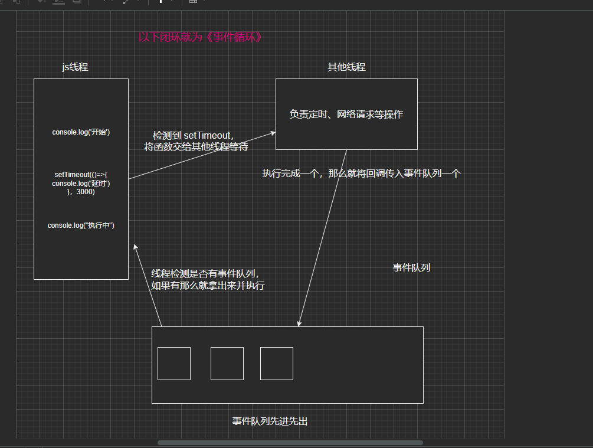
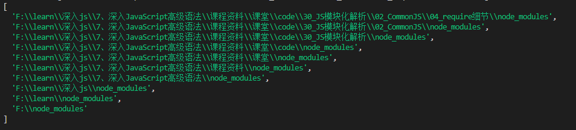

## 一、迭代器 - 生成器

### 1、迭代器

**什么是迭代器**

> 1. 是确使用户可在容器对象（container，例如链表或数组）上遍访的对象，使该接口无需关心对象的内部实现细节
> 2. 迭代器是帮助我们对某个数据结构进行遍历的对象
> 3. 在JavaScript中，迭代器也是一个具体的对象，这个对象需要符合迭代器协议（iterator protocol）
>    1. 迭代器协议定义了产生一系列值（无论是有限还是无限个）的标准方式
>    2. 那么在js中这个标准就是一个特定的 **next** 方法

**next 方法的要求：**

1. 一个无参数或者一个参数的函数，返回一个应当拥有以下两个属性的对象
   1.  **done（boolean）**
      1. 如果迭代器可以产生序列中的下一个值，则为 false。（这等价于没有指定 done 这个属性。）
      2. 如果迭代器已将序列迭代完毕，则为 true。这种情况下，value 是可选的，如果它依然存在，即为迭代结束之后的默认返回值。
   2. **value**
      1. 迭代器返回的任何 JavaScript 值。done 为 true 时可省略。

> 总的来说就是一个对象中需要有一个 **next** 函数，函数中返回对象，并且对象中需要有done，与value，
>
> **done** 为 Boolean 如果为 true 就证明已经迭代到了最后
>
> **value** 为返回值 当前迭代的值


#### 1.1 迭代器编写

##### 1.1.1 标准迭代器

```js
// 数组
const names = ["abc", "cba", "nba"];

// 创建一个迭代器对象来访问数组
let index = 0;

const namesIterator = {
  next: function () {
    if (index < names.length) {
      return { done: false, value: names[index++] };
    } else {
      return { done: true, value: undefined };
    }
  },
};

console.log(namesIterator.next()); // { done: false, value: "abc" }
console.log(namesIterator.next()); // { done: false, value: "cba" }
console.log(namesIterator.next()); // { done: false, value: "nba" }
console.log(namesIterator.next()); // { done: true, value: undefined }
console.log(namesIterator.next()); // { done: true, value: undefined }
console.log(namesIterator.next()); // { done: true, value: undefined }
console.log(namesIterator.next());
console.log(namesIterator.next());
console.log(namesIterator.next());
```

##### 1.1.2 生成迭代器的函数

> 制作迭代器的函数，可以同时创建多个迭代器

```js
function createArrayIterator(arr) {
  let index = 0;
  return {
    next: function () {
      if (index < arr.length) {
        return { done: false, value: arr[index++] };
      } else {
        return { done: true, value: undefined };
      }
    },
  };
}

const names = ["abc", "cba", "nba"];
const nums = [10, 22, 33, 12];

const namesIterator = createArrayIterator(names);
console.log(namesIterator.next()); // { done: false, value: "abc" }
console.log(namesIterator.next());
console.log(namesIterator.next());
console.log(namesIterator.next());

const numsIterator = createArrayIterator(nums);
console.log(numsIterator.next()); // { done: false, value: 10 }
console.log(numsIterator.next());
console.log(numsIterator.next());
console.log(numsIterator.next());

```

##### 1.1.3 无限迭代器

> 无限迭代器代表了，**next** 函数中返回的 **done** 永远都不会为 true ，也就是会一直迭代下去

```js
// 无限的迭代器
function createNumberIterator() {
  let index = 0;
  return {
    next: function () {
      return { done: false, value: index++ };
    },
  };
}

const numberInterator = createNumberIterator();
console.log(numberInterator.next()); // { done: false, value: 0 }
console.log(numberInterator.next()); // { done: false, value: 1 }
console.log(numberInterator.next()); // { done: false, value: 2 }
console.log(numberInterator.next());
console.log(numberInterator.next());
console.log(numberInterator.next());
console.log(numberInterator.next());
console.log(numberInterator.next());
console.log(numberInterator.next());
console.log(numberInterator.next());
console.log(numberInterator.next());
console.log(numberInterator.next());
console.log(numberInterator.next());
```

#### 1.2 可迭代对象


**什么是可迭代对象：**

> 1. 当一个对象实现了iterable protocol协议时，它就是一个可迭代对象
> 2. 这个对象的要求是必须实现 @@iterator 方法，在代码中我们使用 Symbol.iterator 访问该属性

[Symbol.iterator  MDN说明](https://developer.mozilla.org/zh-CN/docs/Web/JavaScript/Reference/Global_Objects/Symbol/iterator)


**可迭代对象有什么好处**

> 当一个对象变成一个可迭代对象的时候，进行某些迭代操作，比如 for...of 操作时，其实就会调用它的
>
> @@iterator 方法；


```js
// 创建一个迭代器对象来访问数组
const iterableObj = {
  names: ["abc", "cba", "nba"],
  [Symbol.iterator]: function() {
    let index = 0
    return {
      next: () => {
        if (index < this.names.length) {
          return { done: false, value: this.names[index++] }
        } else {
          return { done: true, value: undefined }
        }
      }
    }
  }
}
// iterableObj对象就是一个可迭代对象
// console.log(iterableObj[Symbol.iterator])

// 1.第一次调用iterableObj[Symbol.iterator]函数
const iterator = iterableObj[Symbol.iterator]();
console.log(iterator.next());
console.log(iterator.next());
console.log(iterator.next());
console.log(iterator.next());

// // 2.第二次调用iterableObj[Symbol.iterator]函数
const iterator1 = iterableObj[Symbol.iterator]();
console.log(iterator1.next());
console.log(iterator1.next());
console.log(iterator1.next());
console.log(iterator1.next());


for (const item of iterableObj) {
  // abc cba nba
  console.log(item);
}

```

#### 1.3 原生内置的一些可迭代对象

> String、Array、Map、Set、arguments对象、NodeList集合

```js
const names = ["abc", "cba", "nba"]
console.log(names[Symbol.iterator])

// const iterator1 = names[Symbol.iterator]()
// console.log(iterator1.next())
// console.log(iterator1.next())
// console.log(iterator1.next())
// console.log(iterator1.next())

// Map/Set
const set = new Set()
set.add(10)
set.add(100)
set.add(1000)

console.log(set[Symbol.iterator])

for (const item of set) {
  console.log(item)
}

// 函数中arguments也是一个可迭代对象
function foo(x, y, z) {
  console.log(arguments[Symbol.iterator])
  for (const arg of arguments) {
    console.log(arg)
  }
}

foo(10, 20, 30)
```

#### 1.4 可迭代对象的应用场景

**常见应用场景**

```js
// 1.for of场景

// 2.展开语法(spread syntax)
const iterableObj = {
  names: ["abc", "cba", "nba"],
  [Symbol.iterator]: function () {
    let index = 0;
    return {
      next: () => {
        if (index < this.names.length) {
          return { done: false, value: this.names[index++] };
        } else {
          return { done: true, value: undefined };
        }
      },
    };
  },
};

const names = ["abc", "cba", "nba"];
const newNames = [...names, ...iterableObj];
console.log(newNames);

const obj = { name: "why", age: 18 };
// for (const item of obj) {

// }
// ES9(ES2018)中新增的一个特性: 用的不是迭代器
const newObj = { ...obj };
console.log(newObj);

// 3.解构语法
const [name1, name2] = names;
// const { name, age } = obj 不一样ES9新增的特性

// 4.创建一些其他对象时
const set1 = new Set(iterableObj);
const set2 = new Set(names);

const arr1 = Array.from(iterableObj);

// 5.Promise.all
Promise.all(iterableObj).then((res) => {
  console.log(res);
});

```

#### 1.5 自定义可迭代对象

**思路**

1. 在类中根据 `iterable protocol` 协议来封装迭代对象
2. 并在 `Symbol.iterator` 可以监听迭代器的终止

```js
// 案例: 创建一个教室类, 创建出来的对象都是可迭代对象
class Classroom {
  constructor(address, name, students) {
    this.address = address;
    this.name = name;
    this.students = students;
  }

  entry(newStudent) {
    this.students.push(newStudent);
  }
  // 实现可迭代对象
  [Symbol.iterator]() {
    let index = 0;
    return {
      next: () => {
        if (index < this.students.length) {
          return { done: false, value: this.students[index++] };
        } else {
          return { done: true, value: undefined };
        }
      },
      // 监听迭代的终止
      return: () => {
        console.log("迭代器提前终止了~");
        return { done: true, value: undefined };
      },
    };
  }
}

const classroom = new Classroom("3幢5楼205", "计算机教室", ["james", "kobe", "curry", "why"]);
classroom.entry("lilei");

for (const stu of classroom) {
  console.log(stu);
  if (stu === "curry") break;
}

function Person() {}

// 也可以在函数的原型上边添加
Person.prototype[Symbol.iterator] = function () {};

```


### 2、生成器

**什么是生成器函数**

> 生成器函数就是控制当前函数的执行进度，什么时候继续执行，什么时候暂停执行。


#### 2.1 生成器函数的编写


##### 2.1.1 基本生成器函数的要求与使用

+  生成器函数需要在函数上加上一个 * 并且没有位置要求
+  使用 **yield** 来暂停函数 也可以使用 **yield** 来返回值
+ 并且在调用函数时候不会立即执行，而是返回一个 **Generator** 生成器对象
+ 调用 **next** 执行，调用一次执行一步，以 **yield** 区分步骤
+ 执行到了 **return** 证明 函数执行完成

```js
// 生成器函数需要在函数上加上一个 * 并且没有位置要求
// 使用 yield 来暂停函数
// 并且在调用函数时候不会立即执行，而是返回一个 Generator 生成器对象
// 调用next执行，调用一次执行一步，以 yield 区分步骤
function* foo() {
  console.log("函数开始执行~");

  const value1 = 100;
  console.log("第一段代码:", value1);
  yield;

  const value2 = 200;
  console.log("第二段代码:", value2);
  yield;

  const value3 = 300;
  console.log("第三段代码:", value3);
  yield;

  console.log("函数执行结束~");
}

// 调用生成器函数时, 会给我们返回一个生成器对象
const generator = foo();

// 开始执行第一段代码
generator.next();

// 开始执行第二端代码
console.log("-------------");
generator.next();
generator.next();
console.log("----------");
generator.next();

```

##### 2.1.2  生成器 使用 yield 返回值

1. 生成器函数可以使用 **yield** 返回给 **next** 值
2. 在生成器函数中 执行到 **return** 证明函数执行完成，并且可以 **return** 值

```js
// 当遇到yield时候值暂停函数的执行
// 当遇到return时候生成器就停止执行
function* foo() {
  console.log("函数开始执行~");

  const value1 = 100;
  console.log("第一段代码:", value1);
  yield value1;

  const value2 = 200;
  console.log("第二段代码:", value2);
  yield value2;

  const value3 = 300;
  console.log("第三段代码:", value3);
  yield value3;

  console.log("函数执行结束~");
  return "123";
}

// generator本质上是一个特殊的iterator
const generator = foo();
console.log("返回值1:", generator.next()); // { value: 100, done: false }
console.log("返回值2:", generator.next()); //{ value: 200, done: false }
console.log("返回值3:", generator.next()); // { value: 300, done: false }
console.log("返回值3:", generator.next()); //{ value: '123', done: true }

```

##### 2.1.3 生成器的 next 传递参数

1. 在当前的 yield 返回上一段代码next的传入值
2. 第一步参数在函数调用是传入

```js
//当前的 yield 返回上一段代码next的传入值
function* foo(num) {
  console.log("函数开始执行~");

  const value1 = 100 * num;
  console.log("第一段代码:", value1); //500
  const n = yield value1;

  const value2 = 200 * n;
  console.log("第二段代码:", value2); //2000
  const count = yield value2;

  const value3 = 300 * count;
  console.log("第三段代码:", value3); //7500
  const number = yield value3;

  console.log("函数执行结束~");
  return "123" + number; //'12325'
}

// 生成器上的next方法可以传递参数
const generator = foo(5);
console.log(generator.next()); //{ value: 500, done: false }
// // 第二段代码, 第二次调用next的时候执行的
console.log(generator.next(10)); //{ value: 2000, done: false }
console.log(generator.next(25)); //{ value: 7500, done: false }
console.log(generator.next(25)); //{ value: '12325', done: true }

```

#####  2.1.4 生成器的 return 终止执行

1. 调用生成器 **return** 方法终止执行

```js
// 第二段代码的执行, 使用了return
// 那么就意味着相当于在第一段代码的后面加上return, 就会提前终端生成器函数代码继续执行
function* foo(num) {
  console.log("函数开始执行~");

  const value1 = 100 * num;
  console.log("第一段代码:", value1);
  const n = yield value1;

  const value2 = 200 * n;
  console.log("第二段代码:", value2);
  const count = yield value2;

  const value3 = 300 * count;
  console.log("第三段代码:", value3);
  yield value3;

  console.log("函数执行结束~");
  return "123";
}

const generator = foo(10);

console.log(generator.next());

// 第二段代码的执行, 使用了return
// 那么就意味着相当于在第一段代码的后面加上return, 就会提前终端生成器函数代码继续执行
console.log(generator.return(15));//这里开始就不会执行了{ value: 15, done: true }
console.log(generator.next());//{ value: undefined, done: true }
console.log(generator.next());
console.log(generator.next());
console.log(generator.next());
console.log(generator.next());
console.log(generator.next());

```

##### 2.1.5 生成器的 throw 抛出异常

1. 使用 **throw** 方法，配合 try catch 捕获捕获异常

```js
function* foo() {
  console.log("代码开始执行~");

  const value1 = 100;
  try {
    //捕获抛出异常
    yield value1;
  } catch (error) {
    console.log("捕获到异常情况:", error);

    yield "abc";
  }

  console.log("第二段代码继续执行"); //因为上边进入了catch所以这里不会执行
  const value2 = 200;
  yield value2;

  console.log("代码执行结束~");
}

const generator = foo();

const result = generator.next();
// if (result.value !== 200) {
//   generator.throw("error message");
// }
console.log(result); //{ value: 100, done: false }
console.log(generator.throw("error message")); //{ value: 'abc', done: false }

```

### 3、使用生成器替代迭代器

+ 封装 **生成器** 函数使用生成器 **yield** 

```js
// 1.生成器来替代迭代器
function* createArrayIterator(arr) {
  // 3.第三种写法 yield*
  yield* arr; //这里必须是可迭代对象

  // 2.第二种写法
  // for (const item of arr) {
  //   yield item
  // }
  // 1.第一种写法
  // yield "abc" // { done: false, value: "abc" }
  // yield "cba" // { done: false, value: "abc" }
  // yield "nba" // { done: false, value: "abc" }
}

const names = ["abc", "cba", "nba"];
const namesIterator = createArrayIterator(names);

console.log(namesIterator.next());
console.log(namesIterator.next());
console.log(namesIterator.next());
console.log(namesIterator.next());
```

+ 创建一个函数, 这个函数可以迭代一个范围内的数字

```js
// 2.创建一个函数, 这个函数可以迭代一个范围内的数字
// 10 20
function* createRangeIterator(start, end) {
  let index = start;
  while (index < end) {
    yield index++;
  }

  // let index = start
  // return {
  //   next: function() {
  //     if (index < end) {
  //       return { done: false, value: index++ }
  //     } else {
  //       return { done: true, value: undefined }
  //     }
  //   }
  // }
}

const rangeIterator = createRangeIterator(10, 20);
console.log(rangeIterator.next());
console.log(rangeIterator.next());
console.log(rangeIterator.next());
console.log(rangeIterator.next());
console.log(rangeIterator.next());
```

+ class 生成器替代迭代器

```js
class Classroom {
  constructor(address, name, students) {
    this.address = address;
    this.name = name;
    this.students = students;
  }

  entry(newStudent) {
    this.students.push(newStudent);
  }

  foo = () => {
    console.log("foo function");
  };

  // [Symbol.iterator] = function*() {
  //   yield* this.students
  // }
//函数中有 Symbol.iterator 即是可迭代对象
  *[Symbol.iterator]() {
    console.log("进入迭代");
    yield* this.students;
  }
}

const classroom = new Classroom("3幢", "1102", ["abc", "cba"]);
for (const item of classroom) {
  console.log(item);
}

```

### 4、异步代码的处理方式有哪些

#### 需求

> 拿到响应值拼接多次请求
>
> 1. url: why -> res: why
> 2. url: res + "aaa" -> res: whyaaa
> 3. url: res + "bbb" => res: whyaaabbb

#### 调用的方法

```js
function requestData(url) {
  // 异步请求的代码会被放入到executor中
  return new Promise((resolve, reject) => {
    // 模拟网络请求
    setTimeout(() => {
      // 拿到请求的结果
      resolve(url);
    }, 2000);
  });
}
```

#### 4.1 使用 then

**方案:**

1. 利用 **Promise** 的 **then** 

**缺点:**

1. 会出现 Promise的弊端 **回调地狱**

```js
requestData("why").then(res => {
  requestData(res + "aaa").then(res => {
    requestData(res + "bbb").then(res => {
      console.log(res)
    })
  })
})
```


#### 4.2 使用 then 的 return

**方案:**

1. 利用 **Promise**  **then** 的返回值return来解决

**缺点:**

1. 阅读性极差

```js
requestData("why").then(res => {
  return requestData(res + "aaa")
}).then(res => {
  return requestData(res + "bbb")
}).then(res => {
  console.log(res)
})
```

#### 4.3 使用 Promise + generator(生成器) 实现

**方案:**

1. 利用 **Promise** 和 **generator** 生成器函数 与 **yield**

**缺点:**

1. 需要一点调用，或者说需要写一个方便的方法

```js
function* getData() {
  const res1 = yield requestData("why");
  const res2 = yield requestData(res1 + "aaa");
  const res3 = yield requestData(res2 + "bbb");
  const res4 = yield requestData(res3 + "ccc");
  console.log(res4);
}
// 1> 手动执行生成器函数
const generator = getData();
generator.next().value.then((res) => {
  generator.next(res).value.then((res) => {
    generator.next(res).value.then((res) => {
      generator.next(res);
    });
  });
});

const generator = getData();
generator.next().value.then((res) => {
  generator.next(res).value.then((res) => {
    generator.next(res).value.then((res) => {
      generator.next(res);
    });
  });
});


// 2> 自己封装了一个自动执行的函数形成递归
function execGenerator(genFn) {
  const generator = genFn();
  function exec(res) {
    const result = generator.next(res);
    if (result.done) {
      return result.value;
    }
    result.value.then((res) => {
      exec(res);
    });
  }
  exec();
}
// 调用函数
execGenerator(getData);
```


#### 4.4 Es8 async/await (原理为生成器函数)

> 其实 **async / await** 就是 **生成器函数** 与 **yield** 的语法糖

```js
async function getData() {
  const res1 = await requestData("why");
  const res2 = await requestData(res1 + "aaa");
  const res3 = await requestData(res2 + "bbb");
  const res4 = await requestData(res3 + "ccc");
  console.log(res4);
}

getData();
```


## 二、async - await

> async 是asynchronous单词的缩写，异步、非同步；
>
> sync 是synchronous单词的缩写，同步、同时；

### 1、与普通函数的返回值区别

>async 函数返回值是一个 Promise

1. 异步函数也可以有返回值，但是异步函数的返回值会被包裹到**Promise.resolve**中
2. 如果我们的异步函数的返回值是一个对象并且实现了**thenable**，那么会由对象的**then**方法来决定
3. 如果我们的异步函数的返回值是**Promise**，**Promise.resolve**的状态会由**Promise**决定；

```js
async function foo() {
  console.log("foo function start~");

  console.log("中间代码~");

  console.log("foo function end~");

  // 1.返回一个值
  // return "789";
  // 2.返回thenable
  // return {
  //   then: function(resolve, reject) {
  //     resolve("hahahah")
  //   }
  // }

  // 3.返回Promise
  return new Promise((resolve, reject) => {
    setTimeout(() => {
      resolve("hehehehe");
    }, 2000);
  });
}

// 异步函数的返回值一定是一个Promise
const promise = foo();
promise.then((res) => {
  console.log("promise then function exec:", res);
});

```

### 2、 抛异常与普通函数的区别

> 返回的是一个 **Promise** 如果不使用 **cach ** 就不会补错

```js
async function foo() {
  console.log("foo function start~")

  console.log("中间代码~")

  // 异步函数中的异常, 会被作为异步函数返回的Promise的reject值的
  throw new Error("error message")

  console.log("foo function end~")
}

// 异步函数的返回值一定是一个Promise
foo().catch(err => {
  console.log("coderwhy err:", err)
})

console.log("后续还有代码~~~~~")

```

### 3、await关键字

**async**函数另外一个特殊之处就是可以在它内部使用await关键字，而普通函数中是不可以的

+  await关键字特点
  + 通常使用**await**是后面会跟上一个表达式，这个表达式会返回一个**Promise**
  + 那么**await**会等到**Promise**的状态变成**fulfilled**状态，之后继续执行异步函数
+ 如果 **await** 后面是一个普通的值，那么会直接返回这个值
+ 如果 **await** 后面是一个 **thenable** 的对象，那么会根据对象的 **then** 方法调用来决定后续的值
+ 如果 **await** 后面的表达式，返回的 **Promise** 是 **reject** 的状态，那么会将这个 **reject** 结果直接作为函数的 **Promise** 的 **reject** 值

#### 3.1 reject 处理

```js
function requestData() {
  return new Promise((resolve, reject) => {
    setTimeout(() => {
      // resolve(222)
      reject(1111);
    }, 2000);
  });
}

async function foo() {
  const res1 = await requestData();
  console.log("res1:", res1);
}

foo().catch((err) => {
  console.log("err:", err);//"err":111
});

```

## 三、事件循环-队列

### 1、进程与线程（操作系统概念）

**进程:**

>计算机已经运行的程序，是操作系统管理程序的一种方式
>
>**可以认为，启动一个应用程序，就会默认启动一个进程（也可能是多个进程）**

**线程:**

>操作系统能够运行运算调度的最小单位，通常情况下它被包含在进程中
>
>**每一个进程中，都会启动至少一个线程用来执行程序中的代码，这个线程被称之为主线程**

**总结：**

> 我们也可以说 **进程** 是 **线程** 的容器


**举个栗子：**

+ **操作系统**当作 工厂
+ 工厂中的车间 当作 **进程**
+ 车间中的一个以上的人工，每一个工人就是一个 **线程**


#### 1.1 浏览器中的JavaScript线程

+ 目前大部分浏览器都是多进程的，在浏览器中，每一个标签页就是一个进程

  + 这样可以做到，如果一个标签页 出现卡顿等问题，关闭当前标签页就可以了，避免了多标签页的阻塞
  + **在每一个标签也种有多个线程，而其中一个就是 JavaScript 线程**

  

+ JavaScript的代码执行是在一个单独的线程中执行

  + 也就是说在 **同一时刻只能做一件事情**
  + 如果这件事是 **非常耗时** 的，那么就意味着当前的线程就会被阻塞

+ 所以真正耗时的操作，实际上并不是由JavaScript线程在执行的

  + 浏览器的每个进程是多线程的，那么 **其他线程可以来完成这个耗时的操作**
  + 比如 **网络请求**、**定时器** 等，**JavaScript 只需要在特定的时候执行回调就可以**


### 2、浏览器 事件循环 


#### 2.1 事件循环

##### 定义：




#### 2.2 宏任务与微任务队列


**宏任务队列：**

+ **macrotask queue**

+ ajax、setTimeout、setInterval、DOM监听、UI Rendering等

**微任务队列：**

+ **microtask queue**
+ Promise的 **then** 回调、 Mutation Observer API、queueMicrotask()等


##### 2.2.1 队列优先级

> main scripe > 微任务( microtask queue ) > 宏任务( macrotask queue )

+ **main script** 中的代码优先执行（编写的顶层script代码）；
+ 在执行任何一个宏任务之前（不是队列，是一个宏任务），都会先查看微任务队列中是否有任务需要执行
  + **也就是宏任务执行之前，必须保证微任务队列是空的；**
  + **如果不为空，那么就优先执行微任务队列中的任务（回调）**


### 3、 代码队列执行顺序面试题测试

#### 面试题一

+ 注意查看 main script 、微任务、宏任务

```js
setTimeout(function () {
  console.log("setTimeout1");
  new Promise(function (resolve) {
    resolve();
  }).then(function () {
    new Promise(function (resolve) {
      resolve();
    }).then(function () {
      console.log("then4");
    });
    console.log("then2");
  });
});

new Promise(function (resolve) {
  console.log("promise1");
  resolve();
}).then(function () {
  console.log("then1");
});

setTimeout(function () {
  console.log("setTimeout2");
});

console.log(2);

queueMicrotask(() => {
  console.log("queueMicrotask1")
});

new Promise(function (resolve) {
  resolve();
}).then(function () {
  console.log("then3");
});

// promise1
// 2
// then1
// queueMicrotask1
// then3
// setTimeout1
// then2
// then4
// setTimeout2

```


#### 面试题二

```js
// async function bar() {
//   console.log("22222");
//   return new Promise((resolve) => {
//     resolve();
//   });
// }

// async function foo() {
//   console.log("111111");

//   await bar();
//   //这里执行是resolve之后执行所以就是 promise 的 then，加入到微任务中
//   console.log("33333");
// }

// foo();
// console.log("444444");
// // 111111
// // 22222
// // 444444
// // 33333

async function async1() {
  console.log("async1 start");
  await async2();
  //因为上边是await 会 return undefined 相当于resolve一个值所以这块加入微任务队列
  console.log("async1 end");
}

async function async2() {
  console.log("async2");
}

console.log("script start");

setTimeout(function () {
  console.log("setTimeout");
}, 0);

async1();

new Promise(function (resolve) {
  console.log("promise1");
  resolve();
}).then(function () {
  console.log("promise2");
});

console.log("script end");

// script start
// async1 start
// async2
// promise1
// script end
// async1 end
// promise2
// setTimeout

```

##### 面试题二分析


#### 面试题三(难)

+ 返回 **thenable** 会把这个推迟一个微任务
+ 返回 **promise.resolve** 会把这个推迟两个微任务

```js
Promise.resolve()
  .then(() => {
    console.log(0);
    // 1.直接return一个值 相当于resolve(4)
    // return 4

    // 2.return thenable的值
    return {
      //thenable 会把这个推迟一个微任务
      then: function (resolve) {
        // 大量的计算
        resolve(4);
      },
    };

    // 3.return Promise
    // 不是普通的值, 多加一次微任务
    // Promise.resolve(4), 多加一次微任务
    // 一共多加两次微任务
    //return 是个 promise.resolve 会把这个推迟两个微任务
    return Promise.resolve(4);
  })
  .then((res) => {
    console.log(res);
  });

Promise.resolve()
  .then(() => {
    console.log(1);
  })
  .then(() => {
    console.log(2);
  })
  .then(() => {
    console.log(3);
  })
  .then(() => {
    console.log(5);
  })
  .then(() => {
    console.log(6);
  });

// 1.return 4
// 0
// 1
// 4
// 2
// 3
// 5
// 6

// 2.return thenable
// 0
// 1
// 2
// 4
// 3
// 5
// 6

// 3.return promise
// 0
// 1
// 2
// 3
// 4
// 5
// 6

```

### 4、node  事件循环

+ **事件循环像是一个桥梁**，是连接着应用程序的JavaScript和系统调用之间的通道

  + 无论是我们的文件IO、数据库、网络IO、定时器、子进程，在完成对应的操作后，都会将对应的结果和回调函数放到事件循环（任务队列）中
  + 事件循环会不断的从任务队列中取出对应的事件（回调函数）来执行

  

+ **但是一次完整的事件循环Tick分成很多个阶段**

  + **定时器（Timers）**：本阶段执行已经被 setTimeout() 和 setInterval() 的调度回调函数。
  + **待定回调（Pending Callback）**：对某些系统操作（如TCP错误类型）执行回调，比如TCP连接时接收到 ECONNREFUSED
  + **idle, prepare**：仅系统内部使用
  + **轮询（Poll）**：检索新的 I/O 事件；执行与 I/O 相关的回调
  + **检测（check）**：setImmediate() 回调函数在这里执行
  + **关闭的回调函数**：一些关闭的回调函数，如：socket.on('close', ...)


#### 4.1 Node的宏任务和微任务

+ 宏任务（macrotask）：setTimeout、setInterval、IO事件、setImmediate、close事件；
+ 微任务（microtask）：Promise的then回调、process.nextTick、queueMicrotask；

**但是，Node中的事件循环不只是 微任务队列和 宏任务队列**

+ **微任务队列：**
  + next tick queue：
    + process.nextTick
  + other queue：
    + Promise的then回调、queueMicrotask
+ **宏任务队列：**
  + timer queue 
    + setTimeout、setInterval；
  +  poll queue：
    + IO事件；
  + check queue：
    + setImmediate； 
  + close queue：
    + close事件；

####  4.2 Node事件循环的顺序

**在每一次事件循环的tick中，会按照如下顺序来执行代码**

+ next tick microtask queue； 
+ other microtask queue； 
+ timer queue； 
+ poll queue； 
+ check queue； 
+ close queue；


## 四、JS模块化


**AMD，CMD，CommonJS** 是之前 JS 社区中的规范

而随着 JS 官方发布了 `ESModule` 后 AMD，CMD已经被淘汰

并且现在的 nodeJS 也在陆续支持 `ESModule` ，所以后续 `commonJS` 也可能会被淘汰

### 1、commonJS（require细节）

**三种情况**

1. X是一个Node核心模块，path，http等

> 直接返回核心模块，并且停止查找

```js
//情况一: 核心模块
const path = require("path")
const fs = require("fs")

path.resolve()
path.extname()

fs.readFile()
```

2. X是以 ./ 或 ../ 或 /（根目录）开头的

> **第一步：将X当做一个文件在对应的目录下查找；**
>
> 1. 如果有后缀名，按照后缀名的格式查找对应的文件
> 2. 如果没有后缀名，会按照如下顺序
>    + 直接查找文件X 
>    + 查找X.js文件
>    + 查找X.json文件
>    + 查找X.node文件
>
> **第二步：没有找到对应的文件，将X作为一个目录**
>
> 1. 查找目录下面的index文件
>    + 查找X/index.js文件
>    + 查找X/index.json文件
>    + 查找X/index.node文件
>
> 如果没有找到，那么报错：not found
>
> 


3. 直接是一个X（没有路径），并且X不是一个核心模块

> 这个时候会去查找 一级一级向上查找 `node_modules`

```js
console.log(module.paths);
```




### 2、ESModule

#### 2.1 基本使用

```js
//加载
<script src="./main.js" type="module"></script>

//导出
export const name = "why"
export const age = 18

//导入
import { name, age } from "./foo.js"

console.log(name)
console.log(age)

```


#### 2.2 其他用法

##### 2.2.1 导出

```js
// 1.第一种方式: export 声明语句
 export const name = "why"
 export const age = 18

 export function foo() {
   console.log("foo function")
 }

 export class Person {

 }

// 2.第二种方式: export 导出 和 声明分开
const name = "why"
const age = 18
function foo() {
  console.log("foo function")
}

export {
  name,
  age,
  foo
}

 3.第三种方式: 第二种导出时起别名
 export {
   name as fName,
   age as fAge,
   foo as fFoo
 }

//4.第四种方式 直接导出模块
 export { add, sub } from './math.js'
 export { timeFormat, priceFormat } from './format.js'

//5.通配符导出
export * from './math.js'
export * from './format.js'


```

##### 2.2.2 导入

```js
// 1.导入方式一: 普通的导入
// import { name, age, foo } from "./foo.js"
// import { fName, fAge, fFoo } from './foo.js'

// 2.导入方式二: 起别名
// import { name as fName, age as fAge, foo as fFoo } from './foo.js'

// 3.导入方式三: 将导出的所有内容放到一个标识符中
import * as foo from './foo.js'

console.log(foo.name)
console.log(foo.age)
foo.foo()

const name = "main"

console.log(name)
console.log(age)

```

##### 2.2.3 默认导出

```js
const name = "why";
const age = 18;

const foo = "foo value";

// 1.默认导出的方式一:
export {
  // named export
  name,
  // age as default,//设置默认导出，导入时的默认导入的数据就是这个
  // foo as default
};

// 2.默认导出的方式二: 常见
export default foo;

// 注意: 默认导出只能有一个
```


##### 2.2.4 默认导入

```js
// import { name, age } from './foo.js'

// import * as foo from './foo.js'

// 导入语句: 导入的默认的导出
import why from './foo.js'

console.log(why)

```


#### 2.3 import 函数

+ 在 html 中 script 标签中的 `type` 一定要是 `module`

```js
<script src="./main.js" type="module"></script>
```

+ 异步导入
  + `import` 本质返回的是一个 `promise`
  + `import.meta` 可以返回当前模块所在的路径

```js
// 这里导入为同步代码，引入完成才会向下执行
// import { name, age, foo } from './foo.js'

// console.log(name)

// import函数返回的结果是一个Promise
// 异步代码
import("./foo.js").then((res) => {
  console.log("res:", res.name);
});

console.log("后续的代码都是不会运行的~");

// ES11新增的特性
// meta属性本身也是一个对象: { url: "当前模块所在的路径" }
console.log(import.meta);

```


### 3、ESModule 内部原理

#### 1、ES Module的三个阶段

1. 构建（Construction），根据地址查找js文件，并且下载，将其解析成模块记录（Module Record）
2. 实例化（Instantiation），对模块记录进行实例化，并且分配内存空间，解析模块的导入和导出语句，把模块指向对应的内存地址。
3. 运行求值（Evaluation），运行代码，计算值，并且将值填充到内存地址中


### 4、AMD 规范(已淘汰)


+ AMD主要是应用于浏览器的一种模块化规范
  + AMD是Asynchronous Module Definition（异步模块定义）的缩写；
  + 它采用的是异步加载模块
  + 事实上AMD的规范还要早于CommonJS，但是CommonJS目前依然在被使用，而AMD使用的较少了

**常用的库**

+ require.js
+ curl.js

#### 4.1 require.js的使用

[下载地址](https://github.com/requirejs/requirejs)


**使用方法**


目录结构

+ index.html
+ lib
  + require.js
+ src
  + bar.js
  + foo.js
  + main.js


+ 在主页 index.html中引入 require
+ script 标签中的 `data-main`
  + 加载完 `src` 立刻加载 `data-main`

```js
<script src="./lib/require.js" data-main="./src/main.js"></script>
```

+ main.js

```js
require.config({
  baseUrl: "", //默认为./src
  paths: {
    bar: "./src/bar", //模块声明
    foo: "./src/foo", //模块声明
  },
});

// require(["foo", "bar"], function (foo, bar) {
//   console.log("main:", foo); //main: {name: 'why', age: 18, sum: ƒ}，
//   console.log("main:", bar); //main: {name: 'why9', age: 18, sum: ƒ}
// });
// 加载模块
require(["foo", "bar"], function (foo) {
  console.log("main:", foo); //main: {name: 'why', age: 18, sum: ƒ}
});

```

+ bar.js

```js
//定义main中导入的foo模块
define(["foo"], function (foo) {
  console.log("--------");
  // require(["foo"], function(foo) {
  //   console.log("bar:", foo)
  // })

  console.log("bar:", foo);
});

// 导出
// define(function () {
//   const name = "wh9";
//   const age = 18;
//   function sum(num1, num2) {
//     return num1 + num2;
//   }

//   return {
//     name,
//     age,
//     sum,
//   };
// });

```

+ foo.js

```js
// 定义值
define(function () {
  const name = "why";
  const age = 18;
  function sum(num1, num2) {
    return num1 + num2;
  }

  return {
    //导出值
    name,
    age,
    sum,
  };
});


```


### 5、CMD规范(已淘汰)

CMD规范也是应用于浏览器的一种模块化规范：

+ CMD 是Common Module Definition（通用模块定义）的缩写；
+ 它也采用了异步加载模块，但是它将CommonJS的优点吸收了过来；

**常用的库**

+ [SeaJS](https://github.com/seajs/seajs)


#### 5.1 SeaJS的使用


目录结构

+ index.html
+ lib
  + sea.js
+ src
  + foo.js
  + main.js


+ seaJS 的 立刻加载下一个需要卸载 script 标签中
+ index.html

```js
  <script src="./lib/sea.js"></script>
  <script>
    seajs.use("./src/main.js")
  </script>
```

+ main.js

```js
define(function (require, exports, module) {
  const foo = require("./foo");
  console.log("main:", foo); //main: {name: 'why', age: 18, sum: ƒ}
});
```

+ foo.js

```js
define(function(require, exports, module) {
  const name = "why"
  const age = 18
  function sum(num1, num2) {
    return num1 + num2
  }

  // exports.name = name
  // exports.age = age

  module.exports = {
    name,
    age,
    sum
  }
});
```


## 五、包管理工具


### 1、常见的属性

+ **必须填写的属性：name、version**
  + name是项目的名称；
  + version是当前项目的版本号；
  + description是描述信息，很多时候是作为项目的基本描述；
  + author是作者相关信息（发布时用到）；
  + license是开源协议（发布时用到）；
+ **private属性：**
  + private属性记录当前的项目是否是私有的；
  + 当值为true时，npm是不能发布它的，这是防止私有项目或模块发布出去的方式；
+ **main属性：**
  + 设置程序的入口
  + 发布时导出方法的入口
+ **scripts属性：**
  + 配置脚本命令，以键值对形式存在
+ **dependencies属性：**
  + 生产环境依赖的包
+ **devDependencies属性：**
  + 开发环境依赖的包
+ **peerDependencies属性：**
  + 项目依赖关系是对等依赖，也就是你依赖的一个包，它必须是以另外一个宿主包为前提的
  + 比如element-plus是依赖于vue3的，ant design是依赖于react、react-dom
    + 安装时会抛出警告


### 2、依赖的版本管理


#### 2.1 npm 包遵循的规范

+ npm的包通常需要遵从semver版本规范：
  + semver：https://semver.org/lang/zh-CN/
  + npm semver：https://docs.npmjs.com/misc/semver
+ semver版本规范是X.Y.Z：
  + X主版本号（major）：当你做了不兼容的 API 修改（可能不兼容之前的版本）；
  + Y次版本号（minor）：当你做了向下兼容的功能性新增（新功能增加，但是兼容之前的版本）；
  + Z修订号（patch）：当你做了向下兼容的问题修正（没有新功能，修复了之前版本的bug）；

#### 2.2 ^ 与 ~ 的意义

+ ^x.y.z：表示x是保持不变的，y和z永远安装最新的版本
+ ~x.y.z：表示x和y保持不变的，z永远安装最新的版本；

> 但是前提是需要把 `package-lock.json` 文件先删除，因为这文件中是具体版本，只有删除这个文件，`npm install` 时候才会根据 `package.json`的 **^ ~** 符号安装


