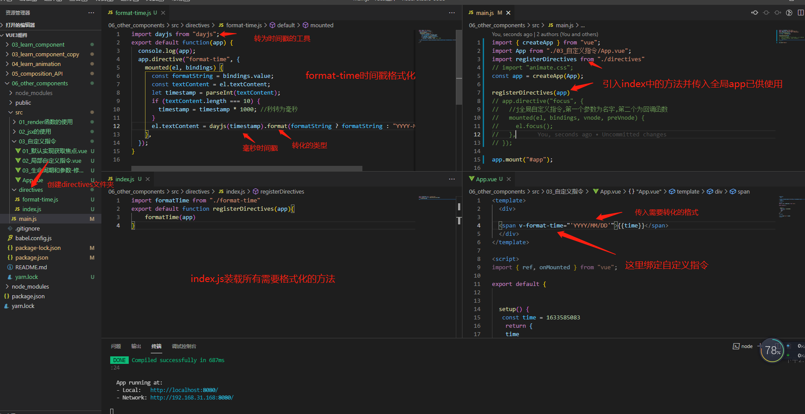
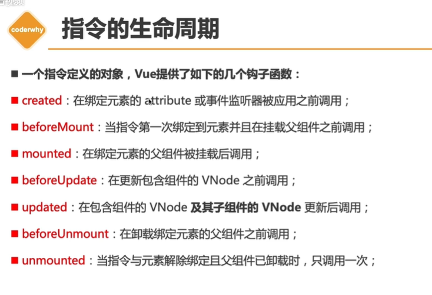
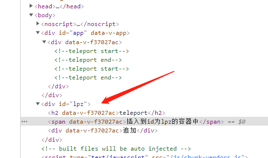
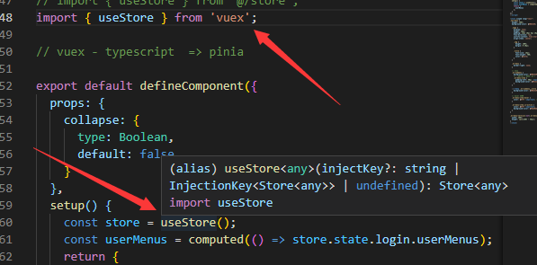
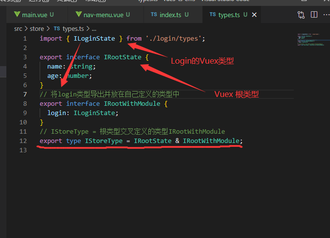
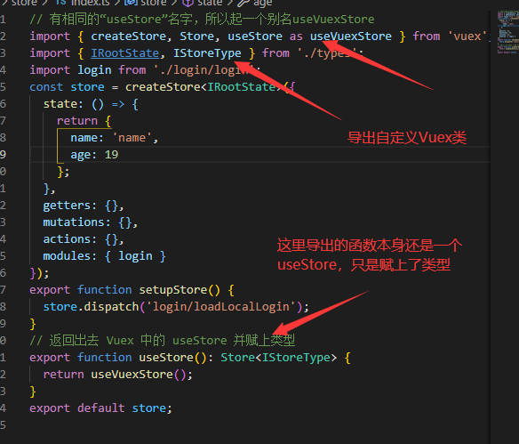
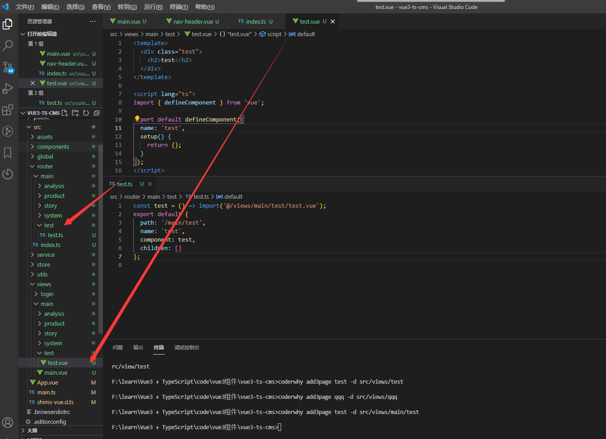
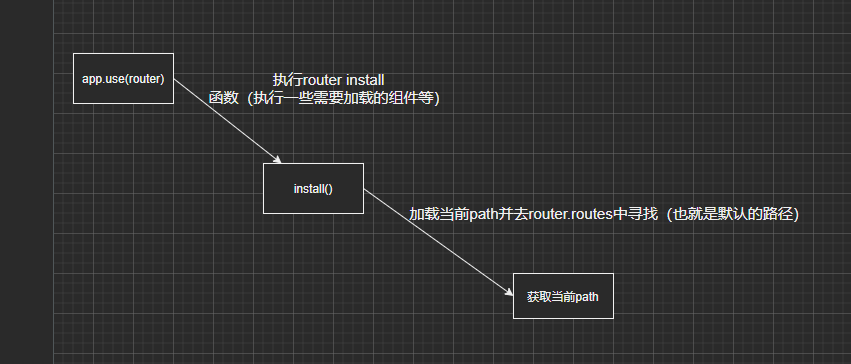
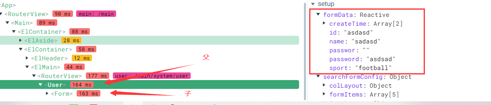

# vue源码

## 1、三大核心系统

+ **Compiler模块** : 编译模板系统
+ **Runtime模块**：也可以称之为Renderer模块，真正的渲染模块；
+ **Reactivity模块**：响应式系统


# 一、组件

## 1、异步组件


**defineAsyncComponent vue异步组件API**

**问：**  异步组件的应用场景与作用 ？

**答：**

+ 异步组件可以让 Vue 第一次渲染时更加快一点
+ 对于Webpack 来说 项目打包时，会将这个异步组件打包成一个单独的 js  当使用到时，再去加载这个 js 文件。

**使用方法**


```vue
<template>
  <div>
    App组件
    <AsyncCategory></AsyncCategory>
  </div>
</template>

<script>
import { defineAsyncComponent } from "vue";
import Loading from "./loading.vue"
// 工厂函数
// const AsyncCategory = defineAsyncComponent(() => import("./AsnycCategory.vue"));//简写
   
//对象方式
const AsyncCategory = defineAsyncComponent({
    loader:()=>import("./AsnycCategory.vue"),
    loadingComponent:Loading,//没有加载出来站位
    // errorComponent:'',//组件加载失败显示的组件
    delay:2000,//在显示loading组件之前,等待多长时间(延迟显示)
   /**
   *
   * @param {*} error 错误信息对象
   * @param {*} retry 一个函数，用于指示当 promise 加载器 reject 时，加载器是否应该重试
   * @param {*} fail  一个函数，指示加载程序结束退出
   * @param {*} attempts 允许的最大重试次数
   */
   onError:function(error, retry, fail, attempts){
     if (error.message.match(/fetch/) && attempts <= 3) {
      // 请求发生错误时重试，最多可尝试 3 次
      retry()
    } else {
      // 注意，retry/fail 就像 promise 的 resolve/reject 一样：
      // 必须调用其中一个才能继续错误处理。
      fail()
    }
}
});

export default {
  components: {
    AsyncCategory,
  },
};
</script>
```


## 2、Suspense插槽 处理组件不显示

**Suspense vue试验性API 随时修改**

**问：**Suspense 的应用场景与作用 ？

**答：**

+ 可以处理组件如果没有加载出来去显示另一个


**使用方法 (异步组件为例)**

```vue
<template>
  <suspense>
    <template #default> <!-- 默认显示 -->
      <todo-list />
    </template>
    <template #fallback> <!-- 没有加载到,显示 -->
      <div>
        Loading.... <!-- 这里也可以放组件 -->
      </div>
    </template>
  </suspense>
</template>

<script>
   import { defineAsyncComponent } from "vue";//异步组件API
export default {
  components: {
    TodoList: defineAsyncComponent(() => import('./TodoList.vue'))
  }
}
</script>

```


## 3、组件之间的v-model

**问：**组件之间的v-model 的应用场景与作用 ？

**答：**

+ 应用场景多了去了 , 作用大了去了 , 封装个组件不要双向绑定嘛, **擦**


**使用方法 ( 利用v-model标签上隐性绑定的update:name方法 )**

+ **父组件**

```vue

<template>
  <div>
    <h2>{{ message }}</h2>
     <h2>{{ title }}</h2>

    <hy-input v-model="message" v-model:title="title"></hy-input>
          <!-- 这里默认会绑定 update:modelValue update:title 两个事件等同于下边的举例-->
     <!--    <hy-input v-model="message" v-model:title="title" @update:modelValue="message=$event" @update:title="title=$event"></hy-input> -->
      

     
  </div>
</template>

<script>
import HyInput from "./HyInput.vue"
export default {
    components:{
        HyInput
    },
  data() {
    return {
      message: "lpz",
      title:'哈哈哈'
    };
  },
};
</script>

<style scoped>
</style>


```


+ **子组件**

```vue
#子组件
<template>
  <div>
    <h2>我是传进来的：{{ modelValue }}</h2>
    <input v-model="value" />
    <input v-model="title1" />
  </div>
</template>

<script>
export default {
  props: {
    modelValue: String,
    title: String,
  },
  emits: ["update:modelValue", "update:title"],//注册自定义事件
  computed: {//利用computed显示(get)与调用自定义事件(set)
    value: {
      set(value) {
        this.$emit("update:modelValue", value);
      },
      get() {
        return this.modelValue;
      },
    },
    title1: {
      set(value) {
        this.$emit("update:title", value);
      },
      get() {
        return this.title;
      },
    },
  },
};
</script>

<style scoped>
</style>
```


# 二、两种setup使用

## 1、函数式 setup

```js
<script lang="ts">
import { defineComponent, computed, ref, watch } from 'vue';
import { useStore } from '@/store';
import { usePermission } from '@/hooks/use-permission';

import HyTable from '@/base-ui/table';

export default defineComponent({
  //定义组件
  components: {
    HyTable
  },
  props: {
    //props使用
    contentTableConfig: {
      type: Object,
      require: true
    },
    pageName: {
      type: String,
      required: true
    }
  },
  emits: ['newBtnClick', 'editBtnClick'], //emits事件
  setup(props, { emit }) {
    //在这里拿到props与emit
    const store = useStore();
    return {
      store
    };
  }
});
</script>
```


## 2、script setup


```js
<script lang="ts" setup>
import { ref, onMounted,defineProps, withDefaults,/*设置props默认值*/ watchEffect } from 'vue';
import { EChartsOption } from 'echarts';
import useEchart from '../hooks/useEchart';
//withDefaults 第一个参数为props 第二个为props中的默认值 并且会返回出来一个props可以使用返回值获取props中的值
// defineProps 定于propsdefineProps<{}>()
// 定义props
const props = withDefaults(
  defineProps<{
    options: EChartsOption;
    width?: string;//设置是否必传(?)
    height?: string;
  }>(),
  {
    width: '100%',
    height: '360px'
  }
);

const echartDivRef = ref<HTMLElement>();

onMounted(() => {
  const { setOptions } = useEchart(echartDivRef.value!);

  watchEffect(() => {
    setOptions(props.options);
  });
});
</script>
```


## 3、两者差异


# 三、基础Api

## 1、customRef（自定义ref）

+ 自定义ref防抖事件

**customRef 有两个参数，并且返回一个对象，对象中必须有set与get函数**

+   track 搜集依赖
+ trigger 触发更新

```js
import { customRef } from "vue";
// 自定义ref
export default function(value) {
  let timer = null;
  // track 搜集依赖
  // trigger 触发更新
  return customRef((track, trigger) => {
    return {
      get() {
        track();
        return value;
      },
      set(newValue) {//延迟一秒更新数据
        clearTimeout(timer);
        timer = setTimeout(() => {
          value = newValue;
          trigger();
        }, 1000);
      },
    };
  });
}
//使用
import debounceRef from "./hook/useDebounceRef.js"
setup() {
    const message = debounceRef("Hello World");
    return {
      message,
    };
  },
```


## 2、computed使用


**computed本身返回的是一个ref对象**

+ 实例

```js
<h2>{{ fullName }}</h2>
    <button @click="changeName">修改firstName</button>

import { ref, computed } from "vue";
setup() {
    const fristName = ref("Kobe");
    const lastName = ref("Bryant");
    //1.直接返回值
    // const fullName = computed(() => fristName.value + " " + lastName.value);
    //2.传入对象设置set，get
    const fullName = computed({
      get: () => fristName.value + " " + lastName.value,
      set(newValue) {
        const names = newValue.split(" ");
        fristName.value = names[0];
        lastName.value = names[1];
        console.log(newValue);
      },
    });

    const changeName = () => {
      //   fristName.value = "James";
      fullName.value = "code why";
    };
    return {
      fullName,
      changeName,
    };
  },
```


## 3、watch的使用

### 两种监听模式

#### 1. watchEffect 自动搜集响应式依赖

**弊端：**

第一次一定会执行，因为会去查找内部有些哪些需要监听的值

+ 当前函数会在最开始立即执行一次，并且在立即执行的同时会去查找函数内使用了哪些值，并监听他们


**使用:**

```js
 <div>name-{{ name }}</div>
    <div>age-{{ age }}</div>
    <button @click="changeName">nameChange</button>
    <button @click="changeAge">AgeChange</button>


import { ref, watchEffect } from "vue";
export default {
  setup() {
    const name = ref("why");
    const age = ref(18);
    const changeName = () => (name.value = "kobe");
    const changeAge = () => age.value++;
    watchEffect(() => {
      console.log(
        "watchEffect-changeName",
        name.value,
        "watchEffect-changeAge",
        age.value
      );
    });
    return {
      name,
      age,
      changeName,
      changeAge,
    };
  },
};
```


##### watchEffect 的停止侦听

+ watchEffect 返回的是一个函数,调用即可停止监听

**使用：**

```js
 const shop =   watchEffect(() => {
      console.log(
        "watchEffect-changeName",
        name.value,
        "watchEffect-changeAge",
        age.value
      );
    });
     const changeAge = () => {
       age.value++;
       if(age.value>25){
         shop()
       }
     }
```

##### 清除watchEffect副作用

**什么是副作用：**

例：监听一个值的变化来发送网络请求，多次变化上一次数据没有回来就发送了第二个请求，这个过程就叫 `watchEffect副作用` 


**使用：**

1. 可以用wacthEffect返回值清空所有
2. 也可以根据情况自己封装

```js
  const shop = watchEffect((test) => {
      // 根据name和age两个变量发送网络请求
      const timer = setTimeout(() => {
        console.log("模拟网络请求");
      }, 2000);
      test(() => {
         //只要是组件销毁便会执行
        // 在这里清楚无用的副作用
        clearTimeout(timer);
      });
      console.log(
        "watchEffect-changeName",
        name.value,
        "watchEffect-changeAge",
        age.value
      );
    });
    const changeAge = () => {
      age.value++;
      if (age.value > 25) {
        shop();
      }
    };
```


##### watchEffect 第二个参数

+ 第二个参数是来控制 watchEffect 的立即监听

**例子：**

```js
  const title = ref(null);
    watchEffect(()=>{
      console.log(title.value);
    },{
      flush:"post"
      // flush:'post'

      // // flush:"sync"

    })
    return {
     title,
    };
```


#### 2. watch 指定侦听

+ watch 的参数
  + 第一个参数为监听的对象
    + 可多个侦听，传入数组
  + 第二个参数为回调函数
  + 第三个参数为配置
    + `deep` 深度侦听
    + `immediate` 立即执行

```js
  // 1.定义可响应对象
    const info = reactive({
      name: "why",
      age: 18,
      friend: {
        name: "kobe",
      },
    });

    // 2.侦听器watch
    watch(()=>({...info}), (newValue, oldValue) => {
      console.log("newValue:", newValue, "oldValue:", oldValue);
    },{
      deep:true,//深度侦听
      immediate:true//立即执行
    });

    const changeInfo = () => {
      info.friend.name = "lpz";
    };
```


## 4、在setup中使用ref

+ 在`setup`中定义一个`ref`对象
+ 并设置给行内元素的`ref`即可

**示例**

```js
 <h2 ref="title">哈哈哈</h2>

import { ref, watchEffect } from "vue";

 setup() {
    const title = ref(null);
    watchEffect(()=>{
      console.log(title.value);
    },{
      flush:"post"//第一次不监听/不然第一次是null
    })
    return {
     title,
    };
  },
```


## 5、render函数与h函数


**render函数为渲染函数，使用render时不需要template模板**

**h函数为渲染每一个节点函数，并且有三个参数**

+ 第一个参数为节点名称(`必须`) 例如 ： div h2 span
+ 第二个参数为节点的属性(`可选官方建议如果没有就传null`)，例如class、点击事件、属性
+ 第三个参数为子节点(`可选`) 可嵌套


**实例：render与h函数的基本使用**

```js
import {  h } from 'vue'

export default {
   render(){
       return h("h2",{class:"title"},"Hello Render")
   }
}
```

**实例：实现计数器（也可以放在setup返回值,setup返回一个函数）**

```js
 setup() {
    const counter = ref(0);
    // return {
    //   counter,
    // };
    return ()=>{
        return h("div", { class: "app" }, [
      h("h2", null, `当前计数：${counter.value}`),
      h(
        "button",
        {
          onClick: () => counter.value++,
        },
        "+1"
      ),
      h(
        "button",
        {
          onClick: () => counter.value--,
        },
        "-1"
      ),
    ]);
    }
  },
//   render() {
//     return h("div", { class: "app" }, [
//       h("h2", null, `当前计数：${this.counter}`),
//       h(
//         "button",
//         {
//           onClick: () => this.counter++,
//         },
//         "+1"
//       ),
//       h(
//         "button",
//         {
//           onClick: () => this.counter--,
//         },
//         "-1"
//       ),
//     ]);
//   },
```

**实例：使用插槽**

+ App.vue

```js
import { h, ref } from "vue";
import HelloWorld from "./HelloWorld.vue";

export default {
  render() {
    return h(HelloWorld, null, {
      default: (props) =>
        h("span", null, `我是传入的插槽 插槽的参数${props.name}`),//props中装载着传过来的值
    });
  },
};
```

+ HelloWorld.vue

```js

import { h, ref } from "vue";

export default {
  render() {
    return h("div", null, [
      h("h2", null, "Hello World"),
      this.$slots.default
        ? this.$slots.default({ name: "lpz" })//这里可以传值给app.vue
        : h("span", null, "我是HelloWorld的默认值"),//这里收集插槽，如果有名字为default的插槽就使用插槽,否则输出一个span
    ]);
  },
};
```


## 6、directives(自定义指令)


### 1. 基本使用

**说明：**

自定义指令的生命周期中都传入了四个参数

+ 第一个参数：`el`   当前`Dom`元素 
+ 第二个参数为：`bindings` 装载自定义指令的传值与修饰符
  + 其中：value为传入的值
  + modifiers 为修饰符，
+ 第三个参数为虚拟节点 `vnode`
+ 第四个参数为前一个虚拟节点 `preVnode`

##### 局部自定义指令

+ 局部自定义指令设置在每一个单独的组件中
+ 自定义指令,第一个参数为名字,第二个为回调函数

```js
<template>
  <div>
    <button
      v-button.aaa.bbb="'自定义指令传值'"
      v-if="counter < 3"
      @click="increment"
    >
      计数器:{{ counter }}
    </button>
  </div>
</template>

<script>
import { ref, onMounted } from "vue";

export default {
  directives: {
    //局部动态自定义指令
    button: {
      created(el, bindings, vnode, preVnode) {
        // bindings 为自定义指令传值与修饰符的容器
        //value 为传入的数据 
        // modifiers 为修饰符 会为true
        console.log("modifiers");
        console.log("created");
        console.log(bindings);
      },
      beforeMount(el, bindings, vnode, preVnode) {
        console.log("beforeMount");
      },
      mounted(el, bindings, vnode, preVnode) {
        console.log("beforeMount");
      },
      beforeUpdate(el, bindings, vnode, preVnode) {
        console.log("beforeUpdate");
      },
      updated(el, bindings, vnode, preVnode) {
        console.log("updated");
      },
      beforeUnmount(el, bindings, vnode, preVnode) {
        console.log("beforeUnmount");
      },
      unmounted(el, bindings, vnode, preVnode) {
        console.log("unmounted");
      },
    },
  },
  setup() {
    const counter = ref(0);
    const increment = () => {
      counter.value++;
    };
    return {
      counter,
      increment,
    };
  },
};
</script>

```


##### 全局自定义指令

```js
const app = createApp(App);
app.directive("focus", {
  //全局自定义指令,第一个参数为名字,第二个为回调函数
  mounted(el, bindings, vnode, preVnode) {
    el.focus();
  },
});
app.mount("#app");
```

##### 封装全局数据格式化

**可用于需要统一理的数据**




### 2. 指令的生命周期





## 7、teleport（template插入到指定容器中）


**作用：将元素插入到指定容器中**

+ app.vue

```js
  <div>
        <teleport to="#lpz">
            <h2>teleport</h2>
            <span>插入到id为lpz的容器中</span>
        </teleport>
         <teleport to="#lpz">
            <div>追加</div>
        </teleport>
    </div>
```

+ index.html

```js
 <div id="app"></div>
    <div id="lpz"></div>
```

**效果**




## 8、全局注册插件(app.use())

**说明：**

全局注册插件

+ 对象形式
  + 会去调用对象中的`install`方法并且传入app实例
+ 函数形式
  + 注册函数插件直接将app传给函数
  + 并且可以使用 全局`mixin`、`component`等事件


**mian.js**

```js
import pluginsObject from "./plugins/plugins_object.js"
import pluginsFuntion from "./plugins/plugins_Funtion.js"

app.use(pluginsObject)//这里注册插件其实直接会调用里边的install方法,并且转入app
app.use(pluginsFuntion)//注册函数插件直接将app传给函数
```

**lugins_object.js**

```js
export default {
  install(app) {
    console.log(app);
    app.config.globalProperties.$name = "lpz";
  },
};

```

**plugins_Funtion.js**

```js
export default function (app) { 
   console.log(app);
 }
```


**在组件中使用全局属性**

+ setup

```js
import {getCurrentInstance} from "vue"//获取组件实例 
setup(props) {
            const instance = getCurrentInstance()//获取组件实例
            console.log(instance.appContext.config.globalProperties.$name)//setup获取全局注册实例属性
        },

```

+ vue2

```js
        mounted() {
            console.log(this.$name)
        },
```


# 四、Vue中认识jsx

## 1、基本使用

**目前VueCli 4.5.0 已经默认支持jsx**

+ App.vue

```js

<script>
import {ref} from "vue"
import HelloWorld from "./HelloWorld.vue";
export default {
    setup() {
        const counter = ref(0)
        return{
            counter
        }
    },
  render() {
      const increment = ()=>this.counter++
      const decrement = ()=>this.counter--
    return (
       <div>
         <h2>当前计数 {this.counter}</h2>
         <button onClick={increment}>+1</button>
          <button onClick={decrement}>-1</button>
          <HelloWorld>
          {{default:props=><button>我是传入的数据插槽</button>}}
          </HelloWorld>
       </div>
    )
  },
};
</script>

<style scoped>
</style>
```

+ HelloWorld.vue

```js

<script>
export default {
  render() {
    return (
      <div>
        <h2>Hello World</h2>
        {this.$slots.default?this.$slots.default():<span>哈哈哈</span>}
      </div>
    );
  },
};
</script>

<style scoped>
</style>
```


# 五、VueX五大核心

## 1、state


## 2、getters


# 六、TypeScript 与 Vue3


## 1、类型

### 1.1 ref () 获取组件   InstanceType

>利用 InstanceType (实例类型) 来获取拥有构造函数的实例

```js
 <login-account ref="accountRef" />//组件

    //使用ref获取组件实例

const accountRef = ref<InstanceType<typeof LoginAccount>>()
```

### 1.2 使用 Vuex useStore *

**问题：**

>因 vuex 对 typeScript 支持不友好，在vuex的useStore中的类型为any 并没有类型检测，如下：




**解决问题：**

>处理 **useStore** ， 在store的index.ts中导出一个函数替换useStore








**结果：**


## 2、router

### 2.1 动态路由创建文件

> 避免手动创建文件 与 router 映射 使用 corderwhy 的工具

1. **安装工具**

npm工具名称 : **“corderwhy” ** 

```cmd
npm install corderwhy
```

2. **使用 ** 

```cmd
#这里的文件路径与路由路径一致，(建议与接口返回路径一致)

coderthy add3page 文件名称 -d 文件路径
coderwhy add3page test -d src/views/main/test

```

3. **结果** 

> 会根据命令创建出不同的 路由 与 vue文件 （并有相应代码）




### 2.2 require.context 加载文件使用

> **require.context** 是 **webpack** 中的方法，可加载上下文 文件

1. **使用方法** 

>1、**require.context**(查找的文件夹路径, 是否进行递归查找, 匹配的文件（正则）)
>
>2、使用 **routeFiles.keys()** 获取加载到的所有文件

```js

const routeFiles = require.context('../router/main', true, /\.ts/);
// console.log(routeFiles.keys());

获取到(../router/main)相对路径
//["./analysis/dashboard/dashboard.ts","./analysis/overview/overview.ts"]
```


### 2.3 实现动态路由

**注意：**

+ 动态路由中 **el-menu** 组件用的是后台传回来的数组(store.state.login.userMenus)

大致结构：

```json
[
    {
        "id": 38,
        "name": "系统总览",
        "type": 1,
        "url": "/main/analysis",
        "icon": "el-icon-monitor",
        "sort": 1,
        "children": [
            {
                "id": 39,
                "url": "/main/analysis/overview",
                "name": "核心技术",
                "sort": 106,
                "type": 2,
                "children": null,
                "parentId": 38
            },
        ]
    },
    {
        "id": 9,
        "name": "商品中心",
        "type": 1,
        "url": "/main/product",
        "icon": "el-icon-goods",
        "sort": 3,
        "children": [
            {
                "id": 15,
                "url": "/main/product/category",
                "name": "商品类别",
                "sort": 104,
                "type": 2,
                "children": [
                    {
                        "id": 30,
                        "url": null,
                        "name": "创建类别",
                        "sort": null,
                        "type": 3,
                        "parentId": 15,
                        "permission": "system:category:create"
                    }
                ],
                "parentId": 9
            },
        ]
    }
 
]
```


> map-menus.ts 文件

```js
import { RouteRecordRaw } from 'vue-router';
// allRoutes为所有的 userMenus为请求回来的
export function mapMenusToRoutes(userMenus: any[]): RouteRecordRaw[] {
  const routes: RouteRecordRaw[] = [];

  // 1.先去加载默认所有的routes
  const allRoutes: RouteRecordRaw[] = [];
  // require.context加载文件夹
  // require.context(文件夹路径, 是否进行递归查找, 匹配的文件)
  // const routeFiles = require.context('../router/main', true, /\.ts$/);//以ts结尾
  const routeFiles = require.context('../router/main', true, /\.ts/); //.ts/.tsx
  console.log(routeFiles.keys());
  // 使用keys获取值
  routeFiles.keys().forEach((key) => {
    // 循环获取单个文件(因获取的是相对路径所以使用 . 来切割)
    const route = require('../router/main' + key.split('.')[1]);
    // route.default获取的就是route对象了
    allRoutes.push(route.default);
  });
  console.log(allRoutes);

  // 2.根据菜单获取需要添加的routes
  // userMenus:
  // type === 1 -> children -> type === 1
  // type === 2 -> url -> route
  const _recurseGetRoute = (menus: any[]) => {
    for (const menu of menus) {
      if (menu.type === 2) {
        console.log(menu);

        const route = allRoutes.find((route) => route.path === menu.url);
        if (route) routes.push(route);
      } else {
        _recurseGetRoute(menu.children);
      }
    }
  };

  _recurseGetRoute(userMenus);

  return routes;
}

```

> vuex store 文件

```js
import { mapMenusToRoutes } from '@/utils/map-menus';  
mutations: {
    changeUserMenus(state, userMenus: any) {
      state.userMenus = userMenus;

      console.log('注册动态路由');

      // userMenus => routes
      const routes = mapMenusToRoutes(userMenus);

      // 将routes => router.main.children
      routes.forEach((route) => {
        // 添加到main路径下
        router.addRoute('main', route);
      });
    }
  },
```

### 2.4 路由注册执行顺序




## 3、组件中的双向绑定


### 3.1 方式

#### 3.1.1 子组件使用v-bind直接修改props(不推荐)

**不推荐原因**

>Vue设计原则为单项数据留，建议不要子组件直接修改 **props**
>
>eslint 也会报错如下

```js
Unexpected mutation of "formData" prop.eslintvue/no-mutating-props
// no-mutating-props: 不要变化props
“formData”prop.eslintvue/no-mutating-props的意外突变
```

**使用方案**

```typescript
 //子组件    formData为数据 searchFormConfig为动态绑定配置文件
<hy-form v-bind="searchFormConfig" :formData="formData" />

//父组件
  setup() {
    const formData = reactive({
      id: '',
      name: '',
      passwor: '',
      sport: '',
      createTime: ''
    });
    return {
      formData,
      searchFormConfig
    };
  }
//传给组件配置文件
import { IForm } from '@/base-ui/form';

export const searchFormConfig: IForm = {
  formItems: [
    {
      field: 'id',//这里为绑定model
      type: 'input',
      label: 'id',
      placeholder: '请输入id'
    }
  ]
};
//子组件使用
  props: {
    formData: {
      type: Object,
      required: true
    },
  }

  <el-input
    :placeholder="item.placeholder"
    v-bind="item.otherOptions"
    :show-password="item.type === 'password'"
    v-model="formData[`${item.field}`]"//用配置文件的field绑定formData中的字段
  />
```

**实现成果**




#### 3.1.2 使用组件双向绑定 v-model modelValue (误区)


**使用方案** 

```js
//将动态绑定修改为v-mode (组件双向绑定)
//<hy-form v-bind="searchFormConfig" :formData="formData" />
//这里其实跟3.1.1的思路是相同的 用 :modelValue="formData" 也是一样的结果
<hy-form v-bind="searchFormConfig" v-model="formData" />

//子组件
     props: {
    modelValue: {
      type: Object,
      required: true
    },
   }
//发出事件 updata:modelValue (可随意修改)
 emits: ['update:modelValue'],
  setup(props, { emit }) {
    //计算属性 双向绑定
    const formData = computed({
      get: () => props.modelValue,//获取
      set: (newValue) => {//设置
  # 并且这里并没有调用 
  			concsole.log('-------')
        emit('update:modelValue', newValue);
      }
    });
    return {
      formData
    };
  }
```


#### 3.1.3 使用v-model并使用watch监听(正确用法)

**使用方案**


> 遵循 **Vue** 单向数据流规则 使用 **emit ** 发出数据变化

```js
 //父组件
<hy-form v-bind="searchFormConfig" v-model="formData" />

   
   
//子组件
props: {
    modelValue: {
      type: Object,
      required: true
    },
 }


 emits: ['update:modelValue'],
  setup(props, { emit }) {
    const formData = ref({//在组件中定义一个ref
      ...props.modelValue
    });
    watch(//监听变量变化并传出去
      formData,
      (newValue) => {
        console.log(789);

        emit('update:modelValue', newValue);
      },
      { deep: true }
    );
    return {
      formData
    };
```

